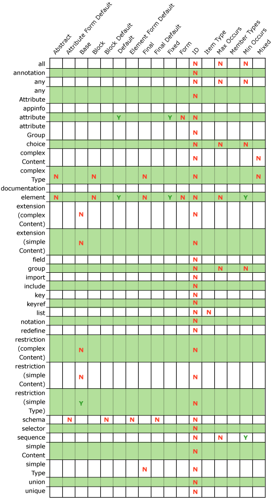
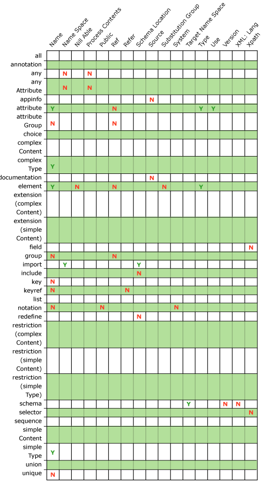

# Adapter XSD Element-Attribute Constructs
The following tables list XSD element-attribute constructs supported by the Adapter Framework. The vertical axis contains the supported element types, and the horizontal axis contains the valid attribute types for each element.  
  
> [!NOTE]
>  Elements and attributes must have unique names. Duplicate names result in a compilation error.  
  
> [!NOTE]
>  The fixed attribute with Enumeration facet is not supported.  
  
> [!NOTE]
>  The configuration XSD should have an element called **uri** of type xsd:string.  
  
   
Supported Adapter XSD Element-Attribute constructs  
  
   
Supported Adapter XSD Element-Attribute constructs  
  
## See Also  
 [Adapter Design Issues](../core/adapter-design-issues.md)
