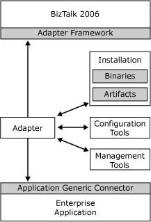

# Adapters
To exchange messages with external systems, applications, and entities Microsoft BizTalk Server uses the concept of an adapter. *Adapters* are COM or .NET-based components that transfer messages to and from business endpoints (such as file systems, databases, and custom business applications) using various communication protocols.  
  
 Adapters are used by BizTalk Server to exchange messages with external entities in send and receive operations  
  
-   Send (or send-side) operations occur when information is being sent by BizTalk Server to an external entity using the protocols supported by the adapter.  
  
-   Receive (or receive-side) operations occur when the adapter receives information from an external entity and passes it into the BizTalk Server Messaging Engine.  
  
## The Adapter Framework  
 The following figure shows how an adapter and the Adapter Framework work together to connect your application to BizTalk Server.  
  
1. Data is received through a receive location that is listening for messages of a certain protocol at a specified address. The receive location is associated with an adapter and a receive pipeline. You can configure both the adapter and the pipeline components to perform certain logic on messages having a predetermined protocol.  
  
2. After the message is received by the receive location, the message is sent to the adapter, which creates a new BizTalk Server message, attaches the data stream to the message (typically in the body part of the message), adds any metadata pertaining to the endpoint over which the data was received, and then submits that message into the Messaging Engine.  
  
3. The Messaging Engine sends the message to the receive pipeline where the data is transformed into XML, the message sender is authenticated, the message is decrypted, and the XML is validated.  
  
4. The Messaging Engine publishes the message to the MessageBox. The MessageBox is a Microsoft SQL Server table containing messages to be processed. Both orchestrations and send ports can subscribe to the MessageBox.  
  
5. The Messaging Engine sends the message to either an orchestration or a send port subscriber based upon the message context properties matching the specifications set in the filter on the subscriber.  
  
6. If an orchestration is the subscriber, it processes the message and sends it out using a send port. After the send port has it, or is the only subscriber, the message passes through the send pipeline into a send adapter before being transmitted over the wire.  
  
   The Adapter Framework  
  
     
  
## Receive Adapters  
 Receive adapters are responsible for creating a new BizTalk Server message by attaching the network/data source stream to the message body. It also adds any metadata pertinent to the endpoint over which the data was received, then submits that message to the Messaging Engine.  
  
 The adapter deletes the data from the receive endpoint or sends the appropriate acknowledgement message to the client indicating that the data has been accepted into BizTalk Server.  
  
## Send Adapters  
 Send adapters are responsible for sending a BizTalk message to the specified endpoint using its specific transport protocol.  
  
 For more information about adapters, the structure of an adapter, and writing custom adapters, see [Developing Custom Adapters](../core/developing-custom-adapters.md).  
  
## See Also  
 [Artifacts](../core/artifacts.md)