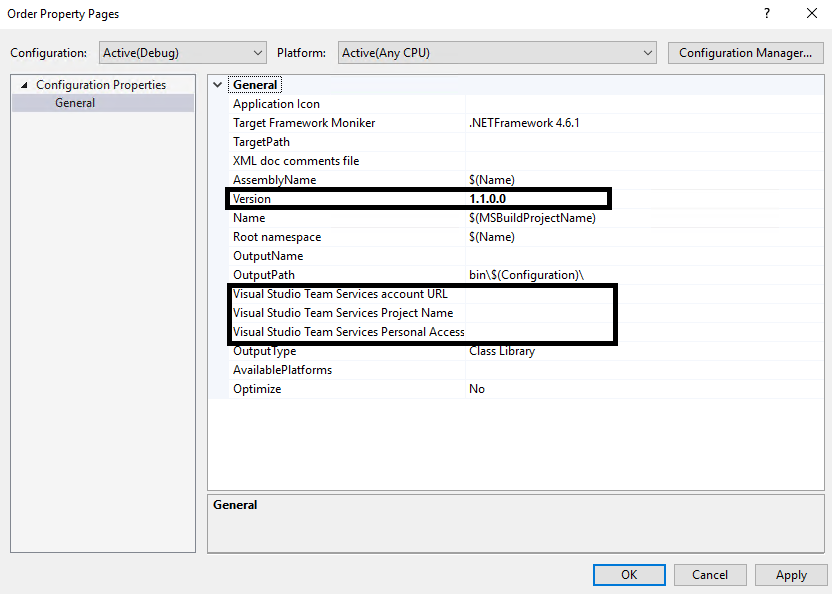

# Add a BizTalk Server application to Visual Studio Team Services
Add a [!INCLUDE[btsBizTalkServerNoVersion_md](../includes/btsbiztalkservernoversion-md.md)] project to VSTS to automatically deploy using continuous integration.  

**Starting with [!INCLUDE[bts2016_md](../includes/bts2016-md.md)] [!INCLUDE[featurepack1](../includes/featurepack1.md)]**, you can automatically deploy your applications to your [!INCLUDE[btsBizTalkServerNoVersion_md](../includes/btsbiztalkservernoversion-md.md)] environments using Visual Studio Team Services (VSTS). 

This topics provides an overview, and lists the key steps to deploy your solution from Visual Studio to your [!INCLUDE[btsBizTalkServerNoVersion_md](../includes/btsbiztalkservernoversion-md.md)]. 

## Prerequisites
* Install [Feature Pack 1](https://www.microsoft.com/download/details.aspx?id=55100) on your [!INCLUDE[btsBizTalkServerNoVersion_md](../includes/btsbiztalkservernoversion-md.md)]
* [Step 3: Create the build and release definitions](../core/feature-pack-add-build-release-definitions.md)
* Knowledge and experience working with Git and repositories in Visual Studio. If you're brand new to repositories and version control, these may be good resources: 

    [Learn Git](https://www.visualstudio.com/learn-git/)  
    [Git and Team Services](https://www.visualstudio.com/docs/git/overview)
* Knowledge and experience working with BizTalk projects in [!INCLUDE[btsVStudioNoVersion_md](../includes/btsvstudionoversion-md.md)]

## Add BizTalk project to VSTS
1. In **Visual Studio**, connect to your **Source repository**, and **Clone** it to your machine.
2. Open or Create a **BizTalk Project** (.btproj).

   > [!NOTE]
   > You can add multiple project into the same solution.
   
3. Add a new **BizTalk Server Application Project** (.btaproj).
4. Right-click the project in the **Solution Explorer**, and select **Properties**.
5. Configure the **Version** and the connection properties to your **Visual Studio Team Services** account.

    

6. Add all the assemblies and artifacts needed by your application.
7. Update the **binding.xml** file with the correct binding information.
8. Update the **BizTalkServerInventory.json** with all the artifacts, and the correct order for the artifacts to be installed on the [!INCLUDE[btsBizTalkServerNoVersion_md](../includes/btsbiztalkservernoversion-md.md)].
9. Right-click and **build** your solution to check for any errors. 
10. When the build completes successfully, right-click your solution, and select **Deploy**.
11. Your application should automatically deploy to your [!INCLUDE[btsBizTalkServerNoVersion_md](../includes/btsbiztalkservernoversion-md.md)].

## See also
[Configure the Feature Pack](../core/configure-the-feature-pack.md)