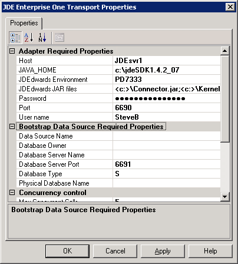

# Configure JD Edwards EnterpriseOne artifacts in BizTalk Administration
Microsoft BizTalk Adapter for J.D.Edwards EnterpriseOne contains both the Receive Handler and Send Handler folders. The folders contain BizTalkServerApplication. BizTalk Adapter for J.D.Edwards EnterpriseOne is creatable; it runs in-process with BizTalk Server and does not run in an isolated host process.  

## Add the adapter to BizTalk Administration 

1.  Open **BizTalk Server Administration**, expand **BizTalk Server Administration**, expand **BizTalk Group**, and then expand **Platform Settings**.  

2.  Right-click **Adapters**, select **New**, and select **Adapter**.  

3.  Enter a name for the adapter. For example, enter`JDEEnterpriseOne`.  

4.  Select **JDEEnterpriseOne** from the **Adapter** list, and select **OK**.  

## Create the send port  

1.  In **BizTalk Server Administration**, expand **Applications**, and then expand the application that you want to host the artifacts

2.  Right-click **Send Ports**, select **New**, and then select **Static Solicit-Response Port**.  

3.  In the **Send Port Properties** dialog box, do the following:  

    -   In **Name**, enter a send port name. For example, enter `SendToJDE`.  

    -   In the **Type** drop-down list, select **JDEdwards**.  

    -   In the **Send handler** drop-down list, select the send handler address.  

5.  Select **OK** to save your changes.

## Configure the transport properties

The JD Edwards EnterpriseOne Transport Properties are used for design and run time. In **Transport Properties**, you set the connection and credential parameters specific to the server system and the objects you are trying to access.  

 After setting the connection parameters, you can browse the JD Edwards EnterpriseOne system tables, views, and procedures in the Adapter Wizard.  

 When a connection is made to JD Edwards EnterpriseOne, parameters pass to the connection object (User, Password, Environment). It returns an instance of the JD Edwards EnterpriseOne application business function. The credentials are further defined by the name of the enterprise/application server and the defined TCP/IP port on which [!INCLUDE[btsBizTalkServerNoVersion](../includes/btsbiztalkservernoversion-md.md)] listens.  

> [!NOTE]
>  The default values for the enterprise server name and port are configured in [!INCLUDE[btsBizTalkServerNoVersion](../includes/btsbiztalkservernoversion-md.md)]. They are also read from a file called jdeinterop.ini. If you receive logon errors, carefully check the credentials and values.  

### Enter the properties  

1. In the BizTalk Server Administration, expand **Applications**, and then expand your application.  

2. Right-click **Send Ports**, select **New**, and then select **Static One-Way Send Port**.  

3. In **Send Port Properties**, select **Name**, and name for this port. For example, enter `JDEEnterpriseOneSend`.  

4. Under **General**, in the **Transport Type** box, select **JDE EnterpriseOne** in the drop-down list.  

5. In the **Address (URI)** property, select the ellipsis (**…**). The **JDE EnterpriseOne Transport Properties** open: 

      

6. In the **JDE EnterpriseOne Transport Properties**properties, expand the **Adapter Required Properties**, and enter all required information for connection to the JD Edwards EnterpriseOne server.  Use the following guidelines to set the transport properties:  

   |                      Use This                       |                                                                                                                                                                                                            To Do This                                                                                                                                                                                                             |
   |-----------------------------------------------------|-----------------------------------------------------------------------------------------------------------------------------------------------------------------------------------------------------------------------------------------------------------------------------------------------------------------------------------------------------------------------------------------------------------------------------------|
   |           **Adapter Required Properties**           |                                                                                                                                                                                                                                                                                                                                                                                                                                   |
   |                        Host                         |                                                                                                                   Type the name of the host server computer (for example:   `actsvr1`)   --or--   Type the IP address of the computer (for example,   `123.456.0.789`)                                                                                                                    |
   |                      JAVA_HOME                      |                                                                                                                                                                  Type the complete path to your JDK installation (for example,   `C:\jdk1sdk1.4.2_07`)                                                                                                                                                                  |
   |                JDEdwards Environment                |                                                                                  Type the name of an environment in JD Edwards EnterpriseOne (for example, `DV7333`).   DV7333 is a common name for the development environment, PY7333 is common for the prototype environment, and PD7333 is common for the production environment.                                                                                   |
   |                 JDEdwards JAR files                 | Enter the complete path and file name for each of the JAR files:   -   C:\JDEOWJars\Connector.jar -   C:\JDEOWJars\Kernel.jar -   Program Files\Microsoft BizTalk Adapters for Enterprise Applications\J.D. Edwards EnterpriseOne(r)\Classes\JDEDynAccess.jar   Each jar file must be separated with a semi-colon (;) and no space (for example,   `<c:>\Connector.jar;<c:>\Kernel.jar;`) |
   |                      Password                       |                                                              Type a user password. If you do not use Single Sign-On (SSO), you must set credential parameters for BizTalk Adapter for JD Edwards EnterpriseOne to access the server system. The password corresponds to the user name, and it determines the privileges you are granted when accessing the database.                                                              |
   |                        Port                         |                                                                                                                                                                         Type the numerical identifier of the send or receive port (for example, `6009`).                                                                                                                                                                          |
   |                      User Name                      |                                                                                                                                                                                         Type the name of the user, and then click **OK**.                                                                                                                                                                                         |
   | **Bootstrap Data Source Required Properties\*\\**\* |                                                                                                                                                                                                                                                                                                                                                                                                                                   |
   |                  Data Source Name                   |                                                                                                                                                                           Type the name of the data source. This name is mandatory for all data types.                                                                                                                                                                            |
   |                   Database Owner                    |                                                                                                                                                                                               Type the name of the database owner.                                                                                                                                                                                                |
   |                Database Server Name                 |                                                                                                                                                                                               Type the name of the database server.                                                                                                                                                                                               |
   |                Database Server Port                 |                                                                                                                                                                                     Type the identifying number of the database server port.                                                                                                                                                                                      |
   |                    Database Type                    |                                                                                                          Type a single character for the database type. For example:   **I** - iSeries   **O** - Oracle   **S** - SQL Server   **L** - SQL Server OLEDB   **W** - UDB                                                                                                           |
   |               Physical Database Name                |                                                                                                                                                                      Type the name of the physical database. This name is mandatory for all database types.                                                                                                                                                                       |
   |               **Concurrency Control**               |                                                                                                                                                                                                                                                                                                                                                                                                                                   |
   |                Max Concurrent Calls                 |                                                                                                                    Type a numeric value for the **Max Concurrent Calls**. This number represents the maximum number of concurrent calls, for example, `10`.   The default value for this field is 5.                                                                                                                    |
   |                  **Refresh Agent**                  |                                                                                                                                                                                                                                                                                                                                                                                                                                   |
   |                    Refresh Agent                    |                           Select **Yes** for the **Refresh Agent** to force the runtimeagent.exe and the browsingagent.exe processes to restart automatically when required.   For example, you want the process to restart automatically if it loses connection with the server, or if you add something to the server and it does not appear in the Microsoft Adapter Wizard for selection.                           |
   |                 **Security Server**                 |                                                                                                                                                                                                                                                                                                                                                                                                                                   |
   |                Security Server Name                 |                                                                                                                                                             Type the name of the security server. This field is optional and defaults to the JD Edwards server host.                                                                                                                                                              |
   |                Service Name Connect                 |                                                                                                                                                  Type the port number used by the security server and object configuration mapping (OCM). Default is the JD Edwards server port.                                                                                                                                                  |
   |                 **Single Sign-On**                  |                                                                                                                                                                                                                                                                                                                                                                                                                                   |
   |                Affiliate Application                |                                                                                                                                                                        Select the affiliate application from the drop-down list only if you are using SSO.                                                                                                                                                                        |
   |                       Use SSO                       |                                                                                                                                                                           Select **Yes** if you are using SSO; a password is not required in this case.                                                                                                                                                                           |

7. Select **OK** to accept all properties.  

### Bootstrap Data Source Required Properties  
 The Bootstrap section is used for sign-on to provide access to system tables. Bootstrap Data Source information defines the data source where the OCM resides.  

 For the Bootstrap Data Source parameters, not all settings are needed for all platforms. If you are using an uncommon database, you might have to update the [JDBj-JDBC DRIVERS] section of **jdeinterop.ini** to declare your JDBC driver. The following list identifies the required settings by platform:  

-   **iSeries**. Data Source Name, Database Type, Database Server Name, Physical Database Name  

-   **Oracle**. Data Source Name, Database Type, Physical Database Name, Database Owner  

-   **SQL Server**. Data Source Name, Database Type, Database Server Name, Database Server Port, Physical Database Name, Database Owner  

-   **SQL Server OLEDB**. Data Source Name, Database Type, Database Server Name, Database Server Port, Physical Database Name, Database Owner  

-   **UDB**. Data Source Name, Database Type, Physical Database Name, Database Owner  

### Optimize Configuration  
 The following information may help you to optimize the configuration of BizTalk Adapter for JD Edwards EnterpriseOne.  

#### Max Concurrent Calls parameter  
 You can use the `Max Concurrent Calls` parameter in instances where the throughput exceeds back-end processing capabilities. You add the parameter to the adapters in the **Send Port Transport Properties** page to activate message overload protection. The default is -1, meaning the calls are unlimited.  

 When [!INCLUDE[btsBizTalkServerNoVersion](../includes/btsbiztalkservernoversion-md.md)] submits messages to the transmit adapter, it first gets a batch from the adapter and invokes `TransmitMessage()` on the batch to transmit each message. When done, [!INCLUDE[btsBizTalkServerNoVersion](../includes/btsbiztalkservernoversion-md.md)] invokes `Done()` on the batch, and the adapter starts transmitting the messages to the back-end.  

 If [!INCLUDE[btsBizTalkServerNoVersion](../includes/btsbiztalkservernoversion-md.md)] obtains multiple batches before `Done` is invoked, the `Done` command might never occur. By setting the maximum number of messages in a batch, you can control messages to the back-end.  

 Changes to the parameter takes effect within one minute. [!INCLUDE[btsBizTalkServerNoVersion](../includes/btsbiztalkservernoversion-md.md)] must retrieve the changes to the adapter configuration saved in the SQL database.  

#### Refresh Agent  
 When you select **Yes** for the **Refresh Agent**, you force the runtimeagent.exe and the browsingagent.exe processes to restart automatically when required.  

 For example, you want the process to restart automatically if it loses connection with the server, or you added something to the server and it does not appear in the Microsoft Adapter Wizard for selection.  

 The Refresh Agent parameter is set in the Transport Properties window and refreshes both the browsing and the runtime agents. The runtimeagent.exe refreshes after a delay of one minute or at the next Send call.  

> [!NOTE]
>  the browsingagent.exe does not refresh until you terminate the current browsing session. For example, you must exit the “add generated item…” browsing session and re-enter to refresh the browsingagent.exe.  

#### Single Sign-On  
 There are two methods you can use to access the JD Edwards EnterpriseOne system. You can use Login Credentials (Transport Properties Login parameters) or Single Sign-On (SSO). Select **Yes** in the **Use SSO** field to use Single Sign-On.  

 For more information and basic instructions on setting up Single Sign-On, see [Security in BizTalk Adapter for JD Edwards EnterpriseOne](../core/security-in-biztalk-adapter-for-jd-edwards-enterpriseone.md).

 You must also select an affiliate application in the drop-down list. An affiliate application, created by Enterprise Single Sign-On tools, represents an application such as JD Edwards EnterpriseOne. BizTalk Adapter for JD Edwards EnterpriseOne uses the credentials of an application user.  

 These credentials are retrieved from the SSO database for the server system for a specified affiliate application. The credentials are those of the user (the application user) who launched the [!INCLUDE[btsBizTalkServerNoVersion](../includes/btsbiztalkservernoversion-md.md)] project.  

 For more information on how to create an affiliate application see [Creating Affiliate Applications](../core/creating-affiliate-applications4.md). You can also refer to Microsoft [!INCLUDE[btsBizTalkServerNoVersion](../includes/btsbiztalkservernoversion-md.md)] online Help.  

## Use the XMLTransmit and XMLReceive pipelines

This adapter requires that you select **XMLTransmit** and **XMLReceive** for the send and receive pipelines respectively.  

1.  In the BizTalk Server Administration, expand **Applications**, and then expand your application.  

2.  Right-click **Send Ports**, point to **New**, and then click **Static Solicit-Response Send Port**.  

3.  In the **Send Port Properties** dialog box, do the following:  

    1.  Type a name for the send port, for example, `SendToJDEEnterpriseOne`.  

    2.  From the **Type** drop-down list, select **JDE EnterpriseOne**.  

    3.  From the **Send handler** drop-down list, select the URI.  

    4.  From the Send Pipeline drop-down list, select **Microsoft.BizTalk.DefaultPipelines.XMLTransmit**.  

    5.  From the **Receive Pipeline** drop-down list, select **Microsoft.BizTalk.DefaultPiplelines.XMLReceive**.  

4.  Click **OK**.  

## See Also  
 [Developing Applications](../core/developing-applications2.md)  
 [Single Sign-On and BizTalk Adapter for JD Edwards EnterpriseOne](../core/single-sign-on-and-biztalk-adapter-for-jd-edwards-enterpriseone.md)   