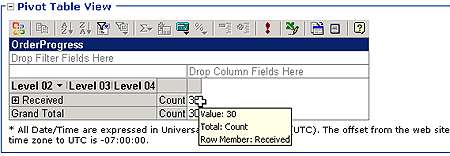
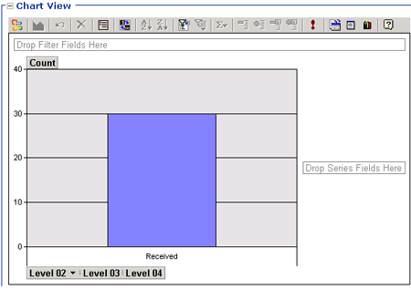

# Aggregations in the BAM Portal
Aggregations are tables of precalculated data you can use for analytical processing with an OLAP cube. Aggregations facilitate the efficient querying of multidimensional databases. When you create and deploy your observation model (the high-level definition of your business data) using the BAM Add-In for Excel, you create aggregations that you can use to quickly evaluate collections of data relating your Key Performance Indicators (KPIs).  
  
## Types of aggregations  
 Aggregations can be either scheduled or real-time. Scheduled aggregations are OLAP cubes, which represent a snapshot of your business data at a time you specify. Real-time aggregations allow a view of your business data based on trigger points that you specify, allowing the BAM system to notify you through an alert as soon as a KPI has been reached.  
  
## PivotTable View  
 The PivotTable View area displays the PivotTable report that you design using the BAM Add-In for Excel. The Office Web Components allow you to manipulate the PivotTable report to present the view of the data that best fits your needs..  
  
> [!NOTE]
>  When viewing a PivotTable report it is possible that some rows could contain null data in both real-time aggregations (RTAs) and precalculated aggregations (an OLAP implementation) if the milestones in the activity have been reached but are not used in the progress dimension. It is also possible to encounter rows with null data if the time dimension is used in the context of a progress dimension and is anchored to a milestone such as "acknowledged" instead of "received." In this case an activity instance is received and triggers the received milestone, but the activity has not yet triggered the acknowledge milestone and a zero will appear in the time dimension row.  To avoid this situation, link the time dimension up to the received milestone.  
  
   
  
 Keep these points in mind when using the Office Web Components in the BAM portal to modify your PivotTable report:  
  
- PivotTable reports in Excel include a Page field where you can put a time slice dimension. The Office Web Components used by the BAM portal do not include a Page field. If your Excel PivotTable report uses the Page field for any dimensions, the data for this field is not displayed in your PivotTable report in the BAM portal.  
  
- The Office Web Components display data in the content frame of the BAM portal. Because of the space limitations of this frame, adding dimensions from the field list to the columns area can cause the display of the PivotTable to move dimension names partly or wholly out of view.  
  
  For more information about PivotTables, see "PivotTable terminology demystified" at [http://go.microsoft.com/fwlink/?LinkId=55416](http://go.microsoft.com/fwlink/?LinkId=55416).  
  
## Chart View  
 The Chart View area displays the aggregation in a graphical manner. The Office Web Components allow you to manipulate the details of the aggregation through the chart view to adjust the reported data as needed. When you adjust the aggregation by dragging and dropping data items from the Chart Field list, the PivotTable report for the aggregation is automatically updated to reflect your changes. You can drill through the PivotTable to create an alert on the new aggregation view.  
  
   
  
## More  
  
-   [How to Set an Alert](../core/how-to-set-an-alert.md)  
  
-   [How to View the Results of an Activity Search](../core/how-to-view-the-results-of-an-activity-search.md)  
  
-   [How to Modify an Aggregation](../core/how-to-modify-an-aggregation.md)  
  
## See Also  
 [What Is an Aggregation?](../core/what-is-an-aggregation.md)