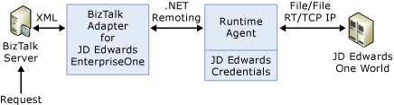

# Architecture of BizTalk Adapter for JD Edwards EnterpriseOne
Microsoft BizTalk Adapter for JD Edwards EnterpriseOne provides access to JD Edwards EnterpriseOne business functions. JD Edwards EnterpriseOne communicates between client and server machines using a proprietary messaging architecture called JDENet. JDENet is implemented by the JD Edwards EnterpriseOne connector classes found in the JAR files, Connector.jar and Kernel.jar. Communication is implemented using TCP/IP as a transport protocol, with a default port of 6009 or 6010. For a description of where this value is set, see [Add the artifacts to BizTalk Administration](../core/adding-biztalk-adapter-for-jd-edwards-oneworld.md).  
  
 The following figure shows the architecture for BizTalk Adapter for JD Edwards EnterpriseOne.  
  
   
  
## Inbound Services at Design Time  
  
-   At design time, you create a port, select an adapter, and provide credential information to connect to the target JD Edwards EnterpriseOne server. The Visual Studio development environment calls the adapter framework to request design-time information for this port. The adapter uses the Browsingagent for this port.  
  
-   At design time, BizTalk Server requests information by making calls to the adapter.  
  
-   The Browsingagent converts the request into native JD Edwards EnterpriseOne code and transmits the requests to JD Edwards EnterpriseOne through the ThinNet API connection (established in Connector.jar and Kernel.jar).  
  
-   A list of Modules in JD Edwards EnterpriseOne is initially returned and transported to the Visual Studio development environment, where it populates the Adapter Wizard.  
  
-   You can expand the hierarchy by displaying the library name and then the module name.  
  
-   When you select a specific module, you see schemas for all functions within the module. The adapter gets the required information from JD Edwards EnterpriseOne, and the browsingagent creates the schemas.  
  
-   The schemas are added to the BizTalk Server project orchestration.  
  
## Inbound Services at Run Time  
  
-   BizTalk Server calls the adapter to send a message on a specific port.  
  
-   The run-time agent converts the XML into native JDE code.  
  
-   The run-time agent submits the request through the ThinNet to the JD Edwards EnterpriseOne system specified in the transport properties of the send port.  
  
-   The Master Business Function is executed on the JD Edwards EnterpriseOne system, which then generates a response document indicating success or failure as well as data parameters returned by the business function.  
  
-   The message sent to JD Edwards EnterpriseOne is a single message, single reply architecture. Multiple messages cannot be processed at the same time.  
  
-   The response document is sent back through ThinNet, converted to XML, and transmitted back to BizTalk Server.  
  
## Outbound Events at Design Time  
  
-   No systematic creation of event metadata is available.  
  
-   A facsimile of the event document must be supplied to Visual Studio so that a schema can be generated and incorporated into the project along with the target namespace.  
  
## Outbound Events at Run Time  
  
-   A file transport mechanism is established in the JD Edwards EnterpriseOne server to transport the resulting XML document, triggered by the event completion, to the target directory on that computer.  
  
-   The BizTalk Server computer has a mapped drive to the directory on the EnterpriseOne server.  
  
-   The receive port transport properties are configured for the mapped drive. The receive port receives messages, which are posted to a directory by the EnterpriseOne server.  
  
-   The target namespace identification ensures that the correct messages are routed to the configured receive port  
  
-   The receive port submits the XML document in BizTalk Server.  
  
## More good stuff
[Security in BizTalk Adapter for JD Edwards EnterpriseOne](../core/security-in-biztalk-adapter-for-jd-edwards-enterpriseone.md)  
[Create the application artifacts](../core/developing-applications2.md)  
[Import your JD Edwards EnterpriseOne app](../core/deploying-biztalk-adapter-for-jd-edwards-enterpriseone.md)  
[Use BizTalk Server Exception Handling](../core/using-biztalk-server-exception-handling3.md)  
[Troubleshoot](../core/troubleshooting-jd-edwards-enterpriseone.md)  
