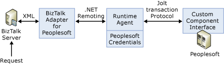

# PeopleSoft Enterprise adapter architecture
During the basic operation of Microsoft BizTalk Adapter for PeopleSoft Enterprise, the adapter receives an XML message from BizTalk Server. It encloses the XML message in a SOAP envelope. BizTalk Adapter for PeopleSoft Enterprise forwards the SOAP requests to the server. The adapter communicates with the PeopleSoft system using the PeopleSoft psjoa classes, which connect to the PeopleSoft system through Jolt Transaction Protocol. The PeopleSoft system receives the request and executes the business logic. The reply is sent back through a similar process.  
  
   

  
## Component Interface Methods  
 The basic APIs that are provided by the PeopleSoft component interface are low-level in nature. The client requires multiple invocations of these APIs. For example, to obtain the property of an instance of a component interface, the client needs one or more calls to set the key values followed by a low-level Get method call. It must then send multiple calls to get the properties. With BizTalk Adapter for PeopleSoft Enterprise, a new set of standard methods (Get, Create, Find, and Update) are provided in such a way that the client is required to make a single call to accomplish the same result. You do this by having BizTalk Adapter for PeopleSoft Enterprise perform multiple calls on behalf of the client. For more information about the methods, see [Appendix A: Component Interface Methods](../core/appendix-a-component-interface-methods.md).  
  
 To create a schema for PeopleSoft, BizTalk Adapter for PeopleSoft Enterprise retrieves the PeopleSoft component interface definitions or metadata.  
  
 BizTalk Adapter for PeopleSoft Enterprise is based on component interfaces for the Send functionality and does not require the PeopleSoft Integration Broker. The component interfaces are exposed as Web services, which can be accessed from BizTalk Server.  
  
### Validation  
 When BizTalk Adapter for PeopleSoft Enterprise receives an XML message from BizTalk Server, two levels of validation are performed:  
  
-   The XML message must be valid with regard to XML specification.  
  
-   The XML message must match what is required by the specific Web service (for example, interface matching such as data types).  
  
> [!NOTE]
>  There is no validation with regard to business logic, which is the domain of the PeopleSoft system, and is transparent to BizTalk Adapter for PeopleSoft Enterprise.  
  
## See Also  
 [Getting Started](../core/getting-started-with-biztalk-adapter-for-peoplesoft-enterprise.md)   