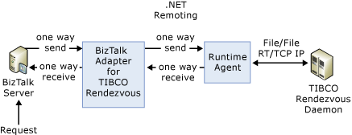

# Architecture of the TIBCO Rendezvous adapter

## Overview
Microsoft BizTalk Adapter for TIBCO Rendezvous provides bi-directional connectivity between [!INCLUDE[btsBizTalkServerNoVersion](../includes/btsbiztalkservernoversion-md.md)] and TIBCO Rendezvous. This adapter uses both the TIBCO Rendezvous API and the BizTalk Adapter Framework API to provide tight integration.  
  
 TIBCO Rendezvous is a software product that provides a message bus for enterprise application integration (EAI). TIBCO provides messaging APIs in C, C++, Java, Visual Basic and the Microsoft .NET Framework to receive data feeds on Microsoft Office Excel worksheets and other applications of choice.  
  
## Message Passing  
 The basic concept of message passing is fairly simple:  
  
- A message has a single subject composed of elements separated by periods. It is sent to a single Rendezvous daemon (though it might eventually be broadcast onto other daemons).  
  
- A listener announces its subjects of interest to a daemon (with a basic wildcard facility), and messages that have matching subjects are delivered to it if the two daemons are 'connected' to each other, or are indeed the same daemon. For more information, see Messages in [Messages in BizTalk Adapter for TIBCO Rendezvous](../core/messages-in-biztalk-adapter-for-tibco-rendezvous.md).  
  
  The following figure shows the architecture for BizTalk Adapter for TIBCO Rendezvous.  
  
    
  
## See Also  
 [Getting Started](../core/getting-started-with-biztalk-adapter-for-tibco-rendezvous.md)  