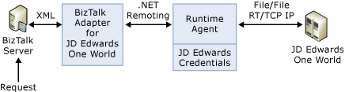

# Architecture of JD Edwards OneWorld
Microsoft BizTalk Adapter for JD Edwards OneWorld provides access to JD Edwards OneWorld business functions. JD Edwards OneWorld communicates between client and server machines using a proprietary messaging architecture called JDENet. JDENet is implemented by the JD Edwards OneWorld connector classes found in the JAR files, Connector.jar and Kernel.jar. Communication is implemented using TCP/IP as a transport protocol, with a default port of 6009 or 6010. For a description of where this value is set, see [Add the artifacts to BizTalk Administration](../core/adding-biztalk-adapter-for-jd-edwards-oneworld.md).  
  
 **Architecture for BizTalk Adapter for JD Edwards OneWorld**  
  
   
  
 Calls to JD Edwards OneWorld business functions require two messages:  
  
-   The first message responds with the location of the server that processes the business function. This is accomplished by performing a lookup in a set of tables called *object configuration mapping (OCM)*.  
  
-   The second message sends a formatted message buffer containing the arguments to pass to or from JD Edwards OneWorld to the appropriate server, and waits for a reply. The buffers are formatted according to the typedefs of the underlying C++ structs.  
  
## Inbound Services at Design Time  
  
-   At design time, you create your port, select the adapter, and provide credential information to connect to the target JD Edwards OneWorld server. The Visual Studio development environment calls the adapter framework to request design-time information for this port. BizTalk Adapter for JD Edwards OneWorld uses the Browsingagent for this port.  
  
-   At design time, BizTalk Server requests information by making calls to the adapter.  
  
-   The Browsingagent converts the request into native JD Edwards OneWorld code and then transmits the requests to JD Edwards OneWorld through the ThinNet API connection (established in the Connector and Kernel.jars).  
  
-   A custom business function is installed through the BTSREL installation: it exposes the master business functions.  
  
-   A list of modules in JD Edwards OneWorld is initially returned and transported to Visual Studio, where it populates the Adapter Wizard.  
  
-   You can expand the hierarchy to display the library name and module name.  
  
-   When you select a specific module, you see schemas for all functions within the module. The adapter obtains the required information from JD Edwards OneWorld, and the browsingagent creates the schemas.  
  
-   The schemas are added to the BizTalk Server project orchestration.  
  
## Inbound Services at Run Time  
  
-   BizTalk Server calls the BizTalk Adapter for JD Edwards OneWorld to send a message on a specific port.  
  
-   The run-time agent converts the XML into native JD Edwards code.  
  
-   The run-time agent submits the request through the ThinNet to the JD Edwards enterprise system specified in the transport properties of the send port.  
  
-   The master business function is executed on the JD Edwards system, which then generates a response document indicating success or failure as well as data parameters returned by the business function.  
  
-   The message sent to JD Edwards OneWorld is a single message, single reply architecture. Multiple messages cannot be processed at the same time.  
  
-   The response document is sent back through ThinNet, converted to XML, and transmitted back to BizTalk Server.  
  
## Outbound Events at Design Time  
  
-   No systematic creation of event metadata is available.  
  
-   A facsimile of the event document must be supplied to Visual Studio so that a schema can be generated and incorporated into the project along with the target namespace.  
  
## Outbound Events at Run Time  
  
-   A file transport mechanism is established in the JD Edwards enterprise server to transport the resulting XML document, triggered by the event completion, to the target directory on that server.  
  
-   The BizTalk Server computer has a mapped drive to the directory on the enterprise server.  
  
-   The receive port transport properties are configured for the mapped drive. The receive port receives messages posted to directory by the enterprise server.  
  
-   The target namespace identification ensures that the correct messages are routed to the configured receive port.  
  
-   The receive port submits the XML document to BizTalk Server.  
  
## See Also  
 [Add the artifacts to BizTalk Administration](../core/adding-biztalk-adapter-for-jd-edwards-oneworld.md)   
 [Planning and Architecture](../core/planning-and-architecture17.md)