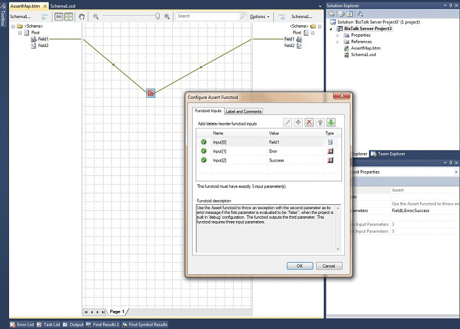

# Assert Functoid
The **Assert** functoid either outputs a string value or throws an exception based on a Boolean value. If you combine this functoid with one or more of the **Logical** functoids, you can effectively test assumptions about conditions in your map. For example, if you have a map that expects purchase order amounts never to exceed a certain threshold, you can test the purchase order value by using the **Greater Than** functoid and then connect it to the **Assert** functoid. If the logical functoid returns **True**, the **Assert** functoid will throw an exception using a string you provide.  
  
   
  
## See Also  
 [Assert Functoid Reference](../core/assert-functoid-reference.md)   
 [Logical Functoids Reference](../core/logical-functoids-reference.md)