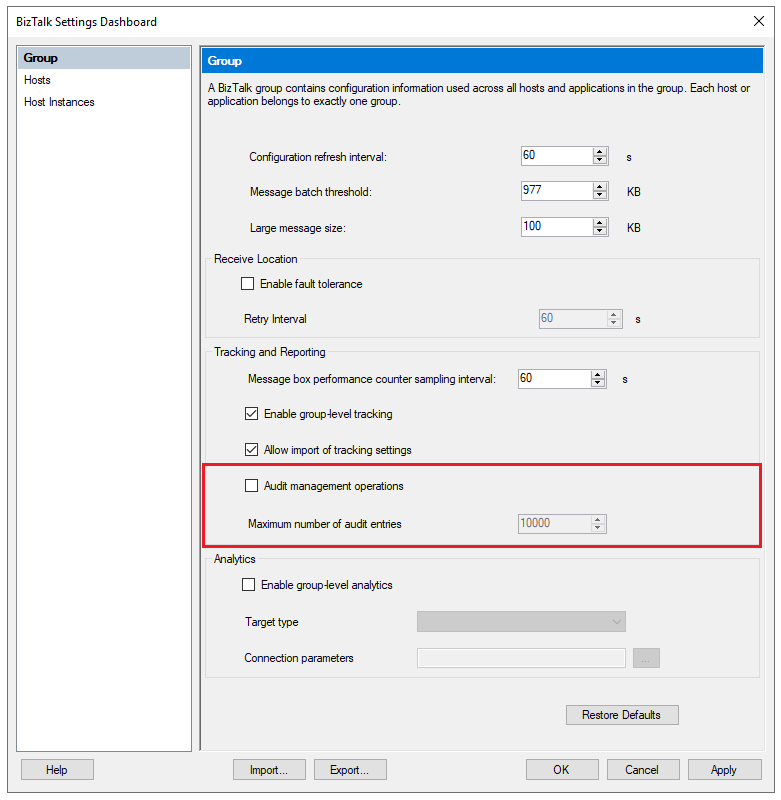

# Enable and view audit logs of common management operations in BizTalk Server

**In BizTalk Server 2020 and later**, administrators can generate an audit trail of management operations on application artifacts. Examples include operations on send ports, receive ports, receive locations, orchestrations, and resources. You can also audit suspend, resume, and terminate operations on service instances.

## Configure auditing

Auditing isn't configured by default. To turn on auditing:

1. Open the BizTalk Server Administration console.

1. Right-click **BizTalk Group**, and then select **Settings**.

1. Select **Audit management operations**.

1. In the **Maximum number of audit entries** box, enter the number of entries that you'd like to retain. By default, BizTalk stores the **10,000** most recent entries.

1. Select **OK** to save your changes.

1. If you'd like to do more management operations in the same session, refresh the administration console.

   > [!div class="mx-imgBorder"]
   > 

## View audit logs

1. Confirm that the **Operational Data Service** is configured. The service should be using an account that's a member of the **BizTalk Server Administrators**, the **BizTalk Server Operators**, or the **BizTalk Server Read Only Users** groups. 

    For more information, see [Configure the REST APIs](../install-and-config-guides/configure-biztalk-server.md#configure-the-rest-apis). 

2. To view audit logs, go to `http://localhost/BizTalkOperationalDataService/AuditLogs`.
3. To see audit log entries from a specific date range, use one of these formats for the URL:

   - `http://localhost/BizTalkOperationalDataService/AuditLogs?fromDate=<yyyy-MM-dd>&toDate=<yyyy-MM-dd>`
   - `http://localhost/BizTalkOperationalDataService/AuditLogs?fromDate=<yyyy-MM-dd>T<hh:mm:ss>&toDate=<yyyy-MM-dd>T<hh:mm:ss>`

   For example, you might use one of these URLs:

   - `http://localhost/BizTalkOperationalDataService/AuditLogs?fromDate=2022-05-01&toDate=2022-05-10`
   - `http://localhost/BizTalkOperationalDataService/AuditLogs?fromDate=2022-05-01T01:00:00&toDate=2022-05-10T01:00:00`

## Audit log structure

An audit log contains following information:

- **Id**: An ID of type `Guid`, which is unique per entry.
- **BatchId**: An ID that's the same for all audited operations that you perform in a single SQL transaction. This value can help you correlate user operations with lower level details.
- **UserPrincipal**: The user who ran the operation, for example, `jeffsmith@Fabricom.com`.
- **Machine**: The name of the machine that the operation ran on, for example, `machine1@contoso.com`.
- **ArtifactId**: The unique ID of the artifact.
- **ParentArtifactId**: The ID of the parent artifact, if the artifact is a child of another artifact.
- **ArtifactType**: The type of artifact that the operation ran on, for example, `SendPort`, `ReceivePort`, or `Application`.
- **ArtifactName**: The name of the artifact. This value is configured by the user, for example, `FTP send port`.
- **OperationName**: The action that ran on the artifact, for example, `Create`.

  The following table lists operations that you can run on different types of artifacts:

  | Artifact type | Operation names|
  | --- | --- |
  | Port | Create, Update, Delete |
  | Service instance | Suspend, Resume, Terminate |
  | Application resource | Add, Update, Remove |
  | Binding file | Import|

- **Payload**: Information about the changes that the operation made. The payload is in JSON format, for example, `{"Description":"New description"}`.
- **CreatedDate**: The time stamp of the operation.

When an artifact is created or updated, one or more audit entries are logged. For example, when a send port is created, audit entries are logged for each of these artifacts:

- The send port
- The primary transport
- The secondary transport

All three entries have the same **BatchId**. You can use the **ArtifactId** and **ParentArtifactId** values to correlate audit log entries for primary and secondary transports with send ports.

## Next steps

[Track and monitor the health of your BizTalk Server](monitoring-biztalk-server.md).
