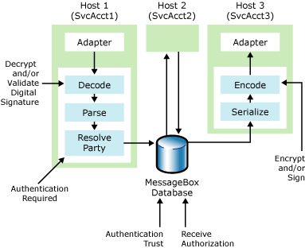

# Authenticating the Sender of a Message
Microsoft [!INCLUDE[btsBizTalkServerNoVersion](../includes/btsbiztalkservernoversion-md.md)] uses different mechanisms to verify that a party is who they claim to be, or that a process is what it claims to be. Furthermore, you can specify whether the process can relay to BizTalk Server who the original sender of the message is, and whether BizTalk Server recognizes the party as a partner.  
  
 The following figure shows the security features in BizTalk Server that enable you to authenticate and authorize the sender of a message.  
  
   
The security features that BizTalk Server uses to authenticate and authorize the send of a message  
  
 The features that enable you to authenticate the sender of a message are:  
  
- **Digital Signature Validation.** If the message has a digital signature, BizTalk Server uses it to verify the identity of the sender. For more information about how to configure digital signature validation, see [How to Configure BizTalk Server for Receiving Signed Messages](../core/how-to-configure-biztalk-server-for-receiving-signed-messages.md).  
  
- **Party Resolution.** All messages inserted into the MessageBox database, whether originating inside or outside of BizTalk Server, carry a Party ID (PID) that is determined through either the mapping of a digital certificate or a Windows Account to a PID. For more information about how to configure party resolution component, see [Using Certificates for Party Resolution](../core/using-certificates-for-party-resolution.md).  
  
- **Authentication required.** If the receive port is not able to determine the sender of the message, a BizTalk Host can either accept it as a "guest" message, or disregard it altogether. This feature enables you to protect your system from Denial of Service attacks, as messages from unknown parties will not be processed or stored in the tracking database. For more information about the authentication options for receive ports, see [How to Configure Authentication Options for a Receive Port](../core/how-to-configure-authentication-options-for-a-receive-port.md).  
  
- **Authentication Trust.** If the MessageBox database receives a message from a host that you did not identify as authentication trusted, the MessageBox database will overwrite the PID with the guest ID, and the SSID with the service account that the host instance is running as. BizTalk Server enables hosts identified as authentication trusted to indicate that the sender of a message that the trusted host is queuing to the MessageBox database is an entity other than the trusted host itself. The primary purposes of authentication trust are to enable pipelines to resolve to a PID and pass that PID along to consuming services for use in authorization and outbound party resolution, and to enable the transmission of the sender Windows Security ID (SSID) along to consuming services for use in orchestration action authorization. For more information about authentication trusted host, see [How to Modify Host Properties](../core/how-to-modify-host-properties.md). For more information about how to use BizTalk Server orchestrations in conjunction with party resolution, see [PartyResolution (BizTalk Server Sample)](../core/partyresolution-biztalk-server-sample.md).  
  
  Depending upon whether you need to know from whom you received this message, the original sender of the message, or the recipient or viewer of your message, you can use some or all of the features shown in the figure.  
  
  If it is important for your partners to know with certainty that messages are from you and that nobody else can read them while they are in transit, you should consider using the following techniques to help ensure that only the specified recipients and recipient applications receive the messages:  
  
- Use digital signatures for outbound messages so that your partner can verify that you are the sender of the message.  
  
- Encrypt outbound messages to help ensure that unauthorized parties cannot view the message while it is in transit.  
  
  If it is important to determine who sent your company a message and that nobody else read it while it was in transit, you should consider using the following techniques to help ensure that only the specified recipients and recipient applications receive the messages:  
  
- Make sure BizTalk Server only accepts messages with digital signatures so that you know who sent the message.  
  
- Make sure you send your partners the public key certificate for encrypting the messages they send to BizTalk Server. By using encryption, you can help ensure that unauthorized parties cannot view the message while it is in transit.  
  
- Use the authentication required property in the receive port to ensure the message is from a known party.  
  
  After more than one host processes the message, it may not be clear who the original sender of the message is. In cases where you must know the identity of the original sender, for example, when granting access to send or receive a message, [!INCLUDE[btsBizTalkServerNoVersion](../includes/btsbiztalkservernoversion-md.md)] provides a security mechanism for propagating the identity of the original sender through many hosts in order to validate access to downstream hosts based on that identity. In BizTalk Server, this calls process Authentication trust. For more information, see [Authentication of Messages Between Processes](../core/authentication-of-messages-between-processes.md).  
  
## In This Section  
  
-   [Inbound Message Authentication](../core/inbound-message-authentication.md)  
  
-   [Authentication of Messages Between Processes](../core/authentication-of-messages-between-processes.md)  
  
-   [Outbound Message Protection](../core/outbound-message-protection.md)