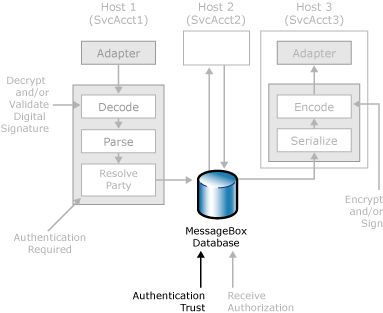

# Authentication of Messages Between Processes
The following figure shows the security features in BizTalk Server that enable you to authenticate messages between different BizTalk hosts.  
  
   
Security features BizTalk Server uses to authenticate messages between processes.  
  
 After BizTalk Server receives a message, decrypts and validates the message, and has a valid party ID (PID) and certificate to identity the sender of the message, the MessageBox database is ready to verify the subscriptions that the message matches, and to send this message to other hosts for further processing.  
  
 As a message flows from one process to another, it is often necessary to pass the identity of the original sender of the message to downstream processes for authorization, party resolution, and business logic relating to the sender. However, enabling all hosts to flow this information without some type of security or trust mechanism would greatly increase the need to verify that all user objects and code (for example, orchestrations, adapters, pipeline components, functoids) are trustworthy.  
  
 To provide the means to differentiate the level of trust for user objects and code, BizTalk Server provides Authentication Trust as a property of hosts. When the MessageBox database receives a message from a host that has not been set as authentication trusted, the MessageBox database overwrites the PID with the guest ID, and overwrites the SSID with the service account that the host instance is running as. When a host is marked as authentication trusted, BizTalk enables the host to specify any sender SID (SSID) and any party ID (PID) on messages that it queues to the MessageBox database.  
  
 By specifying which hosts are trusted and which are not, you can define security boundaries in which user objects and code can be trusted or not trusted. That is, user objects and code deployed into hosts that have been set to Authentication Trusted need to be more trustworthy than user objects and code deployed to hosts that have not been set to Authentication Trusted. For more information about how to configure authentication trusted host, see [How to Modify Host Properties](../core/how-to-modify-host-properties.md).  
  
 When the MessageBox database receives a message, BizTalk Server takes the following steps to enforce the authentication trust of the host instance sending the message to the MessageBox database:  
  
1.  The MessageBox database first determines whether the host sending the message has been set as authentication trusted by checking that the SSID is that of a host instance service account for a trusted host.  
  
2.  If the host that is sending the message to the MessageBox database is authentication trusted, the MessageBox database leaves the SSID and PID in the message context "as is," unless they are empty. If the SSID is empty, the MessageBox database populates it with the SID of the calling process, also known as the host SID (HSID). If the PID is empty, it sets the PID to the guest ID.  
  
3.  If the host that is sending the message to the MessageBox database has not been set as authentication trusted, the SSID is populated with the HSID, and the PID is set to Guest, regardless of whether these fields were already populated.  
  
> [!IMPORTANT]
>  If you want a downstream process to know the SSID and PID of the original sender of the message, you must set all hosts that the message passes through as authentication trusted. In addition, in cases such as when the message is received and subsequently used to construct outbound messages in an orchestration, the SSID and PID received on inbound messages must be explicitly added as a property to outbound messages in order to flow these identities.  
  
> [!IMPORTANT]
>  If you configured the host where a pipeline is running as authentication trusted, BizTalk Server considers the pipeline to be a trusted environment. Therefore, it is extremely important that you verify that any custom components that are included in a BizTalk pipeline that is running on a host that is authentication trusted are also trusted.  
  
> [!NOTE]
>  You cannot use the same service account for hosts that are authentication trusted and for hosts that are not authentication trusted.  
  
## See Also  
 [Inbound Message Authentication](../core/inbound-message-authentication.md)   
 [Outbound Message Protection](../core/outbound-message-protection.md)   
 [Authenticating the Sender of a Message](../core/authenticating-the-sender-of-a-message.md)   
 [Authorizing the Receiver of a Message](../core/authorizing-the-receiver-of-a-message.md)
