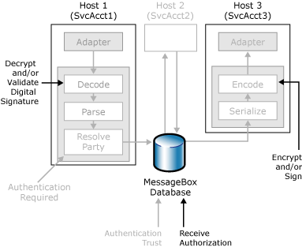

# Authorizing the Receiver of a Message
Microsoft [!INCLUDE[btsBizTalkServerNoVersion](../includes/btsbiztalkservernoversion-md.md)] enables you to limit the processes and parties that you authorize to receive messages.  
  
 The following figure shows the security features in BizTalk Server that you use to authorize the receiver of a message.  
  
   
Security features BizTalk Server uses to authorize the receiver of a message.  
  
 You can use the following security mechanisms to establish who has permission (authorization) to receive the messages that you send:  
  
-   **Decryption.** Make sure the parties that send messages to BizTalk Server have the public key certificate for encrypting messages they send to BizTalk Server. BizTalk Server uses the private key certificate to decrypt the message.  
  
-   **Receive Authorization.** You can use this method to control which hosts within the BizTalk Server environment can receive a given message.  
  
-   **Encryption.** By using the public key certificate from a given party when BizTalk encrypts a message, you can ensure that only the intended party is able to read the message.  
  
## Receive Authorization  
 Receive authorization is the method you can use to control which hosts can receive (subscribe for) a given message. BizTalk Server uses the certificate information as a subscription property to match predicates on the message: the MessageBox database only routes messages marked as authorization required to the hosts that have the decryption certificate for that message. To illustrate the process, consider the following scenarios:  
  
- **Routing an un-encrypted message:** When BizTalk Server receives a message that the sender did not encrypt, there is no decryption limitation as to how BizTalk routes the message. Both hosts with and hosts without receive authorization certificates configured can receive the message.  
  
- **Routing an encrypted message:** When an encrypted message arrives, the receiving pipeline must contain a decoding component that decrypts the message. When BizTalk Server routes a message after it is decrypted, BizTalk uses the certificate thumbprint used to decrypt the message as evidence in the MessageBox database subscription mechanism, and only those hosts configured with that certificate receive the message.  
  
  If you want to use receive authorization, you must provide the thumbprint of the decryption certificate in the properties of the host that you want to authorize to receive the message. For more information about receive authorization, see [How to Modify Host Properties](../core/how-to-modify-host-properties.md).  
  
## See Also  
 [Inbound Message Authentication](../core/inbound-message-authentication.md)   
 [Authentication of Messages Between Processes](../core/authentication-of-messages-between-processes.md)   
 [Outbound Message Protection](../core/outbound-message-protection.md)   
 [Authenticating the Sender of a Message](../core/authenticating-the-sender-of-a-message.md)   
 [Planning Message Security](../core/planning-message-security.md)