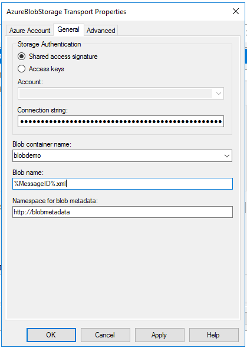
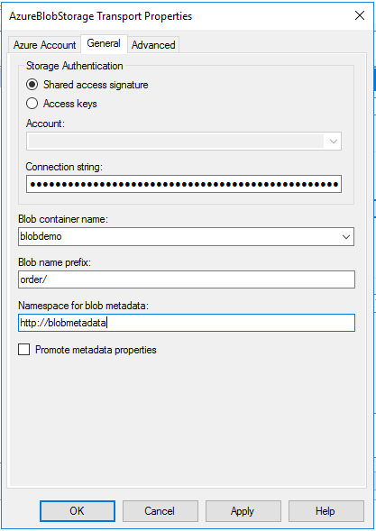

# Azure Blob storage adapter in BizTalk Server

**Starting with BizTalk Server 2020 and newer**, you can send and receive messages between BizTalk Server and Azure Blob storage.

Azure Blob storage is Microsoft's object storage solution for the cloud, which is optimized for storing massive amounts of unstructured data. For more information, see [What is Azure Blob storage?](/azure/storage/blobs/storage-blobs-overview).

## Prerequisites

Create an [Azure blob storage account](/azure/storage/common/storage-create-storage-account) with a container.

## Send messages to Azure Blob storage

1.  In the BizTalk Server Administration console, right-click **Send Ports** > **New** > **Static One-way send port**.

    [Create a Send Port](../core/how-to-create-a-send-port2.md) provides some guidance.

2. Enter a **Name**. In **Transport**, set the **Type** to **AzureBlobStorage**, and select **Configure**.

3. Configure the **Azure Account** properties.

    > [!TIP]
    > The adapter configuration window can auto-populate your Azure resources after signing into your Azure subscription. This makes the configuration easier. Signing into the Azure subscription is optinal.

    - **Sign-in**: Sign into your Azure account.
    - **Subscription**: Select the subscription that has your Azure storage account.
    - **Resource group**: Select the resource group that has your Azure storage account.

4. Configure the **General** properties:

    - **Storage Authentication**: Select an authentication method:

        - **Shared access signature** is selected by default. You must input the Shared Access Signature connection string in the **Connection string** field.
        - If you use **Access keys**, a collection of storage accounts is populated in the **Account** drop-down list. Once you select the storage account, the **Connection string** field is automatically populated with the primary access key, also known as **key1**.

        The following links are good resources to help you decide which authentication method is right for your scenario:

        - [Authorizing access to data in Azure Storage](/azure/storage/common/storage-auth)
        - [Using shared access signatures (SAS)](/azure/storage/common/storage-dotnet-shared-access-signature-part-1)

    - **Blob container name**: Select the name of your Blob container from the drop-down list. The list is auto-populated after the **Connection string** is entered.
    - **Blob name**: Enter the name of the blob to be used by the adapter. Macros can be used in the blob name. For available macros, see [Using macros in file names](restrictions-when-configuring-the-file-adapter.md#using-macros-in-file-names).
    - **Namespace for blob metadata**: Enter namespace as a filter. Context properties of the message are written to the blob metadata if the namespace of the property matches this field.

    When finished, your properties look similar to the following:

    > [!div class="mx-imgBorder"]
    > 

5. Configure the **Advanced** properties:

    - **Blob type**: Enter the **Blob type** to be used. For more information, see [blob types](/azure/storage/blobs/storage-blobs-introduction).
    - **Write mode**: Use this setting to specify adapter behavior when given **Blob name** already exists.
        - **Create new**: The adapter always tries to create a new blob. If a blob with the same name already exists, the BizTalk message is suspended.
        - **Overwrite**: The adapter overwrites if the blob name already exists. The metadata is also overwritten.
        - **Append**: The adapter appends the message body to an existing blob if a blob already exists. The metadata doesn't change.

6. Select **OK** to save your changes.

### Test your send port

You can use a simple File receive port and location to send messages to your Azure Blob storage. 

1. Using the File adapter, create a receive port named **FileReceivePort**. Within your receive location, set the **Receive folder** to `C:\Temp\In\\`, and set the file mask to `\*.xml`.
2. In your Azure Blob storage send port properties, set **Filters** to `BTS.ReceivePortName == FileReceivePort`.
3. Paste the following into a text editor, and save the file as **AzureBlobStorageMessage.xml**. This file is your sample message.

    ```xml
    <Data>
      <DataID>DataID_0</DataID>
      <DataDetails>DataDetails_0</DataDetails>
    </Data>
    ```

4. Start the File receive location and the Azure blob storage send port.
5. Copy the **AzureBlobStorageMessage.xml** sample message into the receive folder, such as `C:\Temp\In\`. The send port sends the XML file to the Azure blob storage. Confirm by looking into your Azure storage container, and viewing the newly-created or updated file.

## Receive messages from Azure Blob storage

1. In the BizTalk Server Administration console, right-click **Receive Ports** > **New** > **One-Way receive port**.

    [Create a receive port](../core/how-to-create-a-receive-port.md) provides some guidance.

2. Enter a name, and select **Receive Locations**.

3. Select **New**, and **Name** the receive location. In **Transport**, select **AzureBlobStorage** from the **Type** drop-down list. Select **Configure**.

4. Configure the **Azure Account** properties:

    >[!TIP]
    > Similiar to the send adapter, this is optional.

    - **Sign-in**: Sign into your Azure account.
    - **Subscription**: Select the subscription that has your Azure storage account.
    - **Resource Group**: Select the resource group that has your Azure storage account.

5. Configure the **General** properties:

    - **Storage Authentication**: Select an authentication method:
        - **Shared access signature** is selected by default. You must input the Shared Access Signature connection string in the **Connection string** field.
        - If you use **Access keys**, a collection of storage accounts is populated in the **Account** drop-down list. Once you select the storage account, the **Connection string** field is automatically populated with the primary access key, also known as **key1**.

        The following links are good resources to help you decide which is right for your scenario:
        - [Authorizing access to data in Azure Storage](/azure/storage/common/storage-auth)
        - [Using shared access signatures (SAS)](/azure/storage/common/storage-dotnet-shared-access-signature-part-1)
    - **Blob container name**: Select the name of your blob container from the drop-down list. The list is auto-populated after the **Connection string** is entered.
    - **Blob name prefix**: Enter a prefix where applicable. For example, if "order/" is used for **Blob name prefix**, then the receive location only picks up the files in the "order" folder.
    - **Namespace for blob metadata**: Enter a namespace for the adapter to create context properties from custom blob metadata.
    - **Promote metadata properties**: Choose whether custom blob metadata is promoted or not.

    >[!NOTE]
    > By default, all standard blob properties, such as Blob Uri, Name, and BlobType, are set as context properties of the BizTalk message with the `http://schemas.microsoft.com/BizTalk/Adapter/AzureStorage-properties` namespace.

    When finished, your properties look similar to the following:

    > [!div class="mx-imgBorder"]
    > 

6. Configure the **Advanced** properties:

    - **Polling interval**: Enter the polling interval.
    - **Maximum messages per batch**: Enter the number of messages the adapter batches when submitting to BizTalk.
    - **Parallel downloads**: Enter the maximum number of blobs allowed to be downloaded in parallel.
    - **Error threshold**: Enter the error threshold. When the receive location reaches this number of errors, the receive location is disabled.

7. Select **OK** to save your changes.

### Test your receive settings

You can use a simple File send port to receive messages from your Azure Blob storage.

1. Create a send port using the File adapter. Within your send port properties, set the **Destination folder** to `C:\Temp\Out\\`, and set the and **File name** to `%MessageID%.xml`.
2. In your File send port properties, set **Filters** to `BTS.ReceivePortName == BlobReceivePort`.
3. Create a receive port named **BlobReceivePort**, and create an Azure Blob storage receive location. Start it.
4. Upload a file to the blob container in the Azure portal. Pay attention to the matching prefix that you configured in the adapter. Look for messages in the destination folder (c:\temp\out).

>[!IMPORTANT]
>The Azure Blob storage receive adapter deletes the blob after it's submitted to the BizTalk MessageBox database.

## High Availability of Azure Blob storage adapter

The Azure Blob storage receive adapter supports high-availability. You can add multiple host instances in the same Azure Blob storage adapter receive handler to receive from the same blob container simultaneously. Blob leasing is used as a lock to avoid the same blob being received by multiple host instances. Accordingly:

- Blobs leased by other processes won't be received by Azure Blob storage adapter.
- Blobs being received by the Azure Blob storage adapter can't be updated while in a leased state.

For more information on Azure blob leasing, see [pessimistic concurrency for blobs](/azure/storage/common/storage-concurrency#pessimistic-concurrency-for-blobs).

The Azure Blob storage send adapter, like most send adapters, provides high availability for the sending host by having multiple host instances in the same send host.

## Next steps

[Adapters in BizTalk Server](adapters-in-biztalk-server.md)