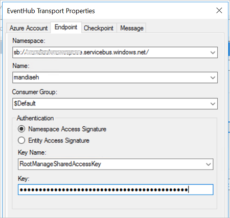

# Azure Blob storage adapter in BizTalk

## Overview
**Starting with BizTalk Server 2020**, you can send and receive messages between BizTalk Server and Azure Blob storage. 

Azure Blob storage is Microsoft's object storage solution for the cloud, which is optimized for storing massive amounts of unstructured data. [What is Azure Blob storage?](https://docs.microsoft.com/azure/storage/blobs/storage-blobs-overview) provides more details.

## Prerequisites

* Create an [Azure blob storage account with a container](https://docs.microsoft.com/azure/storage/common/storage-create-storage-account)

## Send messages to Azure Blob storage

1.  In the BizTalk Server Administration console, right-click **Send Ports**, select **New**, and select **Static One-way send port**.

    [Create a Send Port](../core/how-to-create-a-send-port2.md) provides some guidance.

2. Enter a **Name**. In **Transport**, set the **Type** to **AzureBlobStorage**, and click **Configure** button. 

3. Configure the **Azure Account** properties: 

    |Use this|To do this|  
    |---|---|  
    | **Sign-in** | Sign into your Azure account |
    | **Subscription** | Select the subscription that has your Azure storage account |
    | **Resource Group** | Select your resource group that has your Azure storage account |

4. Configure the **General** properties: 

    |Use this|To do this|  
    |---|---|  
    | **Storage Authentication** | Select an authentication method. <ul><li>Typically, it's recommended to use a Shared Access Signature, which is also by default selected. You can input the Shared Access Signature connection string to **Connection string** field to provide the authentication.</li> <li>If you are using Access keys as authentication method, a collection of storage account will be poped up in **Account** drop-down list, after you select the storage account, **Connection string** field will be automatically filled up using your primary access key, which also know as **key1**. </li></ul><br />The  The following links are good resources to help you decide which is right for your scenario:<br/><br/>[About Azure storage accounts](https://docs.microsoft.com/azure/storage/common/storage-create-storage-account)<br/>[Using shared access signatures (SAS)](https://docs.microsoft.com/azure/storage/common/storage-dotnet-shared-access-signature-part-1) |
    | **Blob container name** | Select the name of your Blob container from the drop-down list which should be automatically manipulated after the **Connection string** field is filled up. |
    | **Blob name** | Name of the blob used by adapter to upload the message to Blob storage container. Macros can be used for Blob name as well as file adapter, for available Macros please refere to [Using macros in file names](restrictions-when-configuring-the-file-adapter.md#using-macros-in-file-names). |
    | **Namespace for blob metadata** | Context properties of the message can be written to blob metadata if namespace of the property match this field. |

    When finished, your properties look similar to the following: 

    

5. Configure the **Advanced** properties:
    |Use this|To do this|  
    |---|---|  
    |**Blob type**| Azure Blob adapter can upload message as different blob types as needed, visit [blob types](https://docs.microsoft.com/en-us/azure/storage/blobs/storage-blobs-introduction) for more information. |
    |**Write mode**| In case of same blob name already exists, different **Write mode** are provided. |  

6. Select **Ok** to save your changes. 


### Test your send port

You can use a simple File receive port and location to send messages to your Azure Blob storage. 

1. Create a receive port named "FileReceivePort" using the File adapter. Within your receive location,  set the **Receive folder** to **C:\Temp\In\\**, and set the file mask to **\*.xml**.
2. In your Azure Blob storage send port properties, set the **Filters** to `BTS.ReceivePortName == FileReceivePort`.
3. Paste the following into a text editor, and save the file as **AzureBlobStorageMessage.xml**. This is your sample message. 

    ```xml
    <Data>
      <DataID>DataID_0</DataID>
      <DataDetails>DataDetails_0</DataDetails>
    </Data>
    ```

4. Start the File receive location and the Azure Blob storage send port.
5. Copy **AzureBlobStorageMessage.xml** sample message into the receive folder (C:\Temp\In\). The send port sends the XML file to the Azure Blob storage. You can verify that by looking into your Azure storage container and exam the new created or updated file.

## Receive messages from Azure Blob storage

1. In the BizTalk Server Administration console, right-click **Receive Ports**, select **New**, and select **One-Way receive port**. 

    [Create a receive port](../core/how-to-create-a-receive-port.md) provides some guidance.

2. Enter a name, and select **Receive Locations**. 

3. Select **New**, and **Name** the receive location. In **Transport**, select **AzureBlobStorage** from the **Type** drop-down list, and then select **Configure**. 

4. Configure the **Azure Account** properties: 

    |Use this|To do this|  
    |---|---|  
    | **Sign-in** | Sign into your Azure account |
    | **Subscription** | Select the subscription that has your Azure storage account |
    | **Resource Group** | Select your resource group that has your Azure storage account |

4. Configure the **Endpoint** properties: 

    |Use this|To do this|  
    |---|---|  
    | **Namespace** | Select your Event Hubs namespace, which is something like sb://*youreventhubnamespace*.servicebus.windows.net/ |
    | **Name** | Select the name of your Event Hub (which was created within your Event Hubs namespace) |
    | **Consumer Group** | Select the Consumer group within your Event Hub. A default group is created automatically. <br/><br/>[Event Hubs features overview](https://docs.microsoft.com/azure/event-hubs/event-hubs-features) provides more details. |
    | **Authentication** | **Namespace Access Signature** is the default, and automatically uses the RootManageSharedAccessKey that's created when you create an Event Hubs namespace.<br/><br/>**Entity Access Signature** is the SAS policy you can create at the Event Hub-level (not the Event Hubs namespace-level). <br/><br/>[Event Hubs features overview](https://docs.microsoft.com/azure/event-hubs/event-hubs-features) explains more. |

    When finished, your properties look similar to the following: 

    

5. Configure the **Checkpoint** properties. This adapter uses an Azure blob storage account to reliably read events using a checkpoint, and resume from a restart. 

    **Storage Authentication**   
    Select an authentication method. Typically, it's recommended to use a Shared Access Signature. The following links are good resources to help you decide which is right for your scenario:<br/><br/>[About Azure storage accounts](https://docs.microsoft.com/azure/storage/common/storage-create-storage-account)<br/>[Using shared access signatures (SAS)](https://docs.microsoft.com/azure/storage/common/storage-dotnet-shared-access-signature-part-1)

    When finished, your properties look similar to the following: 

    

6. Configure the **Message** properties: 

    |Use this|To do this|  
    |---|---|  
    | **Namespace for User Defined Message Properties** | `http://schemas.microsoft.com/BizTalk/EventHubAdapter/EventData/User` is the default schema, but you can enter another schema. This value represents a BizTalk message schema mapped to Event Hubs message properties. |
    | **Promote user defined properties** | Optional. You can promote these properties if you prefer. <br/><br/>**NOTE**<br/>The properties that need to be promoted should have a porperty schema deployed *before* receiving events.|

7. Select **Ok** to save your changes. 

### Test your receive settings

You can use a simple File send port to receive messages from your Azure Event Hub. 

1. Create a send port using the File adapter. Within your send port properties, set the **Destination folder** to **C:\Temp\Out\\**, and set the and **File name** to **%MessageID%.xml**.
2. In your File send port properties, set the **Filters** to  `BTS.ReceivePortName == EHReceivePort`.
3. Start the Event Hub receive location and the File send port.
4. Look for messages in the destination folder (c:\temp\out).

## Do more
Event Hubs is considered the "front door" to a lot of other Azure services, including Azure Data Lake, HD Insight, and more. It's designed to process a lot of messages, and process them fast. Read more about Event Hubs, and its features: 

[Event Hubs features overview](https://docs.microsoft.com/azure/event-hubs/event-hubs-features)  
[What is Event Hubs?](https://docs.microsoft.com/azure/event-hubs/event-hubs-what-is-event-hubs)
