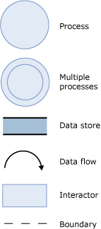

# Background Information for Sample Scenarios
This topic contains background information for the scenarios in this section.  
  
## Background for all scenarios  
 Before the main threat model meeting, we collected the following background information. This information applies to all the usage scenarios we identified for the sample architecture:  
  
-   Boundaries and scope of the architecture  
  
-   Boundaries between trusted and untrusted components  
  
-   Configuration and administration model for each component  
  
-   Assumptions about other components and applications  
  
### Boundaries and scope of the architecture  
  
-   Firewall 2 helps protect the servers and applications in the E-Business domain both from the perimeter network and from any other domains in your environment (for example, a corporate domain or domains for other applications).  
  
-   Firewall 2 routes all incoming and outgoing traffic to the E-Business domain.  
  
-   All user groups and accounts that access the BizTalk Server environment must be global groups in the E-Business domain.  
  
-   Access is limited to the service account for the host instance; any applications that drop messages in the receive server for File, SQL, or Message Queuing; and administrators for BizTalk Server, Enterprise Single Sign-On (SSO), and Windows.  
  
### Boundaries between trusted and untrusted companies  
  
-   Firewall 2 routes all incoming and outgoing traffic to the E-Business domain.  
  
-   Use different BizTalk Hosts as a security boundary between applications within BizTalk Server.  
  
-   Use trusted hosts only when you trust the code within the application (for example, do not run third-party components in a trusted host).  
  
### Configuration and administration model for each component  
 **Configuration model:**  
  
- BizTalk Server runtime components are installed only on the BizTalk Servers.  
  
- Master secret server has no additional components.  
  
- SQL Server contains all BizTalk Server databases.  
  
- Servers in the perimeter networks do not have any BizTalk Server components.  
  
- Administration client is used to administer all servers in the E-Business domain.  
  
  **Administration model:**  
  
- From a desktop (or laptop), an administrator connects to the computer that has the administration tools (using either Terminal Services or Remote Desktop connection). After the administrator connects to the computer that has the administration tools, the administrator can use the BizTalk Administration tools to manage all servers and applications within the domain.  
  
### Assumptions about other components and applications  
 All other applications and components that interact with the BizTalk Server environment are in a domain other than the E-Business domain (for example, in a perimeter network). The traffic from those applications and components to and from the BizTalk Server environment goes through Firewall 2.  
  
 Any third-party applications for BizTalk Server come from a trusted vendor.  
  
### Data flow diagrams  
 The final element of background information for each usage scenario is a data flow diagram (DFD). A DFD illustrates how data flows through the architecture. Each scenario has a different DFD. In this document, the data flow diagrams contain the elements shown in the following figure.  
  
 **Figure 1 Elements of the DFD**  
  
   
  
## Background for adapter scenarios  
 In our sample architecture, we identified the following usage scenarios based on some of the adapters you can use out-of-the-box:  
  
- HTTP and SOAP (Web services) adapters scenario  
  
- BizTalk Message Queuing adapter scenario  
  
- File adapter scenario  
  
- FTP adapter scenario  
  
  For each scenario, we followed these steps to complete the threat model analysis:  
  
- Collect background information  
  
- Create and analyze the threat model  
  
- Review threats  
  
- Identify mitigation techniques and technologies  
  
  For each scenario, we have tried to develop generic ratings of the level of threat that the various attacks might represent. However, your environment or experience might suggest that a particular threat deserves a different rating than we have given it. As with all security scenarios, your own data is the most robust to determine threat levels, and we recommend that you conduct your own analysis, using our analysis and results as a guide.  
  
  The background information—except for the data flow diagram (DFD)—is the same for all our usage scenarios. In the next sections we show the DFD for each scenario.  
  
## See Also  
 [Threat Model Analysis](../core/threat-model-analysis.md)   
 [Sample Scenarios for Threat Model Analysis](../core/sample-scenarios-for-threat-model-analysis.md)   
 [Planning for Security](../core/planning-for-security.md)   
 [Sample Architectures for Small & Medium-Sized Companies](../core/sample-architectures-for-small-medium-sized-companies.md)