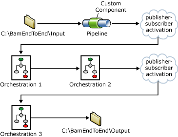
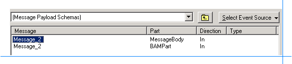

# BAM End-to-End (BizTalk Server Sample)
The End-to-End sample demonstrates how to correlate events from multiple components (in this case, three orchestrations and a pipeline) by using BAM.  

 BAM reconstructs the business activity that spans the pipeline component and orchestrations. At the lowest level, this works by calls to **EventStream.EnableContinuation** from each implementation component that expects more events for the activity. The call to **EnableContinuation** is explicit, while calls in Orchestration1 and Orchestration2 are made by adding a Continuation folder to the Tracking profile in one schedule, and a ContinuationID folder to the schedule that follows it.  

 The following diagram illustrates the workflow used in the sample.  

   

## What This Sample Does  
 The BAM end-to-end sample shows how you can use BAM to gather information from a pipeline and multiple orchestrations and update a single activity.  

## How This Sample Was Designed and Why  
 The BAM end-to-end sample was designed to illustrate the following activities:  

-   Using BAM within a pipeline.  

-   Using the Tracking Profile Editor (TPE) to map activity items to shapes in an orchestration and elements of a message.  

-   Using continuations to keep an activity active when multiple pieces of a solution contribute to the activity.  

The sample works as follows:  

1.  An input message is retrieved from the *\<Samples Path\>*\BamEndToEnd\Input folder.  

2.  The pipeline component assigns a unique DocumentID to the message, and uses the BAM API to begin a new BAM activity. The DocumentID is attached as a separate part of the input message to make it available to the orchestrations.  

3.  The service Orchestration1 is activated when the input message is received.  

4.  Orchestration1 modifies the input message and passes it as a parameter to Orchestration2.  

5.  Orchestration2 modifies the input message and sends it to the MessageBox database, which activates Orchestration3.  

6.  Orchestration3 modifies the message and writes it to the folder *\<Samples Path\>*\BamEndToEnd\Output.  

7.  Each orchestration updates activity items in the BAM activity.  

## Where to Find This Sample  
 You can find this sample at *\<Samples Path\>*\BAM\BamEndToEnd.  

 The following table shows the files in this sample and describes their purpose.  

|                                        File(s)                                        |                                         Description                                          |
|---------------------------------------------------------------------------------------|----------------------------------------------------------------------------------------------|
|                                    BamEndToEnd.sln                                    |                               BAM End-to-End sample solution.                                |
|                                    BamEndToEnd.xls                                    |                                 BAM definition style sheet.                                  |
|                                    BamEndToEnd.xml                                    |                                     BAM definition XML.                                      |
|                                BAMEndToEndBinding.xml                                 |                                         BAM binding.                                         |
|                                      Cleanup.bat                                      |                              Batch file to undeploy the sample.                              |
|                                   InputMessage.xml                                    |                                        Input message.                                        |
|                                       Setup.bat                                       |                         Batch file to compile and deploy the sample.                         |
|                              \Components\AssemblyInfo.cs                              |                                   Pipeline component code.                                   |
|                       \Components\BAMMessagePartPLComponent.cs                        |                                   Pipeline component code.                                   |
|                             \Components\Components.csproj                             |                                 Pipeline component project.                                  |
| \Messages\InputMessage01.xml   ...   \Messages\InputMessage10.xml |                                    Sample input messages.                                    |
|                               \Services\BAMInbound.btp                                |                                    Inbound pipeline file.                                    |
|                              \Services\BAMPartSchema.xsd                              |                                   BAM part message schema.                                   |
|                             \Services\Orchestration1.odx                              |                                        Orchestration.                                        |
|                             \Services\Orchestration2.odx                              |                                        Orchestration.                                        |
|                             \Services\Orchestration3.odx                              |                                        Orchestration.                                        |
|                             \Services\PropertySchema.xsd                              |                                       Property schema.                                       |
|                                 \Services\Schema1.xsd                                 |                                       Message schema.                                        |
|                                 \Services\Schema2.xsd                                 |                                       Message schema.                                        |
|                                 Services\Schema3.xsd                                  |                                       Message schema.                                        |
|                               \Services\Services.btproj                               | [!INCLUDE[btsVStudioNoVersion](../includes/btsvstudionoversion-md.md)] BizTalk file project. |
|                               \Services\Transform_1.btm                               |                                          Map file.                                           |
|                               \Services\Transform_2.btm                               |                                          Map file.                                           |
|                               \Services\Transform_3.btm                               |                                          Map file.                                           |

## How to Use This Sample  
 Use the following procedures to build and run the BAM End-to-End sample:  

-   [To build and initialize this sample](#To_Build_Sample)  

-   [To run this sample](#To_Run_Sample)  

-   [To view the BAM data](#To_View_Data)  

##  Build and initialize this sample  

1.  Open a command prompt as Administrator, and run *\<Samples Path\>*\BAM\BAMEndToEnd\Setup.bat. Setup.bat builds and initializes the BAM infrastructure for this sample. Keep the command prompt open.  

2.  Create a tracking profile to map Orchestration1, Orchestration2, and Orchestration3 to the BAM activity. (Because creating the tracking profile is a complex process, the detailed instructions are in a separate procedure called **To create a tracking profile**. This procedure appears later in this document.)  

3.  Deploy the tracking profile BamEndToEnd.btt that you created in the previous step.  In the command prompt change to the *\<Samples Path\>*\BAM\BamEndToEnd directory. To deploy the tracking profile, type the following line, and then press **Enter**:  

    `“<BizTalkInstallationPath>\Tracking\bttdeploy” BamEndToEnd.btt`

     [How to Deploy Tracking Profiles with the Tracking Profiles Management Utility](../core/how-to-deploy-tracking-profiles-with-the-tracking-profiles-management-utility.md) provides more information.

    > [!IMPORTANT]
    >  You can ignore the message that the ContinuationID Orch1_ does not have a matching Continuation. This message is expected, because the continuation named Orch1_ is defined in the pipeline component, and not in the tracking profile.  

##  Run this sample  

Copy the file *\<Samples Path\>*\BamEndToEnd\InputMessage.xml into the folder *\<Samples Path\>*\BamEndToEnd\Input. After a few seconds, the message disappears from the Input folder, and an output message appears in the *\<Samples Path\>*\BamEndToEnd\Output folder.  

##  View the BAM data  

1.  Open SQL Server Management Studio.  

2.  In SQL Server Management Studio, expand the server, expand **Databases**, expand **BAMPrimaryImport**, and then expand **Tables**.  

3.  Right-click **dbo.bam_EndToEndActivity_Completed**, and then click **Open Table**. If you are using SQL Server, click **Select top 1000 rows**.  

     The contents of the bam_EndToEndActivity_Completed table are displayed in the right pane. Each row in the table represents an EndToEndActivity activity that has been completed.  

#### Rerun this sample  

1. Open a command prompt as Administrator, and change to the *\<Samples Path\>*\BAM\BamEndToEnd directory. Type the following line:  

   `“C:\Program Files\Microsoft BizTalk Server <version>\Tracking\bttdeploy” BamEndToEnd.btt /remove`  

   > [!NOTE]
   >  If you did not install [!INCLUDE[btsBizTalkServerNoVersion](../includes/btsbiztalkservernoversion-md.md)] to the C drive, replace "C" with the drive letter where you installed [!INCLUDE[btsBizTalkServerNoVersion](../includes/btsbiztalkservernoversion-md.md)].  

2. Run *\<Samples Path\>*\BAM\BAMEndToEnd\Cleanup.bat. Cleanup.bat removes the BAM infrastructure for this sample.  

3. Perform the steps in **To build and initialize this sample** section in this topic.  

##  Create a tracking profile  

1. Click **Start**, point to **All Programs**, point to [!INCLUDE[btsBizTalkServerStartMenuItemui](../includes/btsbiztalkserverstartmenuitemui-md.md)]. Right-click **Tracking Profile Editor**, and **Run as administrator**.  

2. In the left pane of the **Tracking Profile Editor** window, click **Click here to import a BAM Activity Definition**.  

3. In the  **BAM Activity Definition Name** section of the **Import BAM Activity Definition** dialog box, select **EndToEndActivity**, and then click **OK**.  

4. In the right pane of the **Tracking Profile Editor** window, click **Click here to select an event source**.  

5. In the **Assembly Name** section of the **Select Event Source Parent Assembly** dialog box, select **Microsoft.Samples.BizTalk.BamEndToEnd.Services**, and then click **Next**.  

6. In the **Orchestration Name** section of the **Select Orchestration** dialog box, select **BamEndToEnd.Services.Orchestration1**, and then click **OK**.  

7. In the left pane of the **Tracking Profile Editor** window, right-click **EndToEndActivity**, and then click **New ContinuationID**. Name the new continuation ID **Orch1_**. Repeat this step to create two more continuation IDs named **Orch2_** and **Orch3_**.  

8. Right-click **EndToEndActivity**, and then click **New Continuation**. Name the new continuation **Orch2_**. Repeat this step to create another continuation named **Orch3_**.  

9. Right-click the **Receive1** shape, and then click **Context Property Schemas**.  

10. Scroll to the end of the **Context Property Name** list, and then double-click **BAMEndToEnd.Services.PropertySchema.DocumentID**.  

11. Expand **\<Schema\>**, and then drag **DocumentID** in the right pane to **Orch1_** in the left pane.  

12. Click the folder icon with the arrow () twice to display the orchestration.  

13. Drag the **Receive1** shape in the right pane to **SBegin1** in the left pane.  

14. Drag the **StartOrchestration_1** shape in the right pane to **SEnd1** in the left pane.  

15. Right-click the **StartOrchestration_1** shape, and then click **Message Payload Schemas**.  

16. Double-click the row that contains the value “Message_2” in the **Message** column and the value “MessageBody” in the **Part** column.  

       

17. Expand **Schema2**, and then drag **Data2** in the right pane to **Data1** in the left pane.  

18. Click **Select Event Source**, and then click **Select Context Property**.  

19. Scroll to the end of the **Context Property Name** list, and then double-click **BAMEndToEnd.Services.PropertySchema.DocumentID**.  

20. Expand **\<Schema\>**, and then drag **DocumentID** to the **Orch2_** continuation in the left pane.  

    > [!NOTE]
    >  Do not confuse the Orch2_ continuation with the Orch2_ continuation ID. The icon that represents a continuation ID contains a key (), whereas the icon that represents a continuation does not contain a key ().  

21. Click **Select Event Source**, and then click **Select Orchestration Schedule**.  

22. In the **Assembly Name** section of the **Select Event Source Parent Assembly** dialog box, select **Microsoft.Samples.BizTalk.BamEndToEnd.Services**, and then click **Next**.  

23. In the **Orchestration Name** section of the **Select Orchestration** dialog box, select **BamEndToEnd.Services.Orchestration2**, and then click **OK**.  

24. Right-click the **ConstructMessage_1** shape, and then click **Message Payload Schemas**.  

25. Double-click the row that contains the value “Message_3” in the **Message** column and the value “BAMPart” in the **Part** column.  

26. Expand **BAMPart**, and then drag **DocumentID** in the right pane to the **Orch2_** continuation ID in the left pane.  

    > [!NOTE]
    >  Do not confuse the Orch2_ continuation with the Orch2_ continuation ID. The icon that represents a continuation ID contains a key (), whereas the icon that represents a continuation does not contain a key ().  

27. Click the folder icon with the arrow () twice to display the orchestration.  

28. Drag the **ConstructMessage_1** shape in the right pane to **SBegin2** in the left pane.  

29. Drag the **Send_1** shape in the right pane to **SEnd2** in the left pane.  

30. Right-click the **Send_1** shape, and then click **Message Payload Schemas**.  

31. Double-click the row that contains the value “Message_3” in the **Message** column and the value “MessageBody” in the **Part** column.  

32. Expand **Schema3**, and then drag **Data3** in the right pane to **Data2** in the left pane.  

33. From the drop-down list above the right pane, select **Message Payload Schemas**.  

34. Double-click the row that contains the value “Message_3” in the **Message** column and the value “BAMPart” in the **Part** column.  

35. Expand **BAMPart**, and then drag **DocumentID** in the right pane to the **Orch3_** continuation in the left pane.  

    > [!NOTE]
    >  Do not confuse the Orch3_ continuation with the Orch3_ continuation ID. The icon that represents a continuation ID contains a key (), whereas the icon that represents a continuation does not contain a key ().  

36. Click **Select Event Source**, and then click **Select Orchestration Schedule**.  

37. In the **Assembly Name** section of the **Select Event Source Parent Assembly** dialog box, select **Microsoft.Samples.BizTalk.BamEndToEnd.Services**, and then click **Next**.  

38. In the **Orchestration Name** section of the **Select Orchestration** dialog box, select **BamEndToEnd.Services.Orchestration3**, and then click **OK**.  

39. Right-click the **Receive1** shape, and then click **Message Payload Schemas**.  

40. Double-click the row that contains the value “Message_3” in the **Message** column and the value “BAMPart” in the **Part** column.  

41. Expand **BAMPart**, and then drag **DocumentID** in the right pane to the **Orch3_** continuation ID in the left pane.  

    > [!NOTE]
    >  Do not confuse the Orch3_ continuation with the Orch3_ continuation ID. The icon that represents a continuation ID contains a key (), whereas the icon that represents a continuation does not contain a key ().  

42. Click the folder icon with the arrow () twice to display the orchestration.  

43. Drag the **Receive1** shape in the right pane to **SBegin3** in the left pane.  

44. Drag the **Send_1** shape in the right pane to **SEnd3** in the left pane.  

45. Right-click the **Send_1** shape, and then click **Message Payload Schema**.  

46. Expand **Schema3**, and then drag **Data3** in the right pane to **Data3** in the left pane.  

47. Right-click **DocumentID** below the **Orch2_** continuation, and then click **Set Port Mappings**.  

    > [!NOTE]
    >  Do not confuse the Orch2_ continuation with the Orch2_ continuation ID. The icon that represents a continuation ID contains a key (), whereas the icon that represents a continuation does not contain a key ().  

48. In the **Select Ports** section of the **Select Ports** dialog box, click **BamEndToEnd_ReceivePort**, click the greater-than sign (**>**), and then click **OK**.  

49. Save the tracking profile to *\<Samples Path\>*\BAM\BamEndToEnd\BamEndToEnd.btt.  

## Important details  
 Tracking profiles are not supported for pipelines. However, the call to **BeginActivity** in the pipeline component is the same as using ActivityID in an orchestration. The call to **EnableContinuation** is the same as using a continuation in an orchestration.  

## See Also  
 [Business Activity Monitoring (BizTalk Server Samples Folder)](../core/business-activity-monitoring-biztalk-server-samples-folder.md)