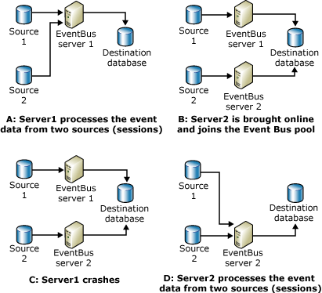

# BAM Event Bus Service Server Failover
The BAM Event Bus service includes fault tolerance logic that enables it to recover and restart from an unexpected failure without losing any data.  
  
 When you enable the BAM Event Bus service on multiple computers, and the service fails, failover logic will detect that a BAM Event Bus service has terminated, and the logic automatically starts a new instance of the BAM Event Bus service on another computer.  
  
 The following figure displays how the BAM Event Bus handles computer or network failures by performing simple load balancing. Two sources and one destination were configured before the BAM Event Bus service starts.  
  
   
How the BAM Event Bus service load balances  
  
 The BAM Event Bus service load balances by performing the following:  
  
-   **A: Server1 processes the event data from 2 sources (sessions)**. Before an instance of the BAM Event Bus service is created on Server2, a BAM Event Bus orchestration instance is created on Server1. The server finds that there are no other servers available, and therefore picks up both sessions for Src1 and Src2.  
  
-   **B: Server2 is brought online and joins the BAM Event Bus pool**. After an instance of the BAM Event Bus service is created on Server2, Server1 drops one BAM Event Bus service session and Server2 picks it up.  
  
-   **C: Server1 fails**. Server1 fails after Server2 joins the BAM Event Bus pool.  
  
-   **D: Server2 processes the event data from 2 sources (sessions)**. Server2 picks up both sessions for Src1 and Src2.  
  
## See Also  
 [Managing the BAM Event Bus Service](../core/managing-the-bam-event-bus-service.md)   
 [BAM Security Recommendations](../core/bam-security-recommendations.md)   
 [Business Activity Monitoring (BAM)](../core/business-activity-monitoring-bam.md)