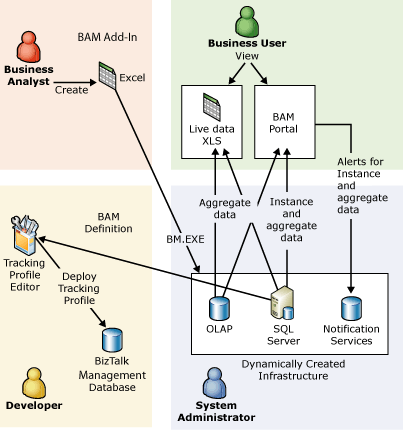

# BAM Workflow
The following figure shows the four user roles who work with Business Activity Monitoring, and the tools that they use.  
  
   
BAM Roles  
  
 The following steps provide a high-level overview of the workflow for using Business Activity Monitoring.  
  
## Specifying the business data to collect  
 Business data is collected in the following manner:  
  
-   The business analyst uses the BAM Activity Wizard to specify what data to collect for all business users.  
  
-   The business analyst uses the BAM View Wizard to define the view for each category of business user.  
  
-   When finished, he saves the activities and views in a Microsoft® Excel Workbook called the BAM Definition Workbook.  
  
-   The business analyst exports the BAM Definition Workbook to XML.  
  
-   The system administrator and developer use the XML to perform their roles.  
  
-   Instructions for using the BAM Definition Workbook are located in [Defining Business Activities and Views in Excel](../core/defining-business-activities-and-views-in-excel.md).  
  
## Managing the BAM Infrastructure  
 After the business analyst has defined the BAM view he wants, the system administrator uses the BAM management utility (BM.EXE), a command-line tool, to deploy the BAM infrastructure from the BAM Definition Workbook or the XML exported from the workbook.  
  
 The BAM management utility dynamically creates the tables, triggers, DTS packages, and OLAP cubes necessary to support the BAM view.  
  
 Each time the business analyst defines a different BAM view, or changes an existing BAM view, the system administrator must redeploy the BAM Definition Workbook.  
  
## Mapping the XML to an orchestration  
 After the business analyst exports the BAM Definition Workbook to XML, the developer imports the XML file into the Tracking Profile Editor. The developer implements the business analyst's information requirements, mapping the XML to an orchestration.  
  
 Using the Tracking Profile Editor, the developer performs the following steps to map the XML to an orchestration:  
  
- Loads the deployed assembly that is stored in the BizTalk Management database (also known as the Configuration database). The deployed assembly contains one or more orchestrations corresponding to the requirements that the business analyst specified in Step 1 above.  
  
- Defines the data to be extracted from an orchestration. You do this by dropping items from the message schemas and orchestration shapes into the appropriate business milestone (event) and data item folders.  
  
- When he is finished, he saves the profile as a BizTalk® Server tracking (.btt) file, to a storage database such as Visual SourceSafe.  
  
  The developer deploys the .btt file to a testing database, and verifies the result through integration testing.  
  
## Deploying the Tracking Profile  
 Using the Tracking Profile Editor, the system administrator deploys the profile to one or more BizTalk Management databases.  
  
 Each time the developer changes the orchestration, or the requirements of the business users change and they want to track more data, the system administrator needs to redeploy the tracking profile using the bttdeploy.exe command line utility.  
  
## Viewing the business data  
 The business user uses the _LiveData workbook, which is produced by the BM.exe utility. Each time the business user opens the _LiveData workbook, he receives a new live version of the data that is collected to monitor a specific aspect of the business process.  
  
-   To view data that is defined as real-time aggregation, the business user just needs to click **Refresh** in the workbook to view the data.  
  
-   If the aggregation data is not real-time, the business user views a snapshot of the business data that is taken at the time that the scheduled DTS package runs.  
  
-   If your organization has collaboration requirements, the business user can access the live data from the BAS Web site.  
  
## See Also  
 [Defining Business Activities and Views in Excel](../core/defining-business-activities-and-views-in-excel.md)   
 [Monitoring Business Activities with BAM](../core/monitoring-business-activities-with-bam.md)