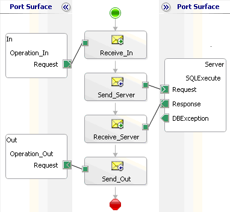

# Basic Orchestration Design
When you create a basic orchestration, you receive XML into the receive port of your orchestration. The XML is sent to the back-end system to be processed. In the back-end system, an exception could occur that could stop the orchestration and generate a fault. The exception that is produced, provides information that the orchestration did not complete.  
  
   
Exception handling  
  
 When a fault occurs, the call is suspended. In the Event Viewer log, you can view the fault and the reason for the failure.  
  
 To prevent the orchestration from entering a suspended state and to redirect the fault, you can create a CatchExpression. To trap the exception generated by the back-end system, and to assist in locating the cause of the problem, you can use the **Scope** shape in your orchestration.  
  
   
Exception handling total  
  
## See Also  
 [Using BizTalk Server Exception Handling](../core/using-biztalk-server-exception-handling1.md)