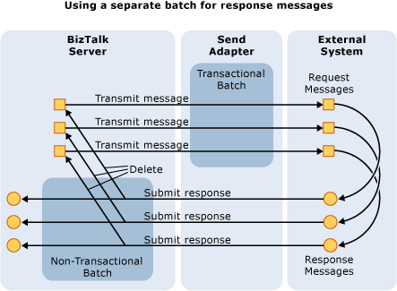
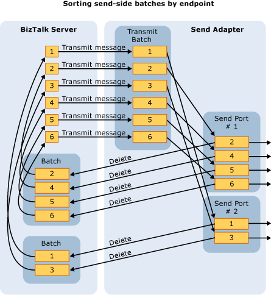

# Batching Messages for Send Processing
## Send Adapter Batch Management  
 When using transactions on the send side, the same transaction created by BizTalk Server and used for sending to the target system is used for the corresponding message deletion once it has been sent successfully. If anything fails, the transaction can be ended, in which case the deletion is aborted, and the data remains in BizTalk Server and not in the target system. This prevents duplication of messages. Transactions are only supported for asynchronous send adapters. You should not use transactions with synchronous send adapters.  
  
 But the adapter cannot just end the transaction; it must also handle correctly the state of the messages it was given. Specifically, the adapter should call the methods **Resubmit**, **MoveToNextTransport**, and **MoveToSuspendQ** appropriately depending upon the retry count and whether a backup transport is available.  
  
 It is important to place the **Delete** and **SubmitResponse** operations together in a batch that uses the same transaction. Failure is handled by ending the transaction (to ensure that data is only submitted once to an external system). But you still want to resubmit or call **MoveToNextTransport** for the message back on BizTalk Server. To do this, use a separate normal (non-transactional) batch for these types of operations.  
  
 The following figure shows the use of separate batches for response messages.  
  
   
  
## Sorting the Send-Side Transactional Batches by Endpoint  
 Batches of messages sent by BizTalk Server to the adapter can span multiple send ports (or endpoints). Because the adapter typically wants to have a transaction to a single endpoint, the adapter must sort the messages based on send port (**SPName** or **OutboundTransportLocation**). By doing this, the adapter can create a transaction that spans only a particular send port.  
  
 For example, when an FTP send adapter receives a batch of messages from BizTalk Server, it gets a mixed batch of messages for all the currently active FTP send ports. This happens because the API is singleton based, meaning that only a single FTP adapter is loaded, not one per send port.  
  
 The adapter must first sort the batch of messages it was given by BizTalk Server into separate batches, one for each endpoint. Then it can deal with each endpoint in turn and will probably construct delete batches for each endpoint. The BaseAdapter generic reusable classes in the SDK sample code work in the same way.  
  
## Sorting for Dynamic Send  
 A BizTalk Server orchestration can send a message to a port that has not been configured as long as it provides sufficient configuration details in the message header and in the URL itself. BizTalk Server must recognize the protocol of the URL.  
  
 When sorting messages, you should take care to establish what defines an endpoint. This is especially true in the case of a dynamic send. If only the URI defines the endpoint, then things are simple. However, in an FTP session the user name logon details might be used by the FTP server to define the true endpoint. In this case, if the adapter logs in as a different account, it may be connected to a different directory.  
  
 In some cases, the true endpoint is not known until you have run the Enterprise Single Sign-On (SSO) command **ValidateAndRedeemTicket**.  
  
 In the case of MQSeries, the determination of whether to use transactions is configurable. Given the architecture and the use of a remote COM+ object, it is best to regard a transactional endpoint as distinct from a non-transactional endpoint.  
  
 To summarize, sorting messages into their single endpoint batches is sometimes a nontrivial task and may involve such extra steps as considering the context values and even the result of a call to SSO.  
  
## Sorting for Static Send  
 If the endpoint is a statically configured endpoint there is a unique GUID on the message context called the static port ID (SPID). This value can be used for sorting the endpoint. The following code can be used to retrieve it:  
  
```  
string spid = (string)message.Context.Read("SPID", "http://schemas.microsoft.com/BizTalk/2003/system-properties");  
```  
  
 This is helpful when you consider the problems introduced by the XML Schema Definition (XSD)-based configuration framework. With this framework, you have a property that might be part of the endpoint key buried inside XML in a single context property. If you have a SPID on the context, you can use that as a way to sort the batch. Otherwise you are doing a dynamic send and you need to construct an alternative key with which to sort the batch.  
  
 The following figure shows message sorting by endpoint.  
  
   
  
 Remember that the retry count of a message is not aware of the success or failure of a batch. On the send side, a batch of messages may fail because a few messages in the batch have failed. The adapter must make a determination for every message that it receives. In the failed batch scenario, you might assume that every message is resubmitted. However, if all the messages in a failing batch are resubmitted, the retry count (which is maintained by the BizTalk Server engine) is incorrectly incremented even for the successful messages because they happen to be in the same batch as the failed messages. In this case, an adapter could reform the outbound batch and retry the successful messages against the external system.