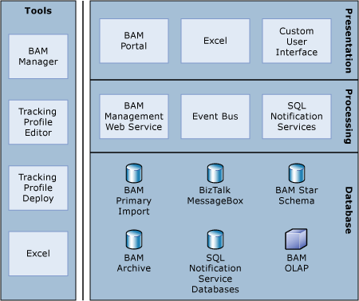
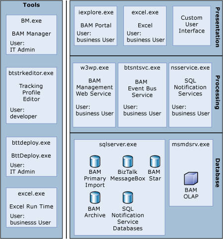
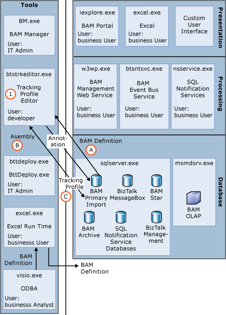
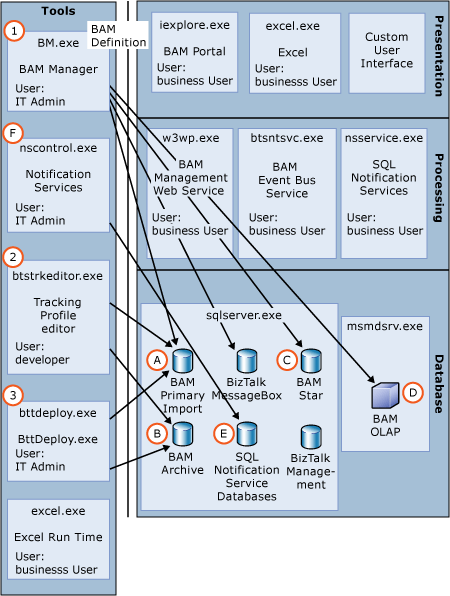
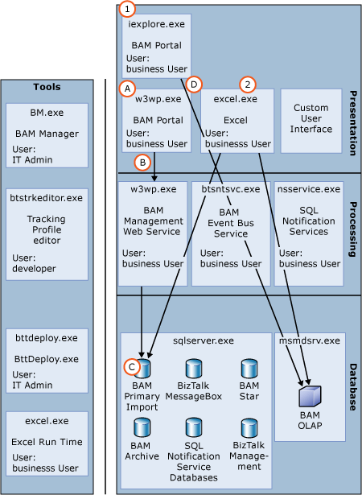
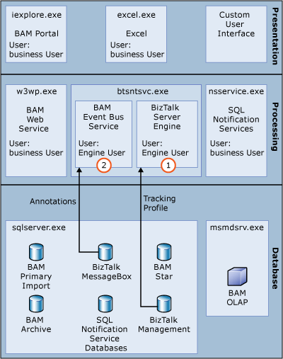
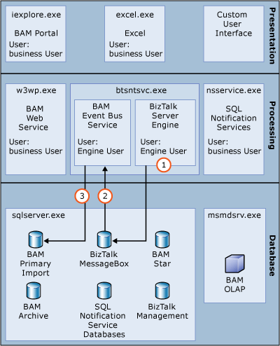
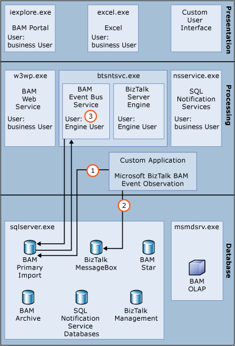

# Business Activity Monitoring (BAM)
The following diagram illustrates the architecture for the Business Activity Monitoring (BAM) feature.  
  
   
  
## Tools  
 You can use the following tools to design, develop, and deploy BizTalk solutions that integrate with BAM.  
  
-   **Microsoft Excel**. The BAM Add-In for Excel provides a user interface that guides business analysts during the creation of Activities and Views. Excel serves as both a design tool for business analysts and a data consumption tool for business users. For more information about the BAM Add-In for Excel, see [Requirements for Using the BAM Add-In for Excel](../core/requirements-for-using-the-bam-add-in-for-excel.md).  
  
-   **BAM Management Utility**. The BAM Management Utility is a deployment tool that allows BAM definitions created in Excel to be deployed into the enterprise. The BAM Management Utility creates the necessary SQL Server databases, Analysis Services cubes, SQL Notification Services databases, and DTS or SSIS tasks (depending on which version of SQL Server is installed). For more information about the BAM Manager, see [BAM Management Utility](../core/bam-management-utility.md).  
  
-   **Tracking Profile Editor**. The Tracking Profile Editor enables BizTalk developers to map the data elements defined by business analysts into the BizTalk implementation including Orchestrations and Messaging. For more information about the Tracking Profile Editor, see [Tracking Profile Editor](../core/tracking-profile-editor.md).  
  
-   **Tracking Profile Deployment Utility**. The Tracking Profile Deployment Utility allows IT professionals to deploy new and updated tracking profiles to the BAM infrastructure. For more information about the Tracking Profile Deploy tool, see [Tracking Profile Deployment Utility](../core/tracking-profile-deployment-utility.md).  
  
## Presentation  
 The presentation layer consists of the following:  
  
- **BAM Portal**. The BAM portal in Microsoft [!INCLUDE[btsBizTalkServerNoVersion](../includes/btsbiztalkservernoversion-md.md)] provides real-time, end-to-end visibility into a business process. It is a Web-based feature that consists of a collection of ASP.NET  pages. You can customize BAM to enhance the performance and experience for your users. For more information about the BAM Portal, see [BAM Portal](../core/bam-portal.md).  
  
- **Microsoft Excel**. The BAM Add-In for Excel provides a user interface that guides business analysts during the creation of Activities and Views. Excel serves as both a design tool for business analysts and a data consumption tool for business users. For more information about the BAM Add-In for Excel, see [Requirements for Using the BAM Add-In for Excel](../core/requirements-for-using-the-bam-add-in-for-excel.md).  
  
- **Custom User Interface**. ISV’s and developers can create custom applications that display BAM data  
  
## Processing  
 The processing layer consists of the following:  
  
- **BAM Management Web Service**. This Web service is used by the BAM Portal application to communicate with the BAM Primary Import Tables (PIT). The communication with the database is done using impersonated credentials stored in the registry which is created during configuration. Methods exposed by this Web service can be used by custom clients to get views and their details, related activities, and pivot table layouts for any user. They can also be used to manage alerts in the database.  
  
- **Event Bus** . The BAM Event Bus Service processes tracking data (streams) stored in a source database and persists that data in a query table format in the destination database.  
  
- **SQL Notification Services**. SQL Notification Services evaluates the Instance and Aggregate BAM alerts that are defined by the business user.  
  
  The following diagram illustrates the underlying physical processes for the BAM architecture.  
  
    
  
## Design time experience  
 The following diagram illustrates the design time experience.  
  
   
  
 The following steps describe the sequence depicted in the illustration above.  
  
1.  The Tracking Profile Editor assumes that BizTalk Server has been configured, that at least one BAM definition has already been deployed (using BM.exe), and that the infrastructure, including the Primary Import Database has been created. The Tracking Profile Editor uses a registry key that is set during BizTalk configuration to determine where the Management database is located.  
  
    1.  BAM enumerates the activities within the Primary Import Database once it is discovered. BizTalk developers select the deployed activities which get pulled from the BAM Primary Import database.  
  
    2.  The BizTalk developer maps this to a physical implementation by browsing the deployed assemblies retrieved from the BizTalk Management database.  
  
    3.  Once the developer has visually mapped this to the BizTalk artifacts, metadata is submitted to the BizTalk Server runtime to collect and store the data. This is done via annotations (for messaging information used to decode the collected data) and the tracking profile (used to retrieve the runtime data).  
  
2.  Microsoft Excel is used as both a design time tool and a data consumption or presentation tool. The design time Excel experience allows users to construct a BAM definition by creating BAM Activities and Views. It also allows for the creation of the pivot controls and graphs that are ultimately displayed in the BAM portal.  
  
## Deployment  
 There are two categories of deployment  
  
- Building out the dynamic infrastructure  
  
- Instrumenting the runtime to collect data.  
  
  The following diagram illustrates BAM deployment.  
  
    
  
  The following steps describe the sequence depicted in the illustration above.  
  
1.  The BAM Management Utility is used to build out the dynamic infrastructure. Using the BAM definition or a design time Excel workbook plus the BAM Configuration XML file, the BAM Management Utility builds all the necessary databases and the corresponding DTS or SSIS tasks necessary for the system to operate.  
  
    1.  The BAM Primary Import database and all the supporting stored procedures, triggers, and DTS or SSIS tasks are constructed.  
  
    2.  The BAM Archive database is defined, but not created, until the Archiving DTS or SSIS task is executed.  
  
    3.  The BAM Star Schema database if BAM OLAP Aggregations were defined. You can determine if aggregations have been defined if the **Real Time Aggregation** button in the Excel spreadsheet is disabled or the **CreateOlapCube** is set to **true** in the BAM Definition and the Configuration XML file has a Deployment Unit for **AnalysisDatabase**.  
  
    4.  The BAM Definition and Configuration XML have to have an Aggregation defined that is not an RTA in order for a BAM OLAP cube to be created.  
  
    5.  Exploded view of the BAM Manager process shows that the Notification Services process (nscontrol.exe) is called to create the SQL NS databases.  
  
2.  The Tracking Profile Editor UI has a deployment command which instruments the runtime to track and decode data from the runtime systems. In this case it pushes **annotations** into the BAM Primary Import database (if data is pulled from the messaging system). A tracking profile is inserted into the BizTalk Management database which is used by the BizTalk Runtime to determine what data to publish to the BAM system.  
  
3.  The BizTalk Tracking Deployment command line tool allows Tracking Profiles to be published to the BAM Primary Import database and Management database, which is similar to what the Tracking Profile Editor does; however the command line tool does not allow mapping capabilities.  
  
## Data Consumption  
 Data consumption refers to the process in which a business user consumes the information that the BAM infrastructure has collected. It is assumed at this point, that the BAM definition has been created (defining what data to collect and how to view it), that the BAM definition has been deployed (dynamically creating the infrastructure), and that the BAM definition has been mapped to the physical implementation (defining where to collect the data, and in some cases writing code to push into the system).  
  
 The following diagram illustrates the process of data consumption.  
  
   
  
 The following steps describe the sequence depicted in the illustration above.  
  
1.  The BAM portal is split out into two processes, Internet Explorer and the BAM Web portal process hosted in Internet Information Services.  
  
    1.  Internet Explorer uses the security context of the business user connecting to the BAM Portal Web site. The BAM Portal Web site is an ASPX application that uses the BAM Management Web Service to collect information.  
  
    2.  The BAM Portal calls the BAM Management Web Service to retrieve information such as what BAM Activities/Views the particular business user can see. It is critical that the BAM Management Web Service is able to impersonate the business user, therefore, the typical deployment is the BAM Portal and the Web Service are hosted on the same machine  
  
        > [!NOTE]
        >  If your enterprise supports Kerberos and Active Directory is set up to support delegation, it is possible that the Portal and Web Service can be located on different machines.  
  
    3.  The Web Service calls stored procedures in the BAM Primary Import to perform security checks, retrieve metadata, and retrieve information about BAM Real Time Aggregations.  
  
        > [!NOTE]
        >  Currently the BAM Portal uses an undocumented Web Service called the **Query Web Service**. This is not supported and will most likely be deprecated in the next release.  
  
    4.  Internet Explorer hosts the Office Web Controls (OWC) which makes direct connections to the BAM Analysis Services cubes.  
  
2.  Excel  
  
## Runtime  
 After the BAM Definition has been defined, the infrastructure has been built out, and the developer has instrumented the necessary systems to enable visibility, data can begin flowing through the system.  
  
### Data Insertion  
 One of the primary ways data flows into the BAM system is via the BizTalk Service (BTSNTSvc.exe). The BizTalk Service is architected such that it can contain logical subsystems.  
  
 The following diagram illustrates this process.  
  
   
  
 The following steps describe the sequence depicted in the illustration above.  
  
1.  One subsystem hosts the BizTalk Server engine itself. The engine is responsible for executing orchestrations and messaging.  
  
2.  Another subsystem is the Event Bus Service. The Event Bus Service is responsible for writing Buffered Event Stream data into the BAM Primary Import database.  
  
### Booting the runtime  
 When the BizTalk Service starts, each subsystem loads metadata that is necessary for the subsystems to operate.  
  
 The following diagram illustrates this process.  
  
   
  
 The following steps describe the sequence depicted in the illustration above.  
  
1.  When the BizTalk Engine is executing (either orchestrations or messaging), it calls into interceptors which regulate the data flow from the engine into BAM. When the engine calls the interceptor, the interceptor analyzes where the engine is at in relation to the order of execution for the orchestration or messaging artifacts. If there is data that needs to be retrieved from the location where the engine is currently executing, the interceptor gathers the appropriate data. The metadata that determines where the data needs to be captured and what data needs to be captured is housed in the Tracking Profile. During booting of the BizTalk Service, the engine’s interceptors will contact the BizTalk Management database to pull the appropriate Tracking Profile for the artifacts being executed.  
  
2.  The Event Bus Service's primary function is to convert data blobs (written by the BizTalk Engine) into usable data items and insert the data into the BAM Primary Import database. The messaging interceptor writes the raw data in a compressed form. This is done to avoid a large memory working set. In order for the Event Bus Service to convert messaging data into usable data items, it must first load metadata that can interpret the raw data. This metadata is known as **annotations**. The annotation metadata was put there via the Tracking Profile Editor or the command line Tracking Profile Deploy tool. If the solution deployed does not retrieve data from messaging there will not be any annotations. Orchestration interceptors encode enough information in the raw form for the Event Bus Service to properly decode without having additional annotations.  
  
### Storing data  
 This section discusses how data is captured from the BizTalk Service.  
  
 The following diagram illustrates this process.  
  
   
  
 The following steps describe the sequence depicted in the illustration above.  
  
1.  The BizTalk engine, as described earlier, has interceptors that are called during runtime execution of orchestrations and messaging solutions. Based on the Tracking Profile information, the interceptors will determine what data to capture and then send it to the BizTalk MessageBox in a binary form. There is a TrackingData table which holds serialized blob data captured during runtime. During the processing, there are times when the engine needs to store data that it holds in memory during execution. These are known as persistence points, and the engine decides when these points occur. When a persistence point happens, the data that was captured from the interceptors is also flushed and persisted within the same transaction. This ensures the consistency of the data in the engine and ultimately what BAM can see. If a failure occurs and the transaction is rolled back, the associated BAM data will also be rolled back.  
  
2.  The Event Bus service is housed in the same executable process as the engine. The service feeds off of data in the TrackingData table stored by the BTS Engine (or any BufferedEventStream data source). The picture depicts an assembly – Microsoft.BizTalk.Bam.EventObservation. This assembly does not expose a method of retrieving the data from the BufferedEventStream. This code is housed in the Event Bus Service itself. The data is retrieved and then prepared to be stored in the Primary Import database. For the most part, the binary data are serialized .NET objects which are rehydrated after which properties are moved from the object to formatted SQL statements.  
  
3.  When storage of the data occurs, the Event Bus service attempts a large batch. The batch contains calls to stored procedures that were generated by the Bam Manager deployment tool. Due to high database activity or other table locking circumstances, the batch storage could fail. In the event of a failure, the batch is tried a couple more times. If the retries fail, the batch is broken up into smaller batches and retried. If this fails, the batch is moved to the FailedTracking table.  
  
### Custom data insertion  
 The previous section demonstrated the details of how BAM retrieves data from the BizTalk Server host using a variety of different methods. Indirectly using the Tracking Profile Editor to create a profile, and more directly using the Event Stream methods directly within code. However, not all data relevant to BAM is necessarily available in BizTalk. Therefore there is an assembly available to custom written applications.  
  
 The following diagram illustrates this process.  
  
   
  
 The following steps describe the sequence depicted in the illustration above.  
  
1.  The custom application must be able to load the [Microsoft.BizTalk.Bam.EventObservation](http://msdn.microsoft.com/library/microsoft.biztalk.bam.eventobservation.aspx) assembly to access the BAM methods of inserting data into a BAM Activity. There are two primary classes that are exposed, DirectEventStream and BufferedEventStream. In the illustration above, the DirectEventStream class is highlighted. This class writes directly to the Primary Import database. This is the most common method of writing data into a BAM activity.  
  
2.  Similar to the method in which BizTalk stores data, the BufferedEventStream class writes binary blobs into an indirect database. In this case, the BizTalk MessageBox is used as the intermediate store. Which class you choose depends on several things; however performance is a primary concern. The BufferedEventStream class will batch data and sustain higher throughput. The drawback is that the data is not written immediately.  
  
3.  As with the BizTalk method of inserting data, the Event Bus Service will process the binary data, decode it, and ultimately store it within the BAM Primary Import database. This is only required for data written via the BufferedEventStream class.  
  
## Distributed Navigation  
 The BAM portal distributed navigation feature allows users to see activity relationships across remote boundaries.  
  
## See Also  
 [Management and Tracking Architecture](../core/management-and-tracking-architecture.md)