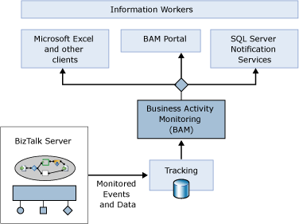
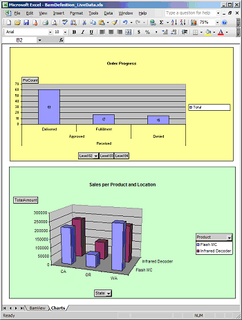

# Business Activity Monitoring
Information workers need flexibility in looking at and evaluating business processes. A purchasing manager might need to see how many POs are approved and denied each day, for example, while a sales manager might want an hourly update on what products are being ordered. Meeting these diverse needs requires a general framework for tracking what’s going on with a particular business process. This is exactly what the Business Activity Monitoring (BAM) component in Microsoft [!INCLUDE[btsBizTalkServerNoVersion](../includes/btsbiztalkservernoversion-md.md)] provides.  
  
   
  
 As the figure above illustrates, the BAM component allows monitoring of events and data produced by a BizTalk application. This information is made accessible using SOAP-callable Web services, and it can be accessed in several different ways, as follows:  
  
- Through Microsoft Excel or other desktop clients, such as a custom dashboard application.  
  
- Using a BAM portal, a component in BizTalk Server that enables business users to examine and configure BAM information. Using the BAM portal, an information worker can select a particular instance of some business process, and then choose a specific BAM view into the process. Each of these views provides a different perspective, such as graphical depictions of per-product sales trends or current inventory levels, or other key performance indicators. The information in these views might be updated every day, every hour, or more frequently. Using the BAM portal, an information worker can also define aggregations of data, such as the number of orders filled, canceled, or in progress over the last hour. Implemented as a set of ASP.NET pages, the BAM portal can also be hosted as a Web part inside Windows SharePoint Services.  
  
- Through SQL Server Notification Services, allowing BAM information to be delivered as notifications. While the first two options allow information workers to examine BAM information, this third option creates a notification when something interesting happens. Using the BAM portal’s alert manager, an information worker can define alerts that will be sent when a specified event occurs. For example, a BAM user might choose to send an e-mail to a particular manager whenever the number of canceled orders in a day exceeds ten, or perhaps inform certain sales associates any time an order arrives from their largest customer.  
  
  Under the covers, each BAM view relies on one or more BAM activities. A BAM activity represents a specific business process, such as handling purchase orders or shipping a product, and each one has a defined set of milestones and business data. For example, a purchase order activity might have milestones such as Approved, Denied, and Delivered along with business data like Customer Name and Product.  
  
  For information workers accessing BAM through Excel, BAM activities and BAM views can be created using an Excel add-in. The BAM Activity Wizard for this add-in allows the defining activities, while the BAM View Wizard allows the defining of views based on those activities. In fact, the BAM View Wizard really just helps an information worker build a standard Excel PivotTable using the information in one or more BAM activities. The information that this view provides can then be shown directly in Excel, as the figure below illustrates.  
  
    
  
  In this simple example, two Excel charts display information about order progress and sales. A BAM view can be more complex, and its creator can specify which users are allowed to see the data it exposes. Maybe a purchasing manager can access certain things in a view into the purchase order process, for instance, that are hidden from purchasing clerks.  
  
  While information workers can create BAM views and BAM activities on their own, these views and activities depend on information provided by the orchestrations they monitor. Accordingly, developers still have a role to play. Using a tool called the Tracking Profile Editor (TPE), a developer must configure an orchestration so that it provides the information required for a particular BAM activity, and thus for the BAM views that depend on this activity. This tool allows a developer to graphically associate the appropriate events and message fields in an orchestration with corresponding milestones and business data in a BAM activity. The [!INCLUDE[btsBizTalkServerNoVersion](../includes/btsbiztalkservernoversion-md.md)] engine then sends these events and message field values to the Tracking database, as shown in the earlier figure, where they can be accessed by the BAM component. While developers must play their part, BAM activities and BAM views aren’t their concern. These business-oriented services are created, maintained, and used solely by information workers.  
  
  In [!INCLUDE[btsBizTalkServerNoVersion](../includes/btsbiztalkservernoversion-md.md)], the TPE can also be used to specify how pipelines generate events. More important, BAM can now accept and display events generated by any user code, whether or not it is built as an orchestration. Any application built using the .NET Framework can potentially be monitored using the BAM component of [!INCLUDE[btsBizTalkServerNoVersion](../includes/btsbiztalkservernoversion-md.md)].  
  
## See Also  
 [Information Worker Technologies](../core/information-worker-technologies.md)