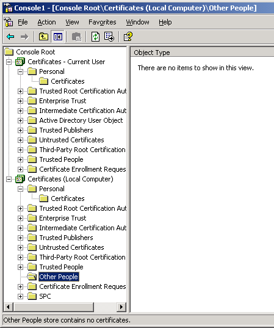
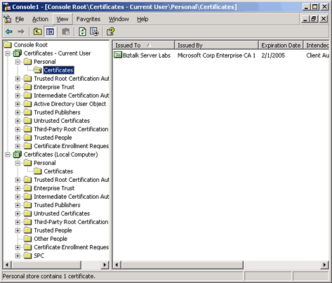

# Certificate Stores that BizTalk Server Uses
BizTalk Server uses two types of certificate stores, the Other People certificate store for public keys, and the Personal certificate store for each host instance service account for the private key.  
  
 **Other People certificate store.** Public key certificates, as their name implies, are public and accessible by anyone with access to the computer on which they are stored. BizTalk Server uses public key certificates to encrypt messages to specific parties and to verify the digital signatures for incoming messages from specific parties. Windows provides the Other People certificate store to store the public key certificates used on the computer. All users can read and use the certificates in this store, and Windows administrators have permissions to maintain this store.  
  
> [!NOTE]
>  You must save the public key certificates on the Local Machine\Other People certificate store of the local computer where there is a BizTalk Host instance that is used to verify the signature or encrypt messages sent to a remote partner.  
  
 The following figure shows the Other People certificate store that BizTalk Server uses for public key certificates:  
  
   
  
 **Personal certificate store.** BizTalk Server uses private key certificates to decrypt incoming messages and sign outbound messages. Every Windows account enabled to log on interactively on a computer has a personal certificate store by the operating system, which only that account can access. BizTalk Server uses the personal certificate stores for each of the host instances service accounts to access the private key certificates to which each service account has access. Only owners of the certificate store can access and maintain their personal certificate stores. In other words, you must log in into each computer that will host S/MIME decode pipelines as each host service account, and import the decryption certificate to the personal certificate store using the Certificates snap-in.  
  
 The following figure shows the Personal certificate store that BizTalk Server uses for private key certificates:  
  
   
  
> [!IMPORTANT]
>  The private key certificates must be stored in the Current User\Personal certificate store for each host instance service account on each computer that has a BizTalk a running host instance that requires the certificate for decryption or for signing outbound messages.  
  
> [!NOTE]
>  After you have added the certificate with the private key to the personal certificate store of the service accounts that will sign outbound messages, you must also specify this signing certificate in the BizTalk Administration console. For more information, see [How to Configure BizTalk Server for Sending Signed Messages](../core/how-to-configure-biztalk-server-for-sending-signed-messages.md).  
  
> [!NOTE]
>  The personal certificate store is also called the MY certificate store when it is used for programmatic operations, such as scripting the importing and exporting of certificates.  
  
 The following table describes the certificates that you must install in each Windows certificate store.  
  
### Table 1 Certificates for each Windows certificate store  
  
|**Certificate purpose**|**Certificate type**|**Certificate store**|  
|-----------------------------|--------------------------|---------------------------|  
|Signing|Own private key|Personal store for each service account of a host instance that has a send pipeline with a MIME/SMIME Encoder pipeline component configured to sign messages (**Add Signing Cert To Message** property set to `True`). For more information, see [How to Configure BizTalk Server for Sending Signed Messages](../core/how-to-configure-biztalk-server-for-sending-signed-messages.md)|  
|Verifying signature|Partner's public key|Other People store on each computer that has a host instance that has a receive pipeline with a MIME/SMIME Decoder pipeline component. For more information, see [How to Configure BizTalk Server for Receiving Signed Messages](../core/how-to-configure-biztalk-server-for-receiving-signed-messages.md).|  
|Decrypting|Own private key|Personal store for each service account of a host instance that has a receive pipeline with a MIME/SMIME Decoder pipeline component. For more information, see [How to Configure BizTalk Server for Receiving Encrypted Messages](../core/how-to-configure-biztalk-server-for-receiving-encrypted-messages.md).|  
|Encrypting|Partner's public key|Other People store on each computer that has a host instance that has a send pipeline with a MIME/SMIME Encoder pipeline component configured to encrypt messages (**Enable encryption** property set to `True)`. For more information, see [How to Configure BizTalk Server for Sending Encrypted Messages](../core/how-to-configure-biztalk-server-for-sending-encrypted-messages.md).|  
|Party resolution|Partner's public key|Other People store on the administration computer from which you are configuring party resolution. For more information, see [Using Certificates for Party Resolution](../core/using-certificates-for-party-resolution.md).|  
  
 The following figure shows what certificates you will need in each certificate store on a BizTalk Server dedicated to receiving messages.  
  
   
  
 The following figure shows what certificates you will need in each certificate store on a BizTalk Server dedicated to sending messages.  
  
   
  
 For more information about the Certificate stores and the Certificate snap-in for the Microsoft Management Console (MMC), search for "Certificate console" on the Windows Help.  
  
## See Also  
 [Certificates that BizTalk Server Uses for Signed Messages](../core/certificates-that-biztalk-server-uses-for-signed-messages.md)   
 [Certificates that BizTalk Server Uses for Encrypted Messages](../core/certificates-that-biztalk-server-uses-for-encrypted-messages.md)   
 [Encryption and Signing Certificates](../core/encryption-and-signing-certificates.md)   
 [Implementing Message Security](../core/implementing-message-security.md)
