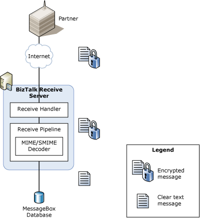
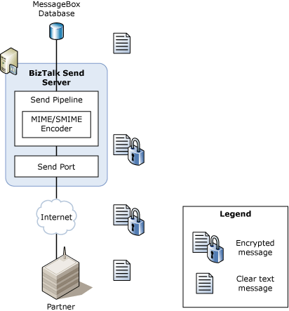

# Certificates that BizTalk Server Uses for Encrypted Messages
[!INCLUDE[btsBizTalkServerNoVersion](../includes/btsbiztalkservernoversion-md.md)] supports public key encryption of outbound messages and decryption of inbound messages based on Secure Multipurpose Internet Mail Extensions (S/MIME). BizTalk Server uses S/MIME version 3 for encryption of outbound messages, and S/MIME versions 2 and 3 for decryption of inbound messages.  
  
- BizTalk Server supports RSA and Diffie Hellman encryption certificates.  
  
- BizTalk Server supports Data Encryption Standard (DES), 3DES, and RC2 encryption algorithms.  
  
  The following figure shows the message flow when BizTalk Server receives an encrypted message.  
  
    
  
  The message flow when BizTalk Server receives an encrypted message is as follows:  
  
1. A partner sends a message to BizTalk Server. The partner encrypts the message with the BizTalk Server public key.  
  
2. The appropriate BizTalk Server receive handler receives the message.  
  
3. During the receive pipeline execution, the MIME/SMIME Decoder pipeline component decrypts the message by using the BizTalk Server private key.  
  
   > [!NOTE]
   >  For pipeline decryption to succeed on an IIS 7.0 computer, ensure that the account for the IIS application pool and the account used by the host instance associated with the receive handler are the same and that this account is a member of the \<machineName\>\IIS_WPG group. For more information on setting IIS process identity for IIS 7.0 see [Guidelines for Resolving IIS Permissions Problems](../core/guidelines-for-resolving-iis-permissions-problems.md). These processes must run under the same account to ensure that the account profile is loaded which in turns loads the registry keys required to perform decryption in the pipeline. For performance reasons, IIS 7.0 does not load the account profile when starting the associated w3wp.exe process so the BizTalk host instance must be configured with the same account so that BizTalk will load the account profile and registry keys.  
  
4. Additional processing occurs.  
  
   The following figure shows the message flow when BizTalk Server sends an encrypted message.  
  
     
  
   The message flow when BizTalk Server sends an encrypted message to a partner is as follows:  
  
5. The appropriate BizTalk Server send handler sends a message to the partner.  
  
6. During the send pipeline execution, the MIME/SMIME Encoder pipeline component encrypts the message by using the partner's public key.  
  
7. The partner receives the message from BizTalk Server. The partner uses its private key to decrypt the message.  
  
## See Also  
 [Certificates that BizTalk Server Uses for Signed Messages](../core/certificates-that-biztalk-server-uses-for-signed-messages.md)   
 [Certificate Stores that BizTalk Server Uses](../core/certificate-stores-that-biztalk-server-uses.md)   
 [Encryption and Signing Certificates](../core/encryption-and-signing-certificates.md)   
 [Sending and Receiving Encrypted Messages](../core/sending-and-receiving-encrypted-messages.md)