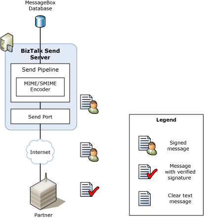

# Certificates that BizTalk Server Uses for Signed Messages
BizTalk Server supports signing outbound messages and signature verification for inbound Secure Multipurpose Internet Mail Extensions (S/MIME) messages. BizTalk Server uses S/MIME versions 2 and 3 to sign outbound messages and to validate the signature of inbound messages. Similarly, you can configure BizTalk Server to sign and then encrypt the messages it sends to its partners.  
  
- BizTalk Server supports the SHA-1 and MD5 signing algorithms for verifying digital signatures. BizTalk Server uses the SHA-1 signing algorithm to sign outbound messages.  
  
- The key exchange systems supported by BizTalk Server for signature keys are the Rivest-Shamir-Adleman (RSA) algorithms and the Digital Signature Standard (DSS). BizTalk Server does not support the Advanced Encryption Standard (AES) exchange system for signature keys.  
  
- The signing certificate supported by BizTalk Server is x.509 version 3.  
  
  The following figure shows the message flow when BizTalk Server receives a digitally signed message and optionally uses the signature to resolve the partner identity to a party in the BizTalk Server environment.  
  
    
  
  The message flow when BizTalk Server receives a digitally signed message is as follows:  
  
1. A partner sends a message to BizTalk Server. The partner signs the message with its private key certificate.  
  
2. The appropriate BizTalk Server receive handler receives the message.  
  
3. During the execution of the receive pipeline, the MIME/SMIME Decoder pipeline component verifies the digital signature by using the partner's public key.  
  
4. If party resolution component is configured, the partner's public key certificate is used to identify the party in the BizTalk Server system during the execution of the receive pipeline party resolution component.  
  
5. Additional processing occurs.  
  
   The following figure shows the message flow when BizTalk Server sends a digitally signed message.  
  
     
  
   The message flow when BizTalk Server sends a digitally signed message to a partner is as follows:  
  
6. The appropriate BizTalk Server send handler sends a message to the partner.  
  
7. During the execution of the send pipeline, the MIME/SMIME Encoder pipeline component signs the message by using the BizTalk Server private key.  
  
8. The partner receives the message from BizTalk Server. The partner uses the BizTalk Server public key to verify the digital signature.  
  
   BizTalk Server verifies the validity of the certificates associated with the incoming signed messages by validating the certification authority (CA) trust chain for the certificate and by verifying that the certificate has not expired. The process of validating the CA trust chain involves traversing the chain of trust on certificates until a root certification authority is reached. This validates that the certificate used to sign a message is indeed from the identified party. This validation occurs at runtime for each and every signed message.  
  
   In addition, BizTalk Server can verify that the certification authority has not revoked the certificate used to sign or encrypt the message. To do this, you must download the certificate revocation list (CRL) from the certification authority and install it using Windows Explorer. For more information about how to validate a certificate, see [How to Configure the MIME-SMIME Decoder Pipeline Component](../core/how-to-configure-the-mime-smime-decoder-pipeline-component.md).  
  
## See Also  
 [Certificates that BizTalk Server Uses for Encrypted Messages](../core/certificates-that-biztalk-server-uses-for-encrypted-messages.md)   
 [Certificate Stores that BizTalk Server Uses](../core/certificate-stores-that-biztalk-server-uses.md)   
 [Encryption and Signing Certificates](../core/encryption-and-signing-certificates.md)   
 [Sending and Receiving Signed Messages](../core/sending-and-receiving-signed-messages.md)