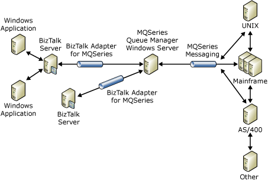

# Components of the MQSeries Adapter
The MQSeries adapter uses two components to facilitate document transfer between [!INCLUDE[btsBizTalkServerNoVersion](../includes/btsbiztalkservernoversion-md.md)] and MQSeries Server for Windows.  
  
- **BizTalk component.** Install this component on the same computer as Microsoft [!INCLUDE[btsBizTalkServerNoVersion](../includes/btsbiztalkservernoversion-md.md)]. This component communicates with BizTalk Server.  
  
- **MQSeries component.** Install this component on the MQSeries Server for Windows. MQSeries Server for Windows runs on [!INCLUDE[btsWinSvr2k8](../includes/btswinsvr2k8-md.md)] or [!INCLUDE[btsWinSvr2k8R2](../includes/btswinsvr2k8r2-md.md)]. This component (referred to as MQSAgent) communicates with IBM MQSeries Server.  
  
  > [!NOTE]
  >  The MQSAgent component of the MQSeries Adapter is supported running against MQSeries Server 5.3, CSD10 or above, and WebSphere MQSeries Server 6.0 on Windows.  
  
  The following figure outlines a typical use of the adapter.  
  
    
  
  The MQSeries adapter is a connectivity solution that lets you use [!INCLUDE[btsBizTalkServerNoVersion](../includes/btsbiztalkservernoversion-md.md)] in an enterprise with MQSeries as the chosen messaging standard. Developing this solution was motivated, in part, by the following issues:  
  
- Accommodating customer requests for simple installation and configuration, and an MQSeries connectivity solution  
  
- Supporting message sizes up to 100 MB  
  
- Providing MQSeries support  
  
- Providing a Plug and Play connectivity solution for MQSeries messages to [!INCLUDE[btsBizTalkServerNoVersion](../includes/btsbiztalkservernoversion-md.md)]  
  
  The MQSeries adapter is a key addition to the [!INCLUDE[btsBizTalkServerNoVersion](../includes/btsbiztalkservernoversion-md.md)] suite of receive services that provide a set of listeners for various communication protocol standards. The listeners attach a protocol, for example HTTP, FTP, or MQSeries, to an enterprise application integration (EAI), business-to-business, or application-to-application integration trading relationship.  
  
## See Also  
 [MQSeries Adapter Architecture](../core/mqseries-adapter-architecture.md)   
 [What Is the MQSeries Adapter?](../core/what-is-the-mqseries-adapter.md)
