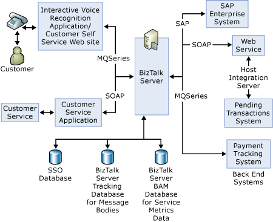

# Components of the Service Oriented Solution
This section describes the major BizTalk Server components of the Service Oriented Solution. The following diagram shows the major components of the solution:  
  
   
  
 The Service Oriented solution has three versions of the orchestrations:  
  
- A version in which all three of the back-end applications are stubbed out  
  
- One in which all three back-end applications are invoked inline  
  
- A version that uses adapters to connect to the applications.  
  
  All versions of the orchestrations appear in the SDK\Senarios\SO\BTSSoln\Orchestrations directory.  
  
  The inline version of the orchestrations provides the lowest latency time within the solution between requests and responses.  
  
  For information about the source files, see [File Inventory for the Service Oriented Solution](../core/file-inventory-for-the-service-oriented-solution.md).  
  
## Orchestrations in the Service Oriented Solution  
 Three orchestrations, **CustomerServiceReceiveSend**, **CustomerServiceNativeRequestResponse**, and **CustomerService** compose the bulk of the solution. The **CustomerServiceReceiveSend** and **CustomerServiceNativeRequestResponse** orchestrations act as front-ends that call the **CustomerService** orchestration. The **CustomerService** orchestration does most of the work—sending requests to the back-end applications, gathering the replies, combining the replies into a single message, and sending the message to the appropriate front-end orchestration. Because the front-end orchestrations call the **CustomerService** orchestration, the front-end orchestrations wait until the **CustomerService** orchestration finishes.  
  
 The solution exposes the **CustomerServiceNativeRequestResponse** orchestration as a Web service. The **CustomerServiceReceiveSend** orchestration takes messages from an MQSeries queue.  
  
## Back-end Applications  
 The Service Oriented solution communicates with three back-end applications:  
  
- The **PaymentTracker** application returns a simulated list of recent payments. **PaymentTracker** reads the request from an MQSeries queue and sends the response to another MQSeries queue.  
  
- The **PendingTransaction** application reports the sum of transactions pending against the customer account. The application is a Web service that, in turn, uses Microsoft Host Integration Server (HIS) to communicate with a CICS/COBOL program on a mainframe computer.  
  
- The SAP application provides information about the customer's overall credit limit. The solution connects to the SAP application as a Web service. The application uses the SAP adapter in [!INCLUDE[adapterpacknoversion](../includes/adapterpacknoversion-md.md)] to communicate with a SAP system.  
  
## Pipelines  
 The Service Oriented solution uses default pipelines except in two places: the receive pipeline for the **CustomerServiceReceiveSend** orchestration, and the **CustomerService** orchestration's send pipeline to the **PaymentTracker**. Both pipelines use custom components.  
  
 The receive pipeline for **CustomerServiceReceiveSend** includes a custom party resolution component, **SSO Ticket Issuer Pipeline Component**. The messages that the **CustomerServiceReceiveSend** orchestration receives do not have credentials. This simulates what would happen if the messages came from an Interactive Voice Response system. The custom pipeline component adds credentials using the service account of the BizTalk receive host.  
  
 In contrast, the messages the **CustomerSericeNativeRequestResponse** orchestration receives already have credentials. Because the virtual folder for the Web service is configured for integrated security and the SOAP receive location is configured to integrate Enterprise Single Sign-On (SSO), the SOAP adapter generates a ticket for the message.  
  
 The other custom pipeline appears in the **CustomerService** send pipeline to the **PaymentTracker** application. The component, MQSeries Header Setter Pipeline Component, sets values for two MQSeries message header properties. The component sets the first, the Message Data Format (**MQMD_Format**), to indicate the message is in the form of an **MQCIH** structure, a structure commonly used to communicate with CICS programs. The second, the format of the data itself within the **MQCIH** structure (**MQCIH_Format**),is set to show the message is a string.  
  
 Using the **MQCIH** format enables you to pass the user ID and password in the **MQCIH** structure. SSO affiliate applications map the BizTalk application's Windows user ID to the Payment Tracking System's user IDs passed in the **MQCIH** structure.  
  
> [!NOTE]
>  The inline version of the solution uses the same pipelines by calling them from the orchestration. This enables re-use of the pipeline code.  
  
## Client Application  
 The solution includes a client application written in C#. You can use the application to send requests as SOAP or MQSeries messages, and examine the results.  
  
## Other Assemblies  
 The application includes several auxiliary assemblies not shown in the summary diagram above. The **Utilities** assembly utility functions for the solution.  
  
 The **ErrorHelper** assembly contains classes to translate error codes into messages, and to convert error messages to error codes.  
  
 The **ServiceLevelTracking** assembly includes helper methods using the Business Activity Monitoring (BAM) API to track service-level agreement data.  
  
 The **ConfigHelper** assembly contains helper methods to retrieve configuration values for the solution from the **SSOConfigStore** application.  
  
## See Also  
 [Developing a Service Oriented Solution](../core/developing-a-service-oriented-solution.md)   
 [File Inventory for the Service Oriented Solution](../core/file-inventory-for-the-service-oriented-solution.md)