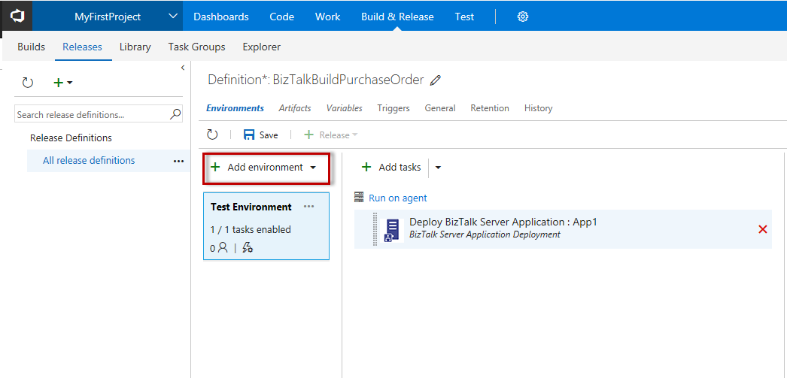
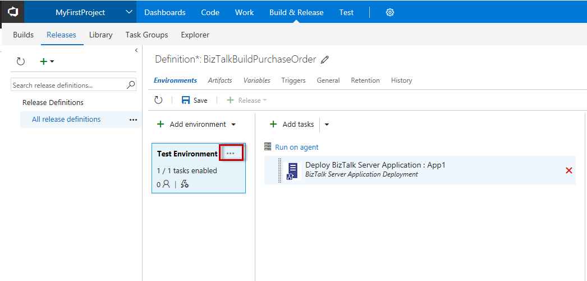

# Configure environmental tokens and variables for automatic deployment
Use Visual Studio Team Services (VSTS) variables in your [!INCLUDE[btsBizTalkServerNoVersion_md](../includes/btsbiztalkservernoversion-md.md)] binding files.

## Overview
In a VSTS environment, you can add variables, and set them to a value. For example, you can create a *sendPortPath* variable, and set its value to a physical folder on your [!INCLUDE[btsBizTalkServerNoVersion_md](../includes/btsbiztalkservernoversion-md.md)]. 

Within the [!INCLUDE[btsBizTalkServerNoVersion_md](../includes/btsbiztalkservernoversion-md.md)] application binding file, the configurable variables can be anything within an XML tag, such as the receive location name, host, send port URI, and so on. 

These variables are specific to your VSTS environment, and can be used to deploy the same application to multiple [!INCLUDE[btsBizTalkServerNoVersion_md](../includes/btsbiztalkservernoversion-md.md)] environments. 

In this topic, we show you how add the VSTS variable in your binding file, and how to create the variable within VSTS. 

## Configure the variables in your BizTalk Binding file

The following example is a part of a [!INCLUDE[btsBizTalkServerNoVersion_md](../includes/btsbiztalkservernoversion-md.md)] binding file, and shows how to apply the tokens.

1. Open the application binding file:

	

2. Find the element you want to change:

    
	
3. Remove the populated value, and replace it with you variables: `$(YourValue)`. For example, enter `$(SendPort1)`: 

	

4. When done, save the binding file, and apply it to your JSON build template.
5. Sign in to your Visual Studio Team Service solution, and select **Build and release**.
6. Go to **Release**. Select your **Release definition**, or create a new one.
7. Under **Environments**, select **Add a new environment**, or change to an existing environment: 

	

8. Click the ellipses, and select **configure variables**:

	

9. By adding the variables for each environment, using the token names created in the binding file, you can deploy your applications to multiple environments with different values:

	
	
10. Select **OK** to save the new variables.
11. Once the build is initiated, the values are added from binding file.

## Next step
[Add a BizTalk application to VSTS](../core/add-a-biztalk-server-application-to-visual-studio-team-services.md)