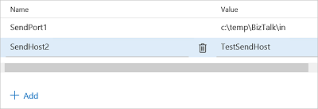

# Configure environmental tokens and variables for automatic deployment
Use Visual Studio Team Services (VSTS) variables in your [!INCLUDE[btsBizTalkServerNoVersion_md](../includes/btsbiztalkservernoversion-md.md)] binding files.

## Overview
In a VSTS environment, you can add variables, and set them to a value. For example, you can create a *sendPortPath* variable, and set its value to a physical folder on your [!INCLUDE[btsBizTalkServerNoVersion_md](../includes/btsbiztalkservernoversion-md.md)]. 

Within the [!INCLUDE[btsBizTalkServerNoVersion_md](../includes/btsbiztalkservernoversion-md.md)] application binding file, the configurable variables can be anything within an XML tag, such as the receive location name, host, send port URI, and so on. 

These variables are specific to your VSTS environment, and can be used to deploy the same application to multiple [!INCLUDE[btsBizTalkServerNoVersion_md](../includes/btsbiztalkservernoversion-md.md)] environments. 

We show you how to add the VSTS variable in your binding file, and how to create the variable within VSTS. 

## Add variables to the binding file

1. Open the application binding file:

	

2. Find the element you want to change:

    
	
3. Remove the populated value, and replace it with you variables: `$(YourValue)`. For example, enter `$(SendPort1)`: 

	

4. When done, save the binding file, and add it to your JSON build template (steps in [Step 1: Add Application project & update .json template](feature-pack-add-application-project.md)).

## Create the variables in VSTS

1. In your VSTS account, select **Build and release**, and select **Releases**.

2. Select your **Release definition**, and select **Variables**:  

    

3. Select **Add**, and create the variable names and values:   

	

4. **Save** your changes. When the deploy is initiated, the values are added from the binding file.

## See also
[Configure automatic deployment with Visual Studio Team Services](configure-automatic-deployment-with-visual-studio-team-services-in-biztalk.md)  
[Configure the feature pack](configure-the-feature-pack.md)