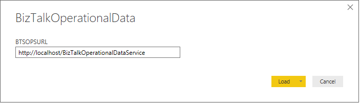

# Configure the operational data feed for Power BI with BizTalk Server
Read operational data provided through an oData feed in [!INCLUDE[btsBizTalkServerNoVersion_md](../includes/btsbiztalkservernoversion-md.md)]. 

**Starting with [!INCLUDE[bts2016_md](../includes/bts2016-md.md)] [!INCLUDE[featurepack1](../includes/featurepack1.md)]**, send tracking to Power BI using the Power BI template provided, or create your own. 

## What is operational data
Operational data is information on the instances and messages flowing through your [!INCLUDE[btsBizTalkServerNoVersion_md](../includes/btsbiztalkservernoversion-md.md)] environment. The operational data feed is the same data you get looking at Group Hub in the [!INCLUDE[btsBizTalkServerAdminConsoleui_md](../includes/btsbiztalkserveradminconsoleui-md.md)] console. The data can be accessed and queried using visualization tools, including Power BI. 

The feed includes the following data tables:
* Application data
* AS2 Status Records
* Batching information
* Instance information
* Interchange Aggregations Records
* Interchange Status Records
* Messages
* Subscriptions
* Tracked Events
* Transaction reports
* Transaction sets

> [!TIP]
> [PowerBI.com](http://powerbi.microsoft.com) is a great resource to understand and learn more about Power BI.

## Prerequisites
* Download and install [Power BI Desktop](https://powerbi.microsoft.com/desktop/) on any computer that has network access to your [!INCLUDE[btsBizTalkServerNoVersion_md](../includes/btsbiztalkservernoversion-md.md)]
* Install [Feature Pack 1](https://www.microsoft.com/download/details.aspx?id=55100) on your [!INCLUDE[btsBizTalkServerNoVersion_md](../includes/btsbiztalkservernoversion-md.md)]
* Install IIS on the [!INCLUDE[btsBizTalkServerNoVersion_md](../includes/btsbiztalkservernoversion-md.md)]. In most [!INCLUDE[btsBizTalkServerNoVersion_md](../includes/btsbiztalkservernoversion-md.md)] environments, IIS is already installed. See [Hardware and Software Requirements for BizTalk Server 2016](../install-and-config-guides/hardware-and-software-requirements-for-biztalk-server-2016.md). 

## Enable operational data feed

1. Run Windows PowerShell as Administrator (**Start** menu, type **PowerShell**, right click, and select **Run as administrator**). 
2. Browse to the folder where [!INCLUDE[bts2016_md](../includes/bts2016-md.md)] is installed **Program Files (x86)/Microsoft BizTalk Server 2016**
3. Run the following command. Be sure to update your `website`, `domain\user`, `password`, and `domain\group` with your values: 

    ```Powershell
    FeaturePack.ConfigureServices.ps1 -Service operationaldata -WebSiteName '<Default Web Site>' -ApplicationPool <operationalDataServiceAppPool> -ApplicationPoolUser <domain>\<user> -ApplicationPoolUserPassword <password> -AuthorizationRoles '<domain>\<group1>, <domain>\<group2>'
    ```
4. After you run the script, browse the new IIS Application:  
    1. Open your web browser
    2. Go to **http://localhost/BizTalkOperationalDataService**

## Use the Power BI template
To access the Power BI Template file, and use the provided visualization from Microsoft, use the following steps:

1. Download and install the [Power BI Desktop](https://powerbi.microsoft.com/desktop/).
2. Browse to your BizTalk Server folder under **Program Files (x86)\Microsoft BizTalk Server 2016\OperationalDataService**.
3. Open the **BizTalkOperationalData.pbit** file.
4. When prompted from Power BI, paste the **http://localhost/\<yourWebSite\>** URL that you created for your OData feed. For example, enter **http://localhost/OperationalDataService**. 

    Your URL looks similar to the following: 
	
    

5. Select **Load** to populate the fields in your Power BI report. 
6. The Template file automatically generates the information and tables available from the OData feed.

The operational data is exposed through the computer, and can be accessed and executed by other applications based on permissions. 

To learn more about Power BI, and how to publish the report online go to [PowerBI.com](http://powerbi.microsoft.com)

## See also

[Learn more about Power BI](https://www.powerbi.com)  
[Configure the Feature Pack](../core/configure-the-feature-pack.md)