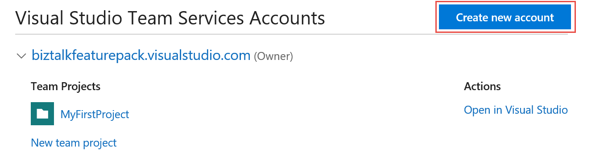
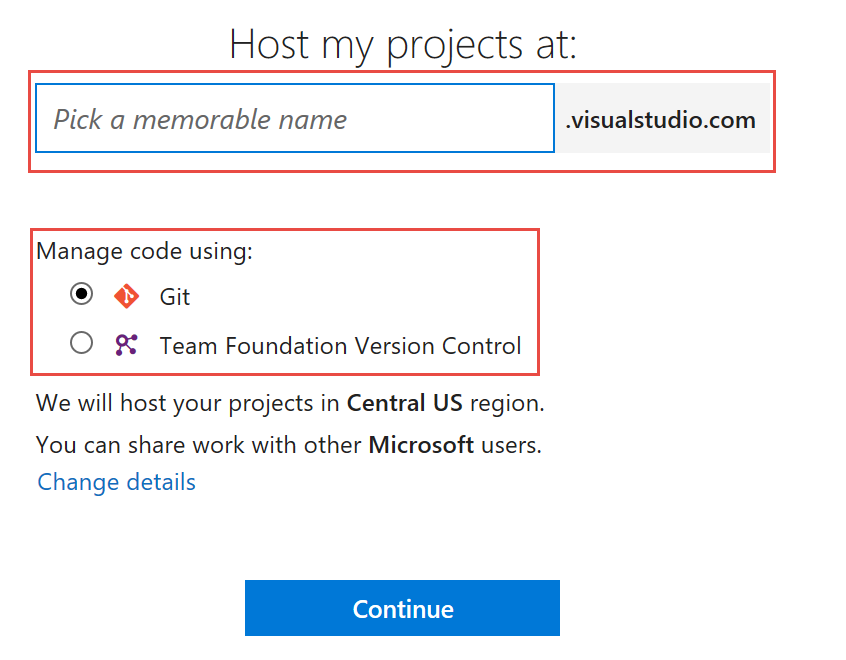
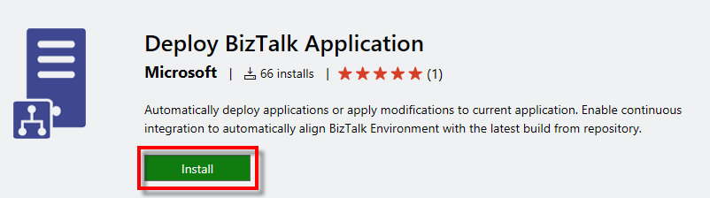
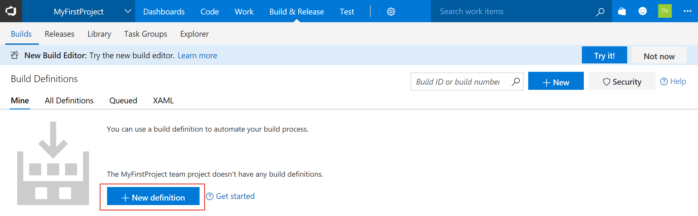
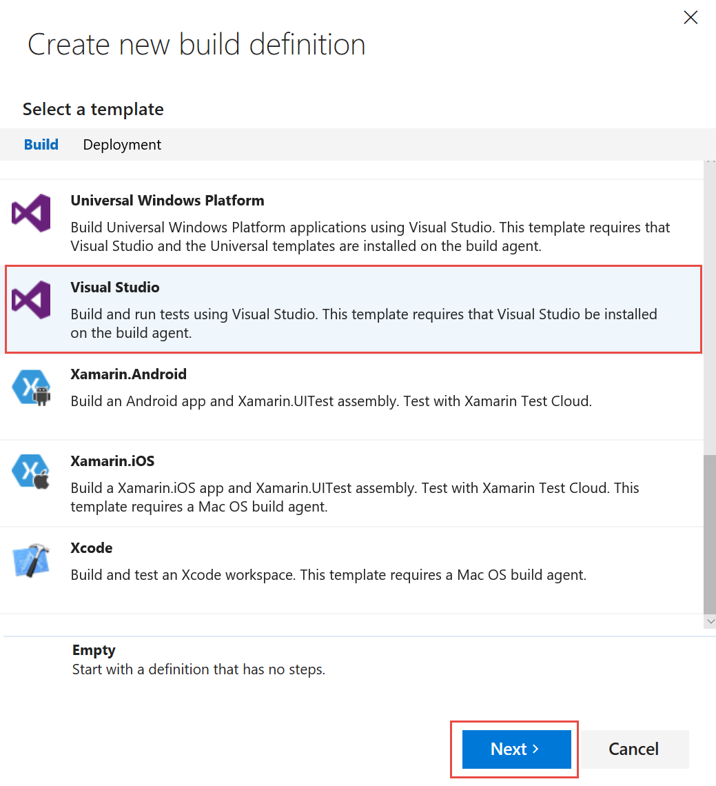
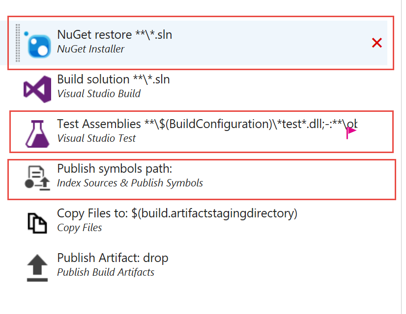
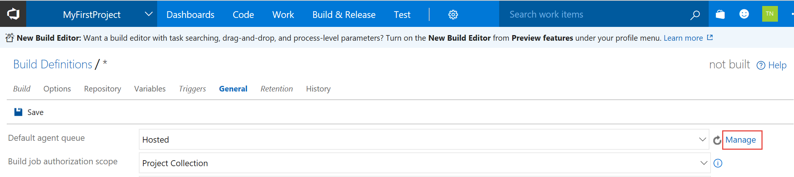
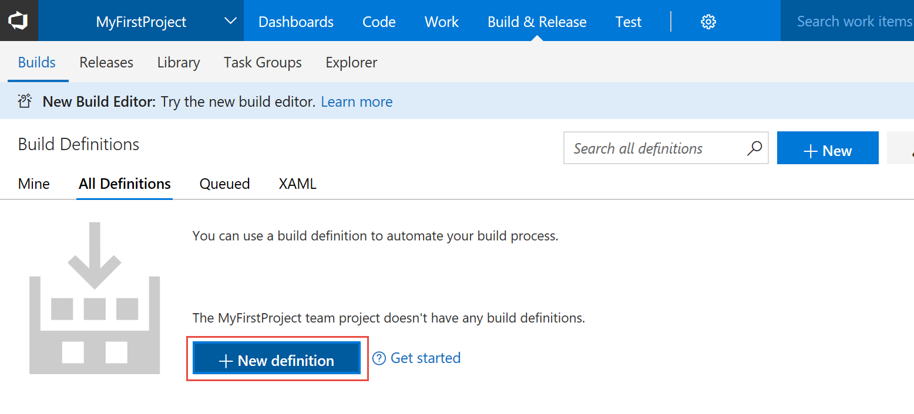
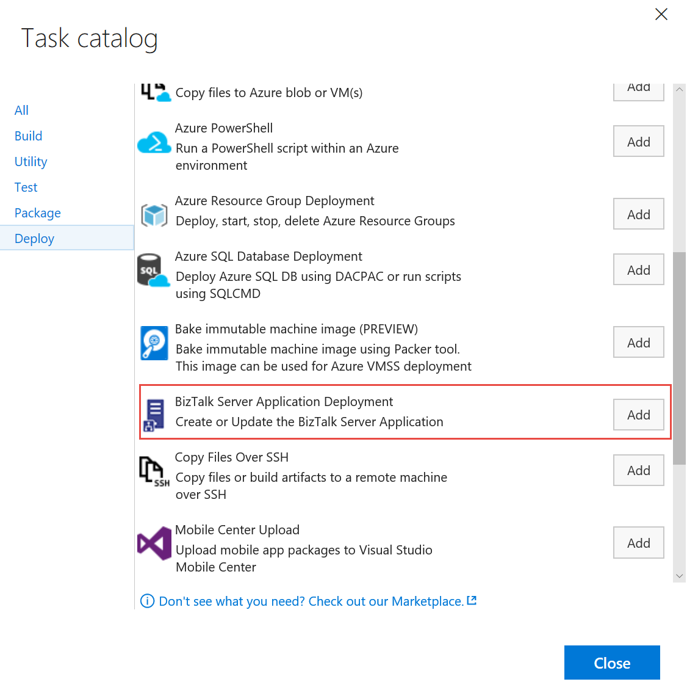
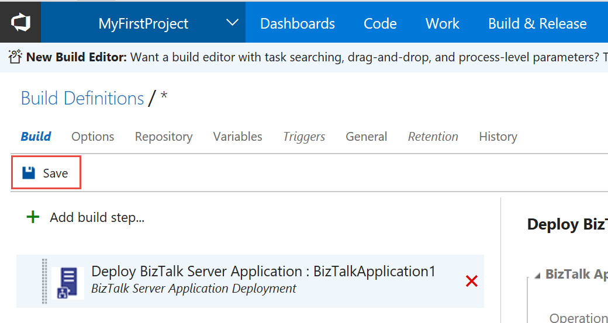

# Configure Visual Studio Team Services to deploy BizTalk Server solutions or projects
Set up VSTS to automatically deploy [!INCLUDE[btsBizTalkServerNoVersion_md](../includes/btsbiztalkservernoversion-md.md)] projects. 

**Starting with [!INCLUDE[bts2016_md](../includes/bts2016-md.md)] [!INCLUDE[featurepack1](../includes/featurepack1.md)]**, you can automatically build your [!INCLUDE[btsBizTalkServerNoVersion_md](../includes/btsbiztalkservernoversion-md.md)] solutions using Visual Studio Team Services (VSTS). 

This topic shows you how to set up and configure Visual Studio Team Service (VSTS) to use automatic deployment for BizTalk. 

> [!IMPORTANT]
> The VSTS agent can only be installed on one [!INCLUDE[btsBizTalkServerNoVersion_md](../includes/btsbiztalkservernoversion-md.md)] in the group. 

## Prerequisites

* Install [Feature Pack 1](https://www.microsoft.com/download/details.aspx?id=55100) on your [!INCLUDE[btsBizTalkServerNoVersion_md](../includes/btsbiztalkservernoversion-md.md)]
* Some experience and knowledge with creating and working with definitions in VSTS. If you're brand new to VSTS, these may be good resources: 

  [Visual Studio Team Services overview](https://www.visualstudio.com/docs/overview)  
  [CI/CD for newbies](https://www.visualstudio.com/docs/build/get-started/ci-cd-part-1)
  

## Create a VSTS account and create a definition

1. In a web browser, go to your [Visual Studio online profile](https://app.vsaex.visualstudio.com/go/profile), sign in, and select a **Create new account**:

    

2. Enter a name for the account, select your preferred source code repository, and select **Continue**:

    

3. Your new account is created, and a site similar to `https://YourAccountName.visualstudio.com/MyFirstProject` opens.
    
4. Install the [Deploy BizTalk Application service](https://marketplace.visualstudio.com/items?itemName=ms-biztalk.deploy-biztalk-application) to the account you just created.

    

5. You may get some prompts. Confirm to continue. Be sure you're signed in to your project in VSTS.

6. Select **Build and release**, and create a **New** build definition:

    

    > [!TIP]
    > Be sure you're at `https://YourAccountName.visualstudio.com/MyFirstProject`. Otherwise, the **New** or **New definition** buttons may not be there. 
    
7. Select the **Visual Studio** template, and select **Next**:

    

8. Review your settings, and select **Create**.

9. Delete the steps you don't need. For this tutorial, you can delete the following: 
10. NuGet Restore
11. Test assemblies
12. Publish symbols path 

      

13. **Optional**. If you want to enable Continous Integration (CI), select **Triggers** in the menu, and check **Continous integration (CI)**.

Next, install the agent on your [!INCLUDE[btsBizTalkServerNoVersion_md](../includes/btsbiztalkservernoversion-md.md)]. 

## Install the Agent

For the solution to work, enable a private Windows Agent on your local machine. Remember, **the agent must be installed on only one [!INCLUDE[btsBizTalkServerNoVersion_md](../includes/btsbiztalkservernoversion-md.md)] in the group**. 

1. In your definition, select the **General** tab (at the top).
2. For the **Default agent queue** property, select the **Default** agent from the list. 
3. Select **Manage** next to the **Default agent queue** property. A new browser tab opens.

    

4. In the left pane, the Default queue is selected. If an agent is already listed, and online, then you're done. You have an agent installed, and running. 

    If an agent is not listed, then select **Download agent**, and continue with the installation on your [!INCLUDE[btsBizTalkServerNoVersion_md](../includes/btsbiztalkservernoversion-md.md)]. **Go to [Deploy an agent on Windows](https://www.visualstudio.com/docs/build/actions/agents/v2-windows) for the complete steps** to install the agent, and start an agent. 

    > [!IMPORTANT]
    > Follow all the steps at [Deploy an agent on Windows](https://www.visualstudio.com/docs/build/actions/agents/v2-windows). Do not skip this step. 

5. With the default agent **Online**, go back to the **General** tab in your definition, and confirm **Default** is selected for the **Default agent queue**.
6. **Save** and **Queue new build**.

Next, create the BizTalk Server Application Deployment definition.

## Create the BizTalk deployment definition

1. Select the **Builds** tab, select **All Definitions**, and select **New**:

    

2. Select the **Empty** template, and select **Next**:

    

3. Select your **Repository** source and **Branch** for the definition.
4. **Optional**. Select **Continous Integration**.
5. Select the **Default** agent from the queue list, and select **Create**.
6. **Add build step**, select the **BizTalk Server Application Deployment** task, and select **Add**. **Close** the task catalog.

    

7. Select the **Operation Name** you want to use:
    * **Create new BizTalk Application** deploys a new application. If the application already exsist, it uninstalls the current applications (full stop), and installs the new application. If continous integration is enabled, it automatically redeploys the application when it is updated in the repository.
    * **Update an exsisting BizTalk Application** appends changes, such as **Schemas** to an already running application. It does not require a full redeploy of the application.
8. Enter the **Application name** in your [!INCLUDE[btsBizTalkServerNoVersion_md](../includes/btsbiztalkservernoversion-md.md)] environment.
9. In **Deployment package path**, select the path to the zip file in your repository.
10. Select **Triggers** from the menu, enable **Continous Integration**, and select the correct **Branch** for the build.
11. Select **Save**:

    

12. Name the new **Definition**, and set the correct path. 
13. Once the definition is saved, select **Queue the new build**. Then, select the **Queue agent**, and add a comment to the commit.
