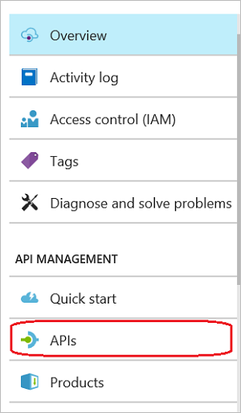
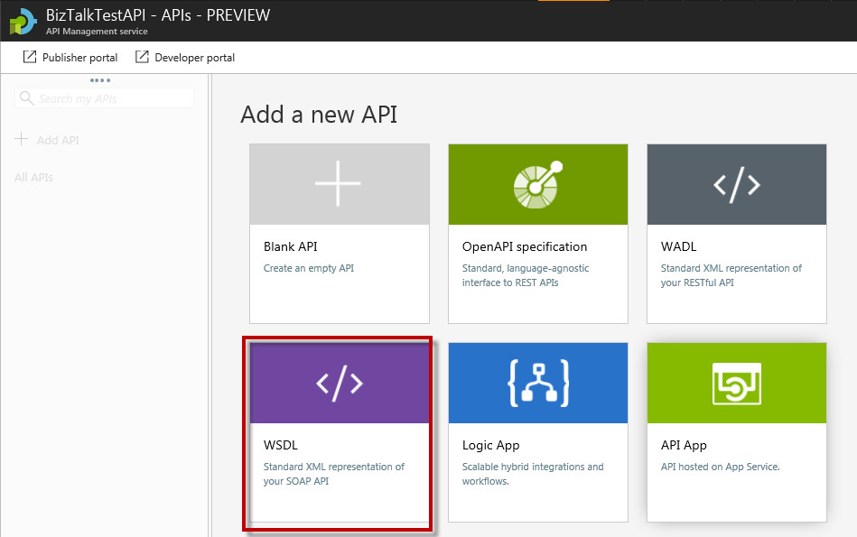
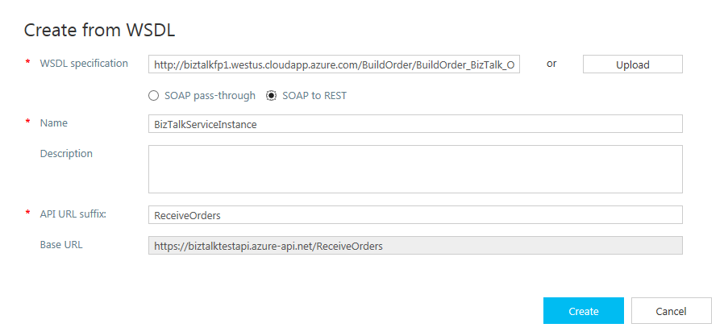
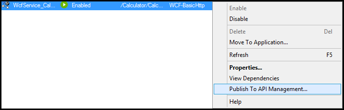
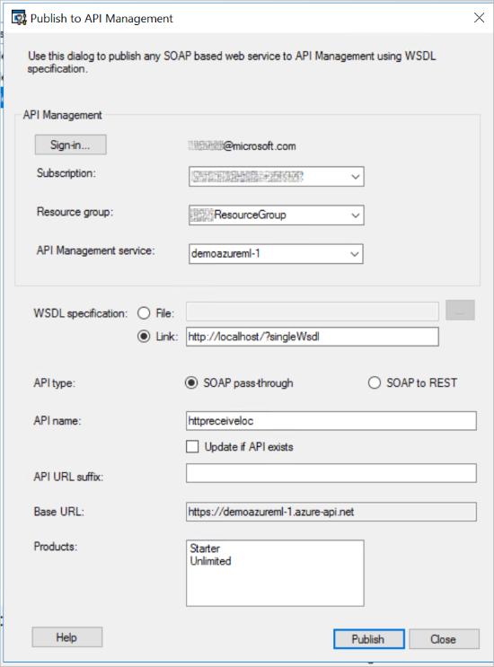

# Publish BizTalk WCF-BasicHTTP endpoints in API Management

Expose your BizTalk WCF-BasicHTTP receive locations as endpoints within Azure API Management using the BizTalk Administration Console. You can also expose your SOAP endpoints through API Management from BizTalk using API Management in the Azure portal.

> [!TIP]
> [What is API Management?](/azure/api-management/api-management-key-concepts) is a great resource to understand and learn more about this Azure service.

## Prerequisites

* Configure and set up [Azure API Management](/azure/api-management/api-management-get-started)
* Create a [virtual network](/azure/api-management/api-management-using-with-vnet) between your BizTalk computer and the API Management instance

## Create using API Management in Azure portal 

1. In the [Azure portal](https://portal.azure.com), open up your API management, and select **APIs**:

    

2. Select **WSDL**:

    

3. Configure your WSDL properties: 

   1. **WSDL specification** : Enter the full URI to your BizTalk SOAP endpoint. For example, enter something like `http://10.0.31.22/RestEndPoint/OrderIncome.svc?wsdl` or `http://biztalkfp1.westus.cloudapp.azure.com/RestEndPoint/OrderIncome.svc?wsdl`.  

   2. **SOAP pass-through** or **SOAP to REST** : Select your preference: 
       * **SOAP to REST**: Create REST-based HTTP APIs from an existing SOAP-based web service
       * **SOAP pass-through**: Acts as a proxy for the SOAP API 

   3. Enter your preferred **Display Name**, **Name**, **Description**, **API Url suffix**, **Products**, and **Version**.

      When finished, your WSDL configuration looks something like the following: 

      

4. Select **Create**.

## Create using the BizTalk Administration

> [!NOTE] 
> This feature is supported with WCF-BasicHTTP receive locations. 

1. In the BizTalk Administration Console, right-click your WCF-BasicHTTP receive location, and select **Publish to API Management**:  

    
 
2. Configure your API management properties: 

   1. **Sign-in** to your Azure subscription, select the **Subscription** and **Resource Group** that has your API management service, and then select your service.

   2. The **WSDL specification link** is automatically populated with your WSDL file. Replace **localhost** with the DNS name or IP address of the BizTalk Server. 

   3. Select **SOAP pass-through** or **SOAP to REST**:  
      * **SOAP to REST**: Create REST-based HTTP APIs from an existing SOAP-based web services
      * **SOAP pass-through**: Acts as a proxy for the SOAP API 

        The API can be published both ways by changing the **API URL suffix**, and then publishing again using a different API type.

   4. The **API name** is automatically populated with the receive location name.

   5. Select an **API URL suffix** that is to be used by consumers of the API. 

      When finished, your properties look similar to the following:  
      

3. Select **Publish**. When successful, the receive location is displayed as a service in API Management in the [Azure portal](https://portal.azure.com). 

## Do more

Azure API Management is a powerful service that is used by a lot of Azure services, including Logic Apps. API Management includes many features, including rate limits and quotas, who has access to your APIs, caching, and more. See [What is API Management?](/azure/api-management/api-management-key-concepts) to get started.