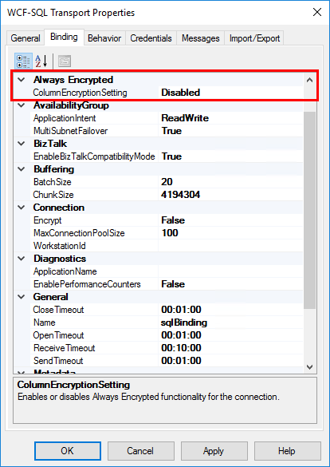

# Connect to SQL Server Always Encrypted columns with BizTalk Server
Enable Always Encrypted in the WCF-SQL adapter in [!INCLUDE[btsBizTalkServerNoVersion_md](../includes/btsbiztalkservernoversion-md.md)] to query encrypted columns.  

**Starting with [!INCLUDE[bts2016_md](../includes/bts2016-md.md)] [!INCLUDE[featurepack1](../includes/featurepack1.md)]**, the WCF-SQL adapter can query encrypted columns in [!INCLUDE[btsSQLServerNoVersion_md](../includes/btssqlservernoversion-md.md)]. The `ColumnEncryptionSetting` binding property is used to enable or disable the functionality to get decrypted/encrypted column values from an Always Encrypted database.

This topic shows you how to enable or disable this feature in [!INCLUDE[btsBizTalkServerNoVersion_md](../includes/btsbiztalkservernoversion-md.md)].

> [!TIP]
> [Always Encrypted (Database Engine)](https://docs.microsoft.com/sql/relational-databases/security/encryption/always-encrypted-database-engine) is a great resource to understand and learn more about this [!INCLUDE[btsSQLServerNoVersion_md](../includes/btssqlservernoversion-md.md)] feature.

## Prerequisites
Install [Feature Pack 2](https://aka.ms/bts2016fp2) on your [!INCLUDE[btsBizTalkServerNoVersion_md](../includes/btsbiztalkservernoversion-md.md)].

## Enable Always Encrypted

1. In the **BizTalk Server Administration** console, right-click your WCF-SQL port, and select **Properties**.
2. Go to the **Binding** tab.
3. Under **Always Encrypted**, enable or disable the `ColumnEncryptionSettings` property:

* **Enabled**: The port queries, and gets encrypted data from an Always Encrypted database
* **Disabled**: The port queries the Always Encrypted database, but the data returned is hashed

    

4. Select **Apply**, and **OK** to save your changes.

## See also
[Always Encrypted (Database Engine)](https://docs.microsoft.com/sql/relational-databases/security/encryption/always-encrypted-database-engine)  
[Configure the Feature Pack](../core/configure-the-feature-pack.md)