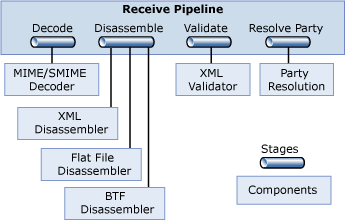

# Connecting Systems
The effective exchange of messages across different software on different machines is an absolute requirement for integration. Given the diversity of communication styles that exist, BizTalk Server must support a variety of protocols and message formats. As described next, a significant portion of the engine is devoted to making this communication work. One important fact to keep in mind, however, is that the engine works only with XML documents internally. Whatever format a message arrives in, it must be converted to an XML document after it is received. Similarly, if the recipient of a document can’t accept that document as XML, the engine converts it into the format expected by the target.  
  
## Sending and Receiving Messages: Adapters  
 Because BizTalk Server must talk to a variety of other software, it relies on adapters to make this possible. An adapter is an implementation of a communication mechanism, such as a particular protocol. A developer determines which adapters to use in a given situation. He might choose one of the built-in adapters BizTalk Server provides, for example, or use an adapter created for a popular product such as Windows SharePoint Services, or even create a custom adapter. In each of these cases, the adapter is built on a standard base called the Adapter Framework. This framework provides a common way to create and run adapters, and it also supports the same tools used to manage all of the adapter types.  
  
 Microsoft BizTalk Server includes the following native adapters:  
  
- File adapter: supports reading from and writing to files in the Windows file system. Because the applications involved in a business process can often access the same file system, either locally or across a network, exchanging messages through files can be a convenient option.  
  
- FTP adapter: supports sending and receiving information between a File Transport Protocol (FTP) Server and BizTalk Server.  
  
- HTTP adapter: supports sending and receiving information using HTTP. BizTalk Server exposes one or more URLs to allow other applications to send data to it, and it can use this adapter to send data to other URLs.  
  
- MSMQ adapter: supports sending and receiving messages using Microsoft Message Queuing (MSMQ).  
  
- WebSphere MQ adapter: supports sending and receiving messages using IBM’s WebSphere MQ (formerly known as MQSeries).  
  
- POP3 adapter: supports receiving e-mail messages and their attachments using version three of the Post Office Protocol (POP3).  
  
- SMTP adapter: supports sending messages using SMTP. Standard e-mail addresses are used to identify the parties.  
  
- SOAP adapter: supports sending and receiving Web service requests to enable BizTalk Server to connect to Web Services.  
  
- WCF adapters: supports sending and receiving information using Windows Communication Foundation.  
  
- Windows SharePoint Services (WSS) adapter: supports accessing and publishing documents stored in Microsoft Windows SharePoint document libraries.  
  
  Adapters for commonly-used business software are also available from Microsoft, these include:  
  
- Microsoft BizTalk Adapter for JD Edwards OneWorld  
  
- Microsoft BizTalk Adapter for JD Edwards EnterpriseOne  
  
- Microsoft BizTalk Adapter for PeopleSoft Enterprise  
  
- Microsoft BizTalk Adapter for TIBCO Rendezvous  
  
- Microsoft BizTalk Adapter for TIBCO Enterprise Message Service  
  
  For more information about these adapters, see [Adapters in BizTalk Server](../core/adapters-in-biztalk-server.md).  
  
  Whichever adapter is used to receive data, the messages it receives must commonly be processed before they can be accessed by an orchestration. Similarly, outgoing messages produced by an orchestration often need to be processed before they are sent by an adapter.  
  
## Processing Messages: Pipelines  
 The applications underlying a business process communicate by exchanging various kinds of documents: for examples, purchase orders and  invoices. For a BizTalk Server application to execute a business process, it must be able to correctly deal with the messages that contain these documents. This processing can involve multiple steps, and hence is performed by a message pipeline. Incoming messages are processed through a receive pipeline, while outgoing messages go through a send pipeline.  
  
 For example, even though more applications are being designed to understand XML documents, many—probably the majority today—cannot. Because BizTalk Server works only with XML documents internally, it must provide a way to convert other formats to and from XML. Other services may also be required, such as authenticating the sender of a message. To handle these and other tasks in a modular, yet customizable way, a pipeline is constructed from some number of stages, each of which contains one or more .NET-enabled or Component Object Model (COM) components. Each component handles a particular part of message processing. BizTalk Server provides several standard components that address the most common cases. If these aren’t sufficient, developers can also create custom components for both receive and send pipelines.  
  
   
  
 The figure above illustrates the stages in a receive pipeline, along with the standard components provided for each one. Those stages and their associated components are:  
  
- Decode: BizTalk Server provides one standard component for this stage, the MIME/SMIME Decoder. This component can handle messages and any attachments they contain in either MIME or Secure MIME (S/MIME) format. The component converts both types of messages into XML, and it can also decrypt S/MIME messages and verify their digital signatures.  
  
- Disassemble: Three standard components are provided. The Flat File Disassembler component turns flat files into XML documents. These files can be positional, where each record has the same length and structure, or delimited, with a designated character used to separate records in the file. The second standard component, the XML Disassembler, parses incoming messages that are already described using XML. The third standard component, one that’s not often used today, is the BizTalk Framework Disassembler. It accepts messages sent using the reliable messaging mechanism defined by the BizTalk Framework, which was implemented in BizTalk Server 2000.  
  
- Validate: BizTalk Server provides an XML Validator component for this stage. As its name suggests, this component validates an XML document produced by the Disassemble stage against a specified schema or group of schemas, returning an error if the document doesn’t conform to one of those schemas.  
  
- Resolve Party: the only standard component for this stage, Party Resolution, attempts to determine an identity for this message’s sender. If the message was digitally signed, the signature is used to look up a Windows identity in the Management database in BizTalk Server. (As described later, this database is also used by BizTalk Server’s management tools.) If the message carries the authenticated security identifier (SID) of a Windows user, this identity is used. If neither mechanism succeeds, the message’s sender is assigned a default anonymous identity.  
  
    
  
  Outgoing messages can also go through multiple stages, as defined by the send pipeline in use. The figure above shows the stages and standard components for a send pipeline. They are:  
  
- Pre-assemble: No standard components are provided. Instead, custom components can be inserted here as needed.  
  
- Assemble: Paralleling the Disassemble stage in a receive pipeline, this stage also has three standard components. The Flat File Assembler converts an XML message into a positional or delimited flat file, and the XML Assembler supports adding an envelope and making other changes to an outgoing XML message. The third option, the BizTalk Framework Assembler, packages messages for reliable transmission using the BizTalk Framework messaging technology.  
  
- Encode: BizTalk Server defines only one standard component for this stage, the MIME/SMIME Encoder. This component packages outgoing messages in either MIME or S/MIME format. If S/MIME is used, the message can also be digitally signed and/or encrypted.  
  
  BizTalk Server defines some default pipelines, including a simple receive/send pair that can be used for handling messages that are already expressed in XML. A developer can also create custom pipelines using the Pipeline Designer. This tool, which runs inside [!INCLUDE[btsVStudioNoVersion](../includes/btsvstudionoversion-md.md)], provides a graphical interface that enables the developer to drag and drop components to create pipelines with whatever behavior is required.  
  
## Choosing Messages: Subscriptions  
 After a message has made its way through an adapter and a receive pipeline, the next step is to determine where it should go. A message is most often targeted to an orchestration, but it’s also possible for a message to go directly to a send pipeline, allowing BizTalk Server to be used as purely a messaging system. In either case, this matching of messages with their destinations is done using subscriptions.  
  
 When a message is processed by a receive pipeline, a message context is created that contains various properties of the message. An orchestration or a send pipeline can subscribe to messages based on the values of these properties. For example, an orchestration might create a subscription that matches all messages of the type “Invoice”, or all messages of the type “Invoice” received from the QwickBank corporation, or all messages of the type “Invoice” received from the QwickBank corporation that are for more than $10,000. However it is specified, a subscription returns to its subscriber only those messages that match the criteria that the subscription defines. A received message might initiate a business process by instantiating some orchestration or it might activate another step in an already running business process. Similarly, when an orchestration sends a message, that message is matched to a send pipeline based on a subscription that pipeline has established.  
  
-   In BizTalk Server, it is also possible to subscribe to specific error conditions. An error message can be processed in a particular way or routed to a specific destination, such as a Windows SharePoint Services folder.  
  
## See Also  
 [The BizTalk Server Messaging Engine](../core/the-biztalk-server-messaging-engine.md)   
 [Publish and Subscribe Architecture](../core/publish-and-subscribe-architecture.md)   
 [Adapters](../core/adapters.md)   
 [Pipelines](../core/pipelines.md)