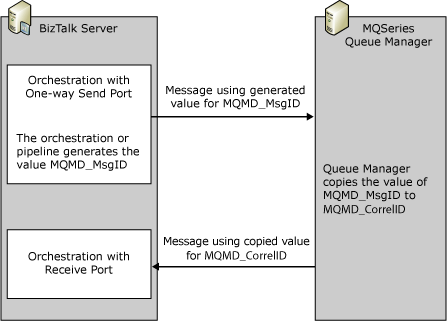
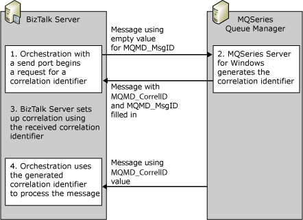

# Correlating Messages Using Request-Reply
There are two ways to correlate messages in BizTalk orchestrations for IBM WebSphere MQ, server component for Windows platforms request-reply scenarios. The first is to supply the correlation identifier by setting both the MessageID (**MQMD_MSGID**) and the CorrelationID (**MQMD_CorrelId**) to the same value. The second is to use the **BizTalk_CorrelationId** context property.  
  
## Setting MQMD_MsgId and MQMD_CorrelId to the Same value  
 When sending the message to an IBM WebSphere MQ Queue Manager, you can set the message identifier (**MQMD_MSGID**) and the correlation identifier (**MQMD_CorrelId**) to the same value in the outgoing message. The IBM WebSphere MQ Queue Manager copies the MessageID to the CorrelationID for the reply message. The following figure shows the process.  
  
   
  
 You can initialize the correlation sets for the outgoing message and follow the correlation sets for the incoming message using the value of **MQMD_CorrelId**.  
  
## Using the MQSeries.BizTalk_CorrelationId Context Property  
 Instead of setting the MessageID and CorrelationID to the same value in the outgoing message, you can use the **BizTalk_CorrelationID** context property with a solicit-response send port of the MQSeries adapter. The following figure shows this process.  
  
   
  
 To use identifiers provided by IBM WebSphere MQ Server for correlations in your BizTalk orchestration, BizTalk Server must first obtain the identifier. Your application does this through a solicit-response request. BizTalk Server sends a solicit-response request to the IBM WebSphere MQ Server by using the MQSeries adapter. In return, it receives a response with the message identifier (**MQMD_MSGId**) and the correlation identifier (**MQMD_CorrelId**).  
  
 For the outgoing message in a solicit-response send port, the adapter copies the **MQMD_MSGID** generated by IBM WebSphere MQ Server to the **MQSeries.BizTalk_CorrelationId** context property.  
  
 When receiving messages, the adapter copies the **MQMD_CorrelId** to the **MQSeries.BizTalk_CorrelationId**. In this case, using correlation sets, you can initialize the correlation sets for the outgoing message and follow the correlation sets for the incoming message using the **MQSeries.BizTalk_CorrelationId**.  
  
## See Also  
 [MQSCorrelationSetOrchestrationWithSolicitResponse (BizTalk Server Sample)](../core/mqscorrelationsetorchestrationwithsolicitresponse-biztalk-server-sample.md)
