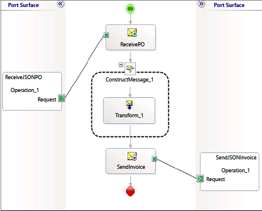

# Create a BizTalk Server orchestration
> [!NOTE]
>  This tutorial applies to BizTalk Server only.  
  
 Create a [!INCLUDE[btsBizTalkServerNoVersion](../includes/btsbiztalkservernoversion-md.md)] orchestration that, when deployed, receives a JSON purchase order message, transforms it to an XML invoice, and then sends out a JSON invoice.  
  
## Define message and message types  
 This solution works with two basic messages – purchase order and invoice. We already generated the schema of the purchase order from a JSON message using the JSON schema wizard. The sample provided for this tutorial already has the schema for the invoice message. We use these schemas to create the message types in the [!INCLUDE[btsBizTalkServerNoVersion](../includes/btsbiztalkservernoversion-md.md)] application.  
  
1.  Add an orchestration to the BizTalk project and open the Orchestration view.  
  
2.  In the Orchestration View, right-click **Messages**, and then click **New Message**.  
  
3.  Right-click the newly created message, and then select **Properties Window**.  
  
4.  In the **Properties** pane for the **Message_1**, do the following:  
  
    |Use this|To do this|  
    |--------------|----------------|  
    |Identifier|Type `PurchaseOrder`|  
    |Message Type|From the drop-down list, expand **Schemas**, and then select *BTSJSON.PO*, where *BTSJSON* is the name of your BizTalk project.|  
  
5.  Repeat the previous step to create a new message type for the invoice message. In the **Properties** pane for the new message, do the following:  
  
    |Use this|To do this|  
    |--------------|----------------|  
    |Identifier|Type `InvoiceMsg`|  
    |Message Type|From the drop-down list, expand **Schemas**, and then select *BTSJSON.Invoice*.|  
  
## Set up the orchestration  
 In this step, you add message shapes and ports to create an orchestration.  
  
### Add message shapes  
 Open the orchestration file from Solution Explorer, and add the following message shapes.  
  
-   Add a Receive shape, set its name to **ReceivePO**, and message type to **PurchaseOrder**.  
  
-   Add a Send shape, set its name to **SendInvoice**, and message type to **InvoiceMsg**.  
  
-   Add a Construct Message shape and set the **Messages Constructed** property of the Construct Message shape to **InvoiceMsg**.  
  
-   Add a Transform shape within the Construct Message shape. Double-click the Transform shape and in the **Transform Configuration** dialog box, select the **Existing Map** option, and then select **BTSJSON.POToInvoice** map. This map is provided as part of the sample. In the dialog box, set **Source** to **PurchaseOrder** and set **Destination** to **InvoiceMsg**. Click **OK**.  
  
### Add ports  
 Add two ports to the orchestration – one for receiving messages and one for sending messages. Use the following properties for the ports.  
  
|Port|Properties|  
|----------|----------------|  
|MessageIn|-   Set **Identifier** to *ReceiveJSONPO* -   Set **Communication Pattern** to *One-Way* -   Set **Communication Direction** to *Receive*|  
|ResponseOut|-   Set **Identifier** to *SendJSONInvoice* -   Set **Communication Pattern** to *One-Way* -   Set **Communication Direction** to *Send*|  
  
 Connect the ports and message shape, as shown in the screenshot below, and save changes to the project.  
  
   
  
## See Also  
 [Processing JSON messages using BizTalk Server](../core/processing-json-messages-using-biztalk-server.md)
