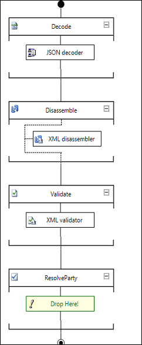
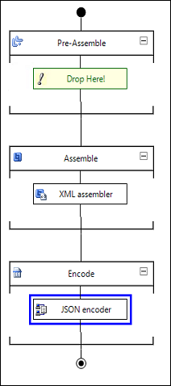

# Create custom pipelines to process JSON messages
> [!NOTE]
>  This tutorial applies to BizTalk Server only.  
  
 [!INCLUDE[btsBizTalkServerNoVersion](../includes/btsbiztalkservernoversion-md.md)] provides pipeline components that can be used to process JSON messages within a [!INCLUDE[btsBizTalkServerNoVersion](../includes/btsbiztalkservernoversion-md.md)] application. In this step, we use those pipeline components to create custom pipelines that can be used when configuring a [!INCLUDE[btsBizTalkServerNoVersion](../includes/btsbiztalkservernoversion-md.md)] application.  
  
## Create a custom receive pipeline  
  
1. In the [!INCLUDE[btsBizTalkServerNoVersion](../includes/btsbiztalkservernoversion-md.md)] application, from the Solution Explorer, right-click the project, and point to **Add** > **New Item** > **Receive Pipeline**. Provide the pipeline name as `JSONToXmlReceivePipeline.btp`, and then click **Add**.  
  
2. Within the **Decode** stage add the new **JSON decoder**. In the other stages and other pipeline components as shown in the screenshot, and save changes.  
  
      
  
## Create a custom send pipeline  
  
1. In the [!INCLUDE[btsBizTalkServerNoVersion](../includes/btsbiztalkservernoversion-md.md)] application, from the Solution Explorer, right-click the project, and point to **Add** > **New Item** > **Send Pipeline**. Provide the pipeline name as `XmlToJSONSendPipeline.btp`, and then click **Add**.  
  
2. Within the **Encode** stage add the new **JSON encoder**. In the other stages and other pipeline components as shown in the screenshot, and save changes.  
  
      
  
## See Also  
 [Processing JSON messages using BizTalk Server](../core/processing-json-messages-using-biztalk-server.md)