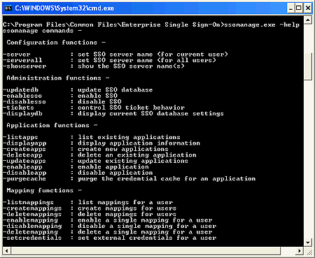

# Creating Affiliate Applications
The following steps show how to start using affiliate applications and Single Sign-On (SSO).  
  
> [!NOTE]
>  If you receive SSO errors, verify that you used a domain account when you were configuring BizTalk Server, as this affects the function of the Enterprise SSO service. SSO only functions under a domain account.  
  
## Create an affiliate application  
  
1. In Control Panel, open **Services**, and verify that the Enterprise Single Sign-On service is running.  
  
2. In a command prompt, change directories to the Enterprise Single Sign-On folder.  
  
    For example:  
  
    **C:\Program Files\Common Files\Enterprise Single Sign-On>**  
  
3. Use the Enterprise Single Sign-On commands. For a list of commands, use the **-help** switch.  
  
      
  
4. To create the affiliate application by using *.XML as a start, type the following command:  
  
    `ssomanage.exe -createapps C:\SSOtest\AffiliateApplication.xml`  
  
    where:  
  
   - C:\SSOtest is the folder that contains your application XML.  
  
   - AffiliateApplication.xml is the application XML you created that contains the sign-on information.  
  
     For example:  
  
   ```  
   <?xml version="1.0"?>  
   <SSO>  
        <application name="PeopleSoftApp">  
             <description>PeopleSoft SSO Application</description>  
             <contact>someone@microsoft.com</contact>  
            <appUserAccount>DomainName\AppUserGroup</appUserAccount>  
             <!—-an existing group on the domain controller - >   
             <appAdminAccount>DomainName\AppAdminGroup<appAdminAccount>   
             <!-- an existing account in the domain group - >   
             <field ordinal="0" label="User ID" masked="no" />  
             <field ordinal="1" label="Password" masked="yes" />  
             <flags groupApp="no" allowTickets="yes" enableApp="yes"/>  
        </application>  
   </SSO>  
   ```  
  
## Create Single Sign-On Tickets  
  
1.  Type the following command to control SSO ticket behavior:  
  
     `ssomanage.exe -tickets yes yes`  
  
2.  Answer the questions:  
  
     `ssomanage -tickets <allowed yes | no> <validate yes | no>`  
  
     On completion, you receive a confirmation:  
  
     **Using SSO server on this computer. The operation completed successfully.**  
  
## Enable the Affiliate Application XML  
  
1.  Type the following command:  
  
     `ssomanage -enableapp PeopleSoftApp`  
  
2.  Type the following command to list the applications and to verify that the application was created:  
  
     `ssoclient.exe –listapps`  
  
     The affiliate applications that are available for use appear in a list.  
  
     **Applications available for IBI\YourID - PeopleSoftApp**  
  
3.  Type the following command to set the affiliate application credentials:  
  
     `ssoclient.exe -setcredentials PeopleSoftApp`  
  
4.  Enter the user name and password at the prompts. Enter the logon credentials for the PeopleSoftApp affiliate application.  
  
     For example, enter the user identification and the password for that user to enter into the system through the SSO server.  
  
    -   **User ID:** `user`  
  
    -   **Password:** `******`  
  
    -   **Confirm? Password:** `******`  
  
5.  The affiliate application appears in the BizTalk Adapter for PeopleSoft Enterprise Transport Properties dialog box.  
  
## See Also  
 [Secure the adapter](../core/security-in-biztalk-adapter-for-peoplesoft-enterprise.md)