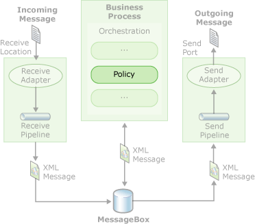

# Creating and Using Business Rules
Business rules (or business policies) define and control the structure, operation, and strategy of an organization. Business rules may be formally defined in procedure manuals, contracts, or agreements, or may exist as knowledge or expertise embodied in employees. Business rules are dynamic and subject to change over time, and can be found in all types of applications. Finance and insurance, e-business, transportation, telecommunications, Web-based services, and personalization are just a few of the many business domains that are governed by business rules. Each of these business domains shares the need to convey business strategies, policies, and regulations to information technology (IT) personnel for inclusion into software applications.  
  
 Traditional procedural and object-oriented programming languages, such as C, C++, and Microsoft Visual Basic, are oriented towards programmers. Even advanced object-oriented languages, such as Java and C#, are still primarily programmers' languages. The traditional software development cycle of design, develop, compile, and test requires substantial time and coordination, and does not enable nonprogrammers to participate in the maintenance of automated business policies. The Business Rules Framework addresses this problem by providing a development environment that allows rapid application creation without the lengthy cycle of traditional application programming. For example, business policies constructed by using this framework can be updated without recompiling and redeploying the associated orchestrations.  
  
 The Business Rules Framework is tightly integrated with Microsoft [!INCLUDE[btsBizTalkServerNoVersion](../includes/btsbiztalkservernoversion-md.md)], and developers can use the following features to build and manage business rules:  
  
- A high-performance rule engine that implements an inference mechanism to evaluate the business rules.  
  
- A rich set of application programming interfaces (APIs) for developing rule-based applications.  
  
- A graphical user interface, the Business Rule Composer, which developers, business analysts, and administrators can use in various ways to efficiently develop and apply rules and policies.  
  
- A seamless integration with BizTalk orchestrations, which enables you to invoke a business policy or a set of business rules from a BizTalk orchestration.  
  
- The Rule Engine Deployment Wizard, which enables you to rapidly import or export business rules or the vocabularies used by the rules, as well as to deploy or undeploy these rules.  
  
  The business rules (policy) you create by using the Business Rules Framework can be used in an orchestrated business process, as shown in the following figure.  
  
    
  Business Policy  
  
  This section provides conceptual information about how you can leverage the Business Rules Framework and use the tools that [!INCLUDE[btsBizTalkServerNoVersion](../includes/btsbiztalkservernoversion-md.md)] provides to develop business rules.  
  
## In This Section  
  
-   [Creating Business Rules](../core/creating-business-rules-using-the-business-rule-composer.md)  
  
-   [Business Rules Framework Security](../core/business-rules-framework-security.md)  
  
-   [Programming with Business Rules Framework](../core/programming-with-business-rules-framework.md)  
  
-   [Rule Engine Configuration and Tuning Parameters](../core/rule-engine-configuration-and-tuning-parameters.md)