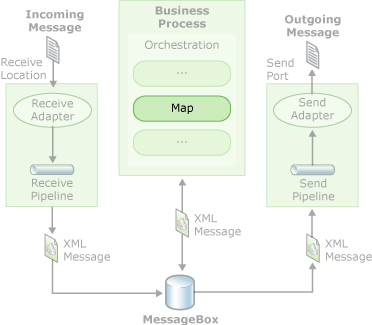

# Creating Maps Using BizTalk Mapper
BizTalk Mapper is a tool that runs within the Microsoft [!INCLUDE[btsVStudioNoVersion](../includes/btsvstudionoversion-md.md)] environment. BizTalk Mapper can be used to create and edit maps, which are used for translating or transforming xml messages. Maps are used in orchestrations, as the following figure suggest, and can also be used for processing messages received at a receive port, and then transforming the message to be sent via send port(s).  
  
   
Maps in Business Processing  
  
 Maps enable you to translate and to transform messages. Translation is the process of converting a message from one format to another format, such as converting a flat file into an XML file. Transformation is the process of taking information from one message and inserting it in another message. For example, you might take shipping and billing addresses from a purchase order and insert them in an invoice document.  
  
 BizTalk Mapper uses its own graphical system of icons and links to represent the translation and transformation of input instance messages to output instance messages. Mapper uses the same graphical representation of schemas as BizTalk Editor. BizTalk Mapper stores its maps as Extensible Stylesheet Language Transformations (XSLT) stylesheets.  
  
> [!NOTE]
>  BizTalk Mapper supports XSLT 1.0. Using XSLT 2.0 in BizTalk Mapper is not supported.  
  
 For information about creating schemas, see [Creating Schemas Using BizTalk Editor](../core/creating-schemas-using-biztalk-editor.md). For information about using maps within orchestrations, see [Creating Orchestrations Using Orchestration Designer](../core/creating-orchestrations-using-orchestration-designer.md).  
  
> [!NOTE]
>  The performance of a map depends on the complexity of the map - the number and type of functoids, size of input and output schemas, the size of the input message, and your hardware.  
  
 For information about using the keyboard shortcuts for BizTalk Mapper, see [BizTalk Mapper Keyboard Shortcuts](../core/biztalk-mapper-keyboard-shortcuts.md).  
  
## In This Section  
  
-   [Planning to Create Maps](../core/planning-to-create-maps.md)  
  
-   [About Maps](../core/about-maps.md)  
  
-   [Using BizTalk Mapper](../core/using-biztalk-mapper.md)  
  
-   [Creating Maps](../core/creating-maps.md)  
  
-   [Compiling and Testing Maps](../core/compiling-and-testing-maps.md)  
  
-   [Troubleshooting Maps](../core/troubleshooting-maps.md)
