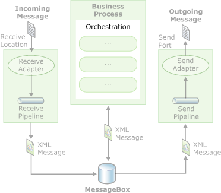

# Creating Orchestrations Using Orchestration Designer
Orchestration in [!INCLUDE[btsBizTalkServerNoVersion](../includes/btsbiztalkservernoversion-md.md)] workflow  
  
   
  
 BizTalk Orchestration Designer is a tool for conveniently creating visual representations of your business processes that are automatically reflected in underlying code and which you build into an executable module. It provides a wide variety of shapes that correspond to different actions that you might want to perform.  
  
 This section provides conceptual information, reference information, and task-related information to help you to understand and use BizTalk Orchestration and BizTalk Orchestration Designer.  
  
 For information about using the keyboard shortcuts for Orchestration Designer, see [Orchestration Designer Keyboard Shortcuts](../core/orchestration-designer-keyboard-shortcuts.md).  
  
## In This Section  
  
-   [About Orchestrations](../core/about-orchestrations.md)  
  
-   [Creating Orchestrations](../core/creating-orchestrations.md)  
  
-   [Building and Running Orchestrations](../core/building-and-running-orchestrations.md)  
  
-   [Debugging Orchestrations](../core/debugging-orchestrations.md)
