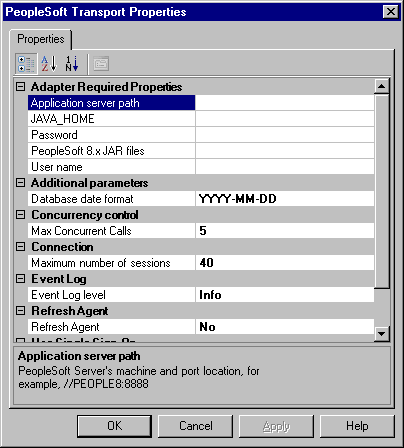

# Create PeopleSoft send artifacts
Microsoft BizTalk Adapter for PeopleSoft Enterprise accesses PeopleSoft and explores available components or processes SOAP requests. This topic shows you how to create the send artifacts in BizTalk Server Administration to use the PeopleSoft adapter.

## Create the send port

1.  In the BizTalk Server Administration Console,expand **BizTalk Group**, expand **Applications**, and then expand the desired application.  
  
2.  Right-click **Send Ports**, select **New**, and then select **Static Solicit-Response Send Port**.  
  
3.  In the **Send Port Properties**, do the following:  
  
    1.  Enter a name for the send port. For example, enter `SSOSendToPeopleSoft`.  
  
    2.  From the **Type** drop-down list, select **PeopleSoft**.  
  
    3.  From the **Send handler** drop-down list, select the URI.  
  
    4.  From the Send Pipeline drop-down list, select **Microsoft.BizTalk.DefaultPipelines.XMLTransmit**.  
  
    5.  From the **Receive Pipeline** drop-down list, select **Microsoft.BizTalk.DefaultPiplelines.XMLReceive**.  
  
    6.  Select **Configure** to configure the send port.  
  
4.  In the **PeopleSoft Transport Properties**, do the following:  
  
    1.  Expand **Adapter Required Properties**, and enter **Application Server Path**, **JAVA_HOME**, **user name**, **password**, and the Jar file for connecting into the Peoplesoft system.  
  
         You do not have to set the logon information.  
  
    2.  In the list, select the SSO affiliate application you created to represent the PeopleSoft system.  
  
    3.  For **Use SSO**, select **Yes**.  
  
    4.  Select **OK**.  
  
5.  Select **OK**.

## Set the transport properties
The PeopleSoft transport properties are used for design and run time. In the **Transport Properties** dialog box, you set the connection and credential parameters specific to the server system and the objects you are trying to access.  
  
   
  
1.  Expand the Adapter Required Properties and fill in all required information for connection to the PeopleSoft server.  
  
     You must set configuration parameters to connect Microsoft BizTalk Adapter for PeopleSoft Enterprise to PeopleSoft Enterprise. This data is case sensitive.  
  
    |Parameter|Description|  
    |---------------|-----------------|  
    |`Application Server Path`|A string representing the computer and port on which the PeopleSoft Application Server is running and listening. The syntax of the URL path to the PeopleSoft 8 Application is //<computer_name>:\<port>. Ask your PeopleSoft administrator for the \<port> value. The \<port> value is the JOLT protocol listener port, not the App Server port. The default JOLT port is 9000.|  
    |`JAVA_HOME`|Set the JAVA_HOME variable to point to your JDK installation, for example: **C:\j2sdk1.4.2_08**.|  
    |`Password`|If you did not select **Use SSO**, you must set credential parameters for the BizTalk Adapter for PeopleSoft Enterprise to access the server system.   A string representing the user's password for logon to a PeopleSoft system. The characters do not appear but are represented by asterisks (*).|  
    |`PeopleSoft 8.x Jar Files`|To use Ccmponent interfaces (PeopleSoft 8 only) you must update your CLASSPATH to include the PeopleSoft Component Interface jar file. For example: **<PeopleSoft_Home>\web\PSJOA\psjoa.jar**.|  
    |`User Name`|If you did not select **Use SSO**, you must set credential parameters for the BizTalk Adapter for PeopleSoft Enterprise to access the server system.   A string representing a user name required for logon to a PeopleSoft system.|  
  
2.  Enter an **Additional parameters** value when a date is used as a key; it has a different format. YYYY-MM-DD is the default format.  
  
3.  Enter a **Concurrency control** value representing the number of calls, for example 200, in **Max Concurrent Calls** if it is required.  
  
     The **Max Concurrent Calls** parameter activates an overload protection if the back-end server cannot process the amount of data. A concurrent call is a request for which the adapter does not yet have a reply. Set **Max Concurrent Calls** in instances where the throughput exceeds back-end processing capabilities.  
  
     The default value for this field is -1, meaning no protection occurs.  
  
     If BizTalk Server submits a request to the Transmit adapter, and the number of concurrent calls equals or exceeds the value set for **Max Concurrent Calls**, the thread submitting the request is saved until the concurrent calls number decreases to below the set value.  

## Update Max Concurrent Calls

The `Max Concurrent Calls` parameter is a feature that enables you to optimize your configuration. You use this parameter in instances where the throughput exceeds back-end processing capabilities. You can add the parameter to the adapters in the **Send Port Transport Properties** dialog box to activate message overload protection. The default is -1, meaning the calls are unlimited.  
  
When BizTalk Server submits messages to the transmit adapter, it first receives a batch from the adapter and invokes `TransmitMessage()` on the batch to transmit each message. When done, BizTalk Server invokes `Done()` on the batch, and the adapter starts transmitting the messages to the back-end. If BizTalk Server obtains multiple batches before `Done` is invoked, the `Done` command might never occur. By setting the maximum number of messages in a batch, you can control messages to the back-end. Changing this parameter takes effect in a minute. BizTalk Server must retrieve the changes to the adapter configuration that is saved in the SQL database.  
  
### Change the Max Concurrent Calls parameter  
  
1.  In the **Send Port Transport Properties** dialog box, enter a **Connection** value.  
  
     The default value is 40 sessions. If you use a smaller value, you might experience degradation in run-time performance. The opposite is also true; a bigger value could exceed the ability of the server and result in run-time errors.  
  
2.  Select **Yes** for **Refresh Agent** to force the runtimeagent.exe and the browsingagent.exe processes to restart automatically when required.  
  
     For example, you want the process to restart automatically if it loses connection with the server, or if you add something to the server and it does not appear in the Microsoft Adapter Wizard for selection.  
  
     The **Refresh Agent** parameter refreshes both the browsing and the run-time agents. The runtimeagent.exe updates after a delay of one minute or at the next send call.  
  
3.  Provide credentials to access the PeopleSoft system.  
  
     You can use two methods to access the system:  
  
    -   Login Credentials (Transport Properties Login parameters)  
  
    -   Single Sign-On  
  
4.  Select **Yes** for **Use SSO** to use Single Sign-On.  
  
    > [!NOTE]
    >  For more information, see [Secure the adapter](../core/security-in-biztalk-adapter-for-peoplesoft-enterprise.md). 
  
5.  Select an affiliate application in the list.  
  
     An affiliate application, created by Enterprise Single Sign-On tools, represents an application such as PeopleSoft. Microsoft BizTalk Adapter for PeopleSoft Enterprise uses the credentials of an application user. These credentials are retrieved from the SSO database for the server system for a specified affiliate application. The credentials are those of the user (the application user) who launched the BizTalk project.  
  
    > [!NOTE]
    >  For more information about how to create affiliate applications, see [Creating Affiliate Applications](../core/creating-affiliate-applications2.md), or the Microsoft BizTalk Server online Help.  
  
6.  After providing all required information to accept the connection information, click **Apply**, and then click **OK**.  
  
     You must set connection parameters for the BizTalk Adapter for PeopleSoft Enterprise to access PeopleSoft.  
  

## Next
  
[Import PeopleSoft Schemas into BizTalk Server Projects](../core/importing-peoplesoft-schemas-into-biztalk-server-projects.md)  
[Receive from PeopleSoft](../core/receiving-from-peoplesoft.md)