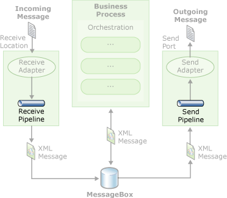

# Creating Pipelines Using Pipeline Designer
Microsoft BizTalk Server works mainly with the XML document format. For a message to take full advantage of BizTalk Server processing, it must often be transformed from its native format into its XML representation. BizTalk Server pipelines perform this transformation, as well as other data-specific actions (such as data encryption or decryption, property promotion, and so on) on incoming and outgoing messages. This section provides conceptual and task-specific information about pipelines and Pipeline Designer.  
  
 The purpose of a pipeline is to prepare a message for processing by the server after being received by an adapter or to prepare a message for sending after being processed by the server.  
  
 Pipelines commonly perform:  
  
- Data normalization from various formats to XML.  
  
- Data transformation from XML to various formats.  
  
- Property promotion and demotion.  
  
- Document disassembly and assembly.  
  
- Document decoding and encoding.  
  
- Document decryption and encryption.  
  
- Document signing and digital signature verification.  
  
  The following figure shows the workflow involved in processing a message by using pipelines.  
  
    
  Depicts the message processing workflow.  
  
  As shown in the figure, the message is passed from the adapter to the receive pipeline where it is transformed to XML. The message can then be used by orchestrations, or passed to a send pipeline, and then to a send adapter.  
  
  For information about using the keyboard shortcuts for Pipeline Designer, see [Pipeline Designer Keyboard Shortcuts](../core/pipeline-designer-keyboard-shortcuts.md).  
  
## In This Section  
  
-   [About Pipelines, Stages, and Components](../core/about-pipelines-stages-and-components.md)  
  
-   [Using Pipeline Designer](../core/using-pipeline-designer.md)  
  
-   [Creating Pipelines with Pipeline Designer](../core/creating-pipelines-with-pipeline-designer.md)  
  
-   [Configuring Native Pipeline Components](../core/configuring-native-pipeline-components.md)  
  
-   [How to Deploy Pipelines](../core/how-to-deploy-pipelines.md)  
  
-   [How to Secure Pipelines](../core/how-to-secure-pipelines.md)