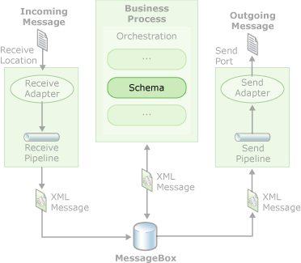

# Create Schemas Using BizTalk Editor

## Overview
BizTalk Editor is a tool that runs within the Microsoft [!INCLUDE[btsVStudioNoVersion](../includes/btsvstudionoversion-md.md)] environment. You can use it to create, edit, and manage schemas for use with your application. BizTalk Editor uses its own graphical system of hierarchical records and fields to represent the structure of instance messages, and uses the XML Schema definition (XSD) language to store the schemas that it defines. This is true regardless of the format in which instance messages are exchanged. For example, suppose that you exchange flat files with a trading partner. As BizTalk Server processes those flat files, it converts them to and from an XML format that conforms to an XSD schema that you defined in BizTalk Editor.  
  
 The schemas you create using BizTalk Editor can be used within an orchestrated business process, as shown in the following figure.  
  
   
  
 Schemas are also used by assemblers and disassemblers for translating instance messages from one format to another, such as between a flat file format and XML. Schemas also play an important role in instance message transformation, wherein the data in an instance message is used to construct an instance message with a different structure. The new instance message might be semantically equivalent, such as different representations of a purchase order, or it might be a different but related type of instance message that requires some or all of the data from the original instance message in its content.  
  
 An important reason for translating all instance messages into an XML format that conforms to an XSD schema is to simplify the process of transforming a message from one structure into another structure. Message structures are typically semantically equivalent despite their syntactic differences. For example, you and your trading partner might structure your purchase orders differently, but the basic information they contain is the same, allowing them to be transformed back and forth automatically. By first converting all instance messages into an XML format governed by a corresponding XSD schema, the instance messages can be translated back and forth between XML and non-XML formats, and transformed from one XML structure to another. For more information about the distinction between instance message translation and instance message transformation, see [Data Transformation](../core/data-transformation.md).  
  
 The companion tool to BizTalk Editor within the Microsoft Visual Studio environment is BizTalk Mapper. After you use BizTalk Editor to create the schemas that define the structure and format of a pair of related instance messages, you use BizTalk Mapper to graphically define how to transform an instance message conforming to one schema (the source instance message and schema) into an instance message conforming to another schema (the destination instance message and schema). The specification of such transformations is implemented using Extensible Stylesheet Language Transformations (XSLT) and persisted as files called maps. For conceptual and procedural information about BizTalk Mapper, see [Creating Maps Using BizTalk Mapper](../core/creating-maps-using-biztalk-mapper.md). For reference information about BizTalk Mapper properties and functoids, see the **Map Property Reference** and **Functoid Reference**  [!INCLUDE[ui-guidance-developers-reference](../includes/ui-guidance-developers-reference.md)].
  
 Using BizTalk Editor, you can open a blank schema that contains no structure, you can open an existing XSD schema, or you can generate a schema from a non-XSD source. When you generate a schema from a non-XSD source, BizTalk Editor interprets the structure of the source and produces a schema that is an XSD representation of it. You can edit any records and fields that appear in the BizTalk Editor schema tree view, and then save the structure as a BizTalk schema.  
  
 For information about using the keyboard shortcuts for BizTalk Editor, see [BizTalk Editor Keyboard Shortcuts](../core/biztalk-editor-keyboard-shortcuts.md).  
  
## Next steps
  
-   [Planning for Schema Creation](../core/planning-for-schema-creation.md)  
  
-   [About Instance Messages](../core/about-instance-messages.md)  
  
-   [About Schemas](../core/about-schemas.md)  
  
-   [Using BizTalk Editor](../core/using-biztalk-editor.md)  
  
-   [Creating Schemas](../core/creating-schemas.md)  
  
-   [Creating Schemas Using BizTalk Flat File Schema Wizard](../core/creating-schemas-using-biztalk-flat-file-schema-wizard.md)  
  
-   [Testing Schemas](../core/testing-schemas.md)  
  
-   [Extending BizTalk Editor](../core/extending-biztalk-editor.md)  
  
-   [Considerations When Creating Schemas](../core/considerations-when-creating-schemas.md)  
  
-   [Known Issues with Schema Generation and Validation](../core/known-issues-with-schema-generation-and-validation.md)
