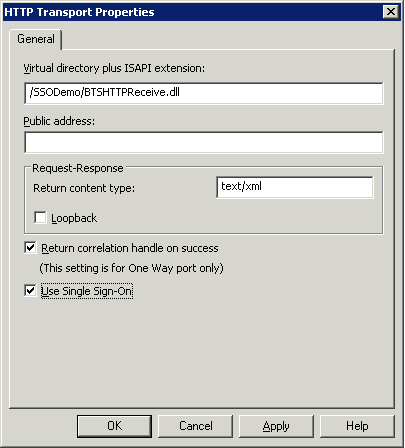
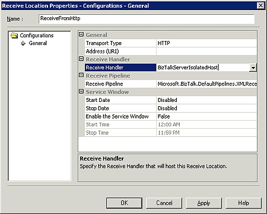

# Creating Send and Receive Ports
Use the following procedures to create [!INCLUDE[btsBizTalkServerNoVersion](../includes/btsbiztalkservernoversion-md.md)] send and receive ports for BizTalk Adapter for JD Edwards OneWorld.  
  
## Creating a Port  
  
#### To create a send port  
  
1.  Click **Start**, point to **All Programs**, point to **Microsoft BizTalk Server**, and then click **BizTalk Server Administration**.  
  
2.  In the BizTalk Server Administration console, expand **BizTalk Server Administration**, expand **BizTalk Group**, and expand **Applications**, and then expand the application for which you want to create a send port.  
  
3.  Right-click **Send Ports** and click **New**, and then click **Static Solicit-Response Port**.  
  
4.  In the **Send Port Properties** dialog box, do the following:  
  
    -   In the **Name** box, type a send port name (for example, `SSOSendToJDE OneWorld`).  
  
    -   From the **Type** drop-down list, select **JDEdwards**.  
  
    -   From the **Send handler** drop-down list, select the send handler address.  
  
    -   For the **Send Pipeline**, select **Microsoft.BizTalk.DefaultPipelines.XMLTransmit**.  
  
    -   For the **Receive Pipeline**, select **Microsoft.BizTalk.DefaultPiplelines.XMLReceive**.  
  
5.  Click **OK**.  
  
## Creating a Receive Port  
  
#### To create a receive port  
  
1.  Click **Start**, point to **All Programs**, point to **Microsoft BizTalk Server**, and then click **BizTalk Server Administration**.  
  
2.  In the BizTalk Server Administration console, expand **BizTalk Server Administration**, expand **BizTalk Group**, and expand **Applications**, and then expand the application for which you want to create a send port.  
  
3.  Right-click **Receive Ports** and click **New**, and then click **One-way Receive Port**.  
  
     On the **One-Way Receive Port Properties** screen, in the **Name** field, type `ReceiveFromHttp`, and then click **OK**.  
  
4.  Enter the following information in the **One-way Receive Port Properties** window:  
  
    -   In the **Name** field, type `ReceiveFromHTTP`.  
  
    -   For the **Transport Type**, select **HTTP**.  
  
5.  Click the ellipsis (…) button in the address (URI).  
  
       
  
    1.  Set the Virtual directory plus ISAPI extension, /mySSODemo/BTSHTTPReceive.dll.  
  
    2.  Select **Return correlation handle on success**.  
  
    3.  Select **Use Single Sign-On**, and then click **OK**.  
  
6.  In the **Receive Handler** drop-down list, select **BizTalkServerIsolatedHost**.  
  
       
  
7.  For the **Receive Pipeline**, select **Microsoft.BizTalk.DefaultPiplelines.XMLReceive**, and then click **OK**.  
  
## See Also  
 [Add the artifacts to BizTalk Administration](../core/adding-biztalk-adapter-for-jd-edwards-oneworld.md)   
 [Add the artifacts to BizTalk Administration](../core/adding-biztalk-adapter-for-jd-edwards-oneworld.md)   
 [Security in the adapter](../core/security-in-biztalk-adapter-for-jd-edwards-oneworld.md)