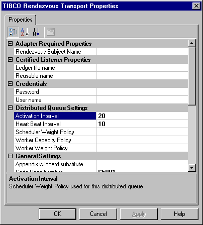

# Create TIBCO Rendezvous Receive artifacts
Creating notifications or events is similar to creating other calls in [!INCLUDE[btsBizTalkServerNoVersion](../includes/btsbiztalkservernoversion-md.md)]. This section explains how to create a receive location to listen for TIBCO Rendezvous messages.  

## Events and Receive Locations
Any TIBCO Rendezvous system can send messages to their subject name of choice. The concept of *event* is the generation of messages by other TIBCO Rendezvous programs.  
  
 The following steps describe the life cycle of a receive location:  
  
1.  Receive location is created.  
  
2.  Receive location is associated with a host.  
  
3.  Receive location is bound to an orchestration.  
  
4.  Receive location is enabled.  
  
5.  Receive location receives messages.  
  
> [!IMPORTANT]
>  Each receive location must have a unique name. Two receive locations cannot have the same name in the same [!INCLUDE[btsBizTalkServerNoVersion](../includes/btsbiztalkservernoversion-md.md)] deployment.  
> 
> [!IMPORTANT]
>  It is recommended that you set strong access control lists (ACL) in the receive locations drop locations. For example, you must set strong ACLs for the directory where the file receive location picks up messages, so that only authorized users can drop messages in this location. 

## Create a receive port  
  
1.  In **BizTalk Server Administration**, expand **BizTalk Group**, expand **Applications**, and then expand your application.  
  
2.  Right-click **Receive Ports**, point to **New**, and then click **One-way Receive Ports**.  
  
3.  In the **Receive Port Properties** window, on the **General** page, do the following:  
  
    1.  In the **Name** field, type `ReceiveFromTIBCORV`.  
  
    2.  In the **Authentication** group box, specify how messages are handled when using authentication.  
  
    3.  Select the **Enable routing for failed messages** checkbox.  
  
4.  On the **Receive Locations** page, do the following:  
  
    1.  Click **New**.  
  
    2.  In the **Receive Locations** window, on the **General** page, type the **Name** of the receive location.  
  
    3.  From the **Type** drop-down list, select the **BizTalkServerIsolatedHost**, and from the **Receive handler** drop-down list, select the transport address.  
  
    4.  From the **Receive pipeline** drop-down list, select **XMLReceive** or any equivalent pipeline. 
  
    5.  On the **Schedule** page, select the **Start date** and the **End date** to restrict receiving documents.  
  
    6.  Select the **Enable service window** checkbox.  
  
    7.  Click **OK**.  
  
5.  On the **Inbound Maps** page, select the inbound maps for transforming documents on the selected port.  
  
6.  On the **Tracking** page, select the desired tracking message bodies and tracking message properties.  
  
7.  Click **OK**.  

## Set the transport properties
When you configure Microsoft BizTalk Adapter for TIBCO Rendezvous to listen for messages, you specify the subject names to listen for. This is the only property that is required.  
  
 
1.  On the TIBCO Rendezvous Transport Properties dialog, expand **Adapter Required Properties**, enter the **Rendezvous Subject Name**.  
  
     This is the subject name (Rendezvous wildcard characters allowed) that the adapter listens for. In the simplest deployment scenario, this is the only property that is required.  
  
       
  
2.  In the **Certified Listener Settings**, provide the reusable name and ledger file name if you want certified messaging.  
  
     This is mandatory if you are defining a distributed queue. If certified messaging is not required, leave these entries empty. Both the ledger file name and the reusable name must be unique across all the ports defined on this host, and other TIBCO Rendezvous programs running on this host. If this is not the case, the user interface does not detect it, but an error is trapped and logged at run time.  
  
3.  In the **Distributed Queue Settings**, if the distributed queue is not required, do not change the entries.  
  
     The following values are used together with a BizTalk Server group. BizTalk Adapter for TIBCO Rendezvous uses these values in API calls to TIBCO RV.  
  
    |Use this|To do this|  
    |--------------|----------------|  
    |**Ledger file name**|Ledger file name for the certified listener (or group member). Default value is Null.   If a value is not specified, a memory ledger is used.|  
    |**Reusable name**|Reusable name for the certified listener (or group member). Default value is Null.   A reusable name is required to survive a process being restarted. If a value is not specified, a generated (non-reusable) name is used.|  
  
     Distributed Queues are useful if deploying a TIBCO Rendezvous receive location in a BizTalk Server group. In that case, enter the desired intervals and policies values. Both activation intervals and Heart Beat intervals are provided as is to TIBCO Rendezvous. Because intervals must be identical among all participants of a distributed queue, values are entered only one time. With policies, the values could easily be different on every host. All the policy values follow the same syntax of semi-colon-separated colon-separated host:value pairs.  
  
     For example, **host1:10; host2:20; host3:30**  
  
     The host name must be either a valid DNS host name or an IP address. For each of those policies, the adapter finds the value associated with its host and uses it with the TIBCO Rendezvous API.  
  
     If values are to be identical on all computers, you can enteOn the Tibr a simple value instead of the list of name:value pairs (for example, **20**).  
  
    |Use this|To do this|  
    |--------------|----------------|  
    |**Activation Interval**|Scheduler Weight Policy used for this distributed queue. It is the time interval without a heart beat message from the scheduler, after which TIBCO RV activates a new scheduler. Default value is 20 seconds.|  
    |**Heart Beat Interval**|Heart Beat Interval used within this distributed queue. It is used with the BizTalk Server Group parameter. BizTalk Adapter for TIBCO Rendezvous uses these values in API calls to TIBCO RV. The value is used by the instance of the adapter that is the active scheduler for the group and broadcasts heartbeat messages at that interval (in seconds). Default value is 10.|  
    |**Scheduler Weight Policy**|By default (null value), all members of a group have the same chance of becoming a scheduler. A list of host-weight pair values provides for a different weight policy. Default value is Null.|  
    |**Worker Capacity Policy**|Worker capacity policy used for this distributed queue. This value indicates how many concurrent tasks a group member can handle. If unspecified, the default is 1. A list of host-capacity pair values provides for different capacity policy.|  
    |**Worker Weight Policy**|Worker weight policy used for this distributed queue. This value provides a weight value to help TIBCO assign tasks in a distributed queue. Available workers are assigned tasks the higher weight first. Default value is 1.|  
  
4.  Expand **General Settings** and enter all required information for connection to the TIBCO Rendezvous server.  
  
    |Use this|To do this|  
    |--------------|----------------|  
    |**Appendix wildcard substitute**|Specify a wildcard text substitute. The subject names that a receive location is listening to are used to generate the XML target namespace in the resulting messages. By default, the adapter replaces any '>' wildcard with the text GTWILDCARD in generated messages. You can specify a different wildcard in this field.|  
    |**Code Page Number**|Identifies the code page used by the message originator to encode the strings that are contained in the incoming messages. Default is 65001. (The adapter does not support having the same message subjects generated from two different code page environments.)|  
    |**Element wildcard substitute**|Specify a different wildcard text substitute The subject names that a receive location is listening to are used to generate the XML target namespace in the resulting messages. By default, the adapter replaces any '*' wildcard with the text STARWILDCARD in generated messages. You can specify a different wildcard in this field.|  
    |**Event Queue Name**|Specify a name to use when you are creating the Rendezvous Queue object. Provided as a convenience, because associated log messages display the event queue name. Default is empty.|  
    |**Filter**|When you specify wildcard characters in listening subject names, the target orchestration might only be interested in a subset of the potentially very large set of subjects that could reach it. To minimize the impact on BizTalk Server and associated access to databases, you can further specify which messages should be sent to BizTalk Server. This entry contains a semi-colon separated list of subject names (no wildcard characters allowed). Any message that matches a wildcard-specified subject name, but whose subject name is in this list, is filtered out (not sent to BizTalk Server). The filter logic can be reversed by prepending a '!' character to the filter value. Default is empty (no filter).|  
    |**Map unsupported types to string**|Whether unsupported types generate an error or are mapped to string. Can be used if using the adapter with a more recent version of TIBCO Rendezvous, where new types would have been added.|  
    |**Member of BizTalk group**|If set to True, the Distributed Queue parameters (refer to the Distributed Queue Settings node) and Certified Listener parameters (refer to the Certified Listener Settings node) must be set. Default is False.|  
    |**Path**|Set to point to TIBCO Rendezvous binaries, if that information is not already in the PATH environment variable.|  
    |**Preserve Order**|Whether the adapter dispatches incoming messages to BizTalk Server in the same order that they were received (for example, using a single dispatch thread). Note that if Certified Messaging parameters are not set, it does not mean that the adapter is receiving the message in the same order that they were sent (referring to a single source).|  
    |**Receive Location Identifier**|The name of the receive location.|  
    |**Reserved**|Field reserved for special use.|  
  
5.  Expand the **Rendezvous Transport**, and enter all required information for communication between the TIBCO Rendezvous daemons and programs.  
  
     The **Transport (Network, Daemon, Service)** specifies how the TIBCO Rendezvous daemons exchange messages. These settings are sent as is to the TIBCO Rendezvous API. Using the default values (empty) result in using the default communication strategy.  
  
     A TIBCO Rendezvous transport defines the delivery scope—that is, the set of possible destinations for the messages it sends. This set of properties defines a transport.  
  
    |Parameter|Description|  
    |---------------|-----------------|  
    |**Daemon**|Type the numeric identifier for the Rendezvous transport Daemon parameter.|  
    |**Network**|Type the name of the Rendezvous Network parameter.|  
    |**Service Nam** `e`|Type the name of the Rendezvous transport service.|  
  
6.  Provide credentials using Single Sign-On (SSO).  
  
     There are two methods that you can use to access the TIBCO Rendezvous system. You can use Credentials (User Name and Password parameters) or Single Sign-On.  
  
    1.  Select **Yes** in the **Use SSO** to use Single Sign-On.  
  
        > [!NOTE]
        >  See [Security](../core/security-in-biztalk-adapter-for-tibco-rendezvous.md) for information about how to set up SSO.  
  
    2.  Select an affiliate application from the list.  
  
         An affiliate application, created by Enterprise Single Sign-On tools, represents an application such as TIBCO Rendezvous. Microsoft BizTalk Adapter for TIBCO Rendezvous uses the credentials of an application user. These credentials are retrieved from the SSO database for the server system for a specified affiliate application.  
  
        > [!NOTE]
        >  For information about how to create an affiliate application, see [Creating Affiliate Applications](../core/creating-affiliate-applications1.md).  
  
7.  After providing all required information, click **Apply**, and then click **OK**.  
  
     You must set connection parameters for BizTalk Adapter for TIBCO Rendezvous to receive TIBCO Rendezvous messages.  
  

   
## Next steps
  
-   [Receive schemas & process events](../core/using-tibco-rendezvous-receive-ports-from-biztalk-server.md) 
  
-   [Message Mapping](../core/message-mapping-in-tibco-rendezvous.md)  
  
-   [Data Type Mapping](../core/data-type-mapping-for-receive-handlers-in-tibco-rendezvous.md)  
  
-   [Message Context Properties (Receive Handlers)](../core/biztalk-server-message-context-properties-receive-handlers.md)