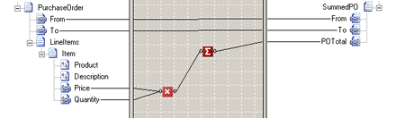

# Cumulative Functoids

## Overview
**Cumulative** functoids reduce a series of values to a single value such as a sum, a concatenated string, or an average.  

 All **Cumulative** functoids accept two input parameters:  

1. The value to accumulate. This value is numeric for all **Cumulative** functoids except the **Cumulative Concatenate** functoid which expects a string value. The value is a link, often from a **Field Attribute**, **Field Element**, or **Record** node (with its **Mixed** property set to **True**).  

   > [!NOTE]
   >  If none of the ancestor **Record** nodes in the schema tree are looping, using a **Cumulative** functoid is unnecessary.  

2. The scope within which the value is accumulated. This argument is optional. The argument indicates how closely related the specified values must be to be accumulated.  

   The following table shows the values for the scoping parameter and its effect:  

|Scoping Parameter Value|Effect|  
|-----------------------------|------------|  
|0 (zero)|Accumulate the value over the entire instance message. The default.|  
|1 (one)|Accumulate the value of element or attribute values with the same parent element.|  
|2|Accumulate the value of element or attribute values with the same grandparent element.|  
|3 or greater|Accumulate the value of element or attribute values of progressively wider scope following the preceding pattern (great-grandparent, great-great-grandparent, etc.).|  

## Example  
 An example of using a **Cumulative** functoid might be summing costs across a purchase order. The following code is an example of a purchase order.  

```  
<ns0:PurchaseOrder xmlns:ns0="http://CumulativeFunctoid.PurchaseOrder">  
    <From>Kevin F. Browne</From>  
    <To>Northwind Traders</To>  
    <LineItems>  
        <Item>  
            <Product>Laptop Computer</Product>  
            <Description>Thin profile laptop</Description>  
            <Price>1999.95</Price>  
            <Quantity>1</Quantity>  
        </Item>  
        <Item>  
            <Product>Monitor Swipes</Product>  
            <Description>Disposable monitor swipes</Description>  
            <Price>3.95</Price>  
            <Quantity>10</Quantity>  
        </Item>  
    </LineItems>  
</ns0:PurchaseOrder>  
```  

 The **Max Occurs** property for the **Item** record would, of course, be **unbounded**. This indicates that the item record loops, and BizTalk Mapper compiles this record as a loop.  

 The following figure shows a map using a **Multiplication** functoid and a **Cumulative Sum** functoid to aggregate item records from an incoming purchase order and output the results in the **POTotal** field:  

   


 The map produces the following output with the preceding data and with the default scoping parameter value, 0 (zero):  

```  
<ns0:SummedPO xmlns:ns0="http://CumulativeFunctoid.SummedPO">  
    <From>Kevin F. Browne</From>  
    <To>Northwind Traders</To>  
    <POTotal>2039.45</POTotal>  
</ns0:SummedPO>  
```  

 In this example, all the **Item** records under the **LineItems** record participate in the accumulation—the default for the scoping parameter indicates accumulating the values across the entire message. The **Price** and **Quantity** fields are sent to a **Multiplication** functoid. The output of the **Multiplication** functoid becomes the input to the **Cumulative Sum** functoid. The output of the **Cumulative Sum** functoid is the accumulated value as the **Item** records are traversed in the input purchase order.  

> [!NOTE]
>  The cumulative aggregation of input takes place over the parent record from which the input link originates. Even when the **Cumulative** functoid gets its input from another functoid, the cumulative aggregation takes place over the parent record of the input links to the functoid that serves as input to the **Cumulative** functoid.  

 Changing the scoping parameter to 1 (one) and modifying the output schema slightly, yields output like the following:  

```  
<ns0:SummedPO xmlns:ns0="http://CumulativeFunctoid.SummedPO">  
    <From>Kevin F. Browne</From>  
    <To>Northwind Traders</To>  
    <ItemTotal>1999.95</ItemTotal>  
    <ItemTotal>39.5</ItemTotal>  
</ns0:SummedPO>  
```  

 Setting the scoping parameter to 1 (one) indicates accumulating values for elements or attributes with the same parent. Here the **Price** and **Quantity** fields have **Item** as a parent so that the functoid sums values for each individual **Item**.  

 If the scoping parameter is 2, the functoid accumulates values for elements or attributes with the same grandparent. The grandparent of the **Price** and **Quantity** fields is the **LineItems** record. Because there is only one **LineItems** record in the instance message, the result is the same as using the default value:  

```  
<ns0:SummedPO xmlns:ns0="http://CumulativeFunctoid.SummedPO">  
    <From>Kevin F. Browne</From>  
    <To>Northwind Traders</To>  
    <POTotal>2039.45</POTotal>  
</ns0:SummedPO>  
```  

> [!NOTE]
>  Cumulative functoids (except for the **Cumulative String** functoid) ignore non-numeric input. For example, an input value of "three" is ignored.  

 The **Cumulative Average**, **Cumulative Minimum**, and **Cumulative Maximum** functoids behave similarly to the **Cumulative Sum** functoid. The **Cumulative String** concatenates strings rather than aggregating numeric values.  

## Available functoids

 The **Cumulative** functoids are: 

* Cumulative Average
* Cumulative Concatenate
* Cumulative Maximum
* Cumulative Minimum
* Cumulative Sum

More details on these functoids are [!INCLUDE[ui-guidance-developers-reference](../includes/ui-guidance-developers-reference.md)].

## See Also  
- [How to Add Basic Functoids to a Map](../core/how-to-add-basic-functoids-to-a-map.md)   
- **Cumulative Functoids Reference** [!INCLUDE[ui-guidance-developers-reference](../includes/ui-guidance-developers-reference.md)]
