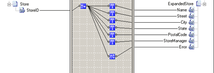

# Database Functoids
**Database** functoids extract data from a database for use in an output instance message. 

## Overview
The following is a list of the **Database** functoids and how you can use them:  

- **Database Lookup.** Use the **Database Lookup** functoid to extract information from a database and store it as a Microsoft ActiveX Data Objects .NET (ADO.NET) recordset. This functoid requires four input parameters in the following order:  

  -   A lookup value  

  -   A database connection string  

  -   A table name  

  -   A column name for the lookup value.  

- **Error Return.** Use the **Error Return** functoid to capture error information, such as database connection failures, that occur during run time. This functoid requires one input parameter: a link from the **Database Lookup** functoid.  

- **Format Message.** Returns a formatted and localized string using argument substitution and, potentially, ID and value cross-referencing.  

- **Get Application ID.** Retrieves an identifier for an application object.  

- **Get Application Value.** Retrieves an application value.  

- **Get Common ID.** Retrieves an identifier for a common object.  

- **Get Common Value.** Retrieves a common value.  

- **Remove Application ID.** Removes an application value.  

- **Set Common ID.** Sets and returns an identifier for a common object.  

- **Value Extractor.** Use the **Value Extractor** functoid to extract data from the specified column in a recordset returned by the **Database Lookup** functoid. This functoid requires two input parameters: a link to the **Database Lookup** functoid and a column name.  

  Seven of the **Database** functoids— **Format Message, Get Application ID**, **Get Application Value**, **Get Common ID**, **Get Common Value**, **Remove Application ID**, and **Set Common ID**—are **CrossReferencing** functoids. These functoids translate IDs and values from an input message into the IDs and values needed in the output message. For more information, see **Database Functoids Reference** [!INCLUDE[ui-guidance-developers-reference](../includes/ui-guidance-developers-reference.md)]. 

## Example  
 The following example uses some of the **Database** functoids. Consider a large retail manufacturer with stores spread over a large geographical area. To keep track of the stores, headquarters assigns each store a unique code called a **StoreID**. Additionally, headquarters associates the following information with each **StoreID**:  

- StoreName  

- StoreAddress  

- City  

- PostalCode  

- StorePhoneNumber  

- StoreManager  

  This information is stored in a database and is distributed to trading partners on a regular basis. For the manufacturer, all purchasing is done by headquarters, not the stores. When headquarters sends a purchase order to the trading partners, it is common for multiple stores to receive merchandise ordered through the single purchase order. Instead of sending name and address information for each store that is to receive merchandise, headquarters simply sends the **StoreID**. To insert the name and address information into the advanced ship notice, the trading partner uses the **Database** functoids to automatically insert this information into the output instance message. The following figure shows how a trading partner can implement the replacement of the StoreID in a map.  

    

  In the figure, the source schema represents an incoming purchase order; the destination schema represents an advanced ship notice. The **Database Lookup** functoid finds the appropriate record from the appropriate database table. The **Value Extractor** functoids extract the appropriate column from the lookup record. The **Error Return** functoid outputs a string containing error information if there are errors (such as connection failures) at run time.  

  In the previous example, the first input parameter is taken from the **StoreID** field of the incoming purchase order, and the remaining three input parameters are constants configured in the **Configure \<Functoid\> Functoid** dialog box for the **Database Lookup** functoid. It is possible to create links from the source schema to supply values for all four input parameters.  

> [!NOTE]
>  * You cannot use some Microsoft SQL Server data types, such as **text**, **ntext**, and **image**, as lookup values for the **Database Lookup** functoid. The functoid requires data types that can be represented as a text string.  
>
>  * If there is more than one record matching the input parameters of the **Database Lookup** functoid, the **Value Extractor** functoid extracts data only from the first record.  
>
>  * Use NT authentication in connection strings to protect passwords with encryption.  

## Available functoids  
 The **Database** functoids are: 

* Database Lookup
* Error Return
* Format Message
* Get Application ID
* Get Application Value
* Get Common ID
* Get Common Value
* Remove Application ID
* Set Common ID
* Value Extractor

For more details on these functiods, see the **Functoid Reference** [!INCLUDE[ui-guidance-developers-reference](../includes/ui-guidance-developers-reference.md)].

## See Also  
- [How to Add Basic Functoids to a Map](../core/how-to-add-basic-functoids-to-a-map.md)   
- **Database Functoids Reference** [!INCLUDE[ui-guidance-developers-reference](../includes/ui-guidance-developers-reference.md)]
